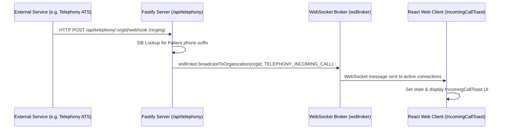

# 🏗️ DENTE Dental CRM — System Architecture

This document describes the structure, data flows, and architectural conventions of the DENTE Dental CRM project.

---

## 📁 Monorepo Layout

The project is structured as an npm workspaces monorepo:
*   `apps/api/` — Backend server (Fastify, TypeScript, tsx execution).
*   `apps/web/` — Web Frontend client (Vite, React 18, Tailwind CSS, TypeScript).
*   `packages/shared/` — Common types, schemas, and helper functions shared by both frontend and backend.
*   `scripts/` — Smoke test scenarios, database tooling, and validation scripts.

---

## ⚡ Backend Server (`apps/api`)

The backend is built with **Fastify** and uses **Drizzle ORM** for PostgreSQL interaction.

### 🔌 Proxy & Tunnel Configuration (`apps/api/src/server.ts`)
*   During startup, `setupProxyAndTunnels()` tries to configure an SSH SOCKS5 tunnel on port `1080`.
*   If successful, it directs HTTP traffic through `socks5://127.0.0.1:1080` (used for secure, remote AI processing endpoints).
*   If the configured proxy is offline, the server deletes proxy environment variables to fall back to a direct connection.

### 🌐 WebSocket Broker (`apps/api/src/services/websocketBroker.ts`)
The server exposes a websocket endpoint `/api/ws/schedule`.
*   Clients establish websocket connections passing `orgId` (organization) and optional `patientId`.
*   The `wsBroker` maps connections and handles real-time updates.
*   Methods:
    *   `broadcastToOrganization(organizationId, message)` — Sends to all active clinic admins.
    *   `broadcastToPatient(organizationId, patientId, message)` — Sends to a specific patient portal.

---

## 🖥️ Web Frontend (`apps/web`)

The frontend is a Single Page Application (SPA) built with React 18 and Vite.

### 🧠 App State Management
*   **Zustand** is used for smaller global settings stores (e.g., `settingsStore.ts`).
*   **God Context (`useAppLogic.tsx`)**: Most application-wide states (active patient, schedule view configurations, clinical logs) are gathered in the `useAppLogic` hook and shared via React Context (`AppLogicContext`).
*   **WS Connection**: `useWebsocket.ts` hooks into the backend ws broker and updates component states dynamically.

### ⚡ View Preloading (`apps/web/src/workspacePreload.ts`)
To prevent route-change lags in the custom UI shell, all core views (Schedule, Patients, Documents, Finance, Communications, Settings) are imported at app initialization.

---

## 🔄 Core Data Flow: Real-Time Event Dispatch

