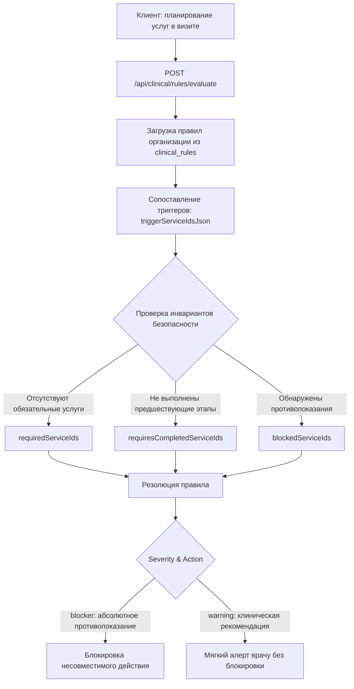

# 🩺 Clinical Rules Engine, EHR & Protocols Highway

> 🧭 **Navigation:** [🗺️ Master Documentation Index (.agents/INDEX.md)](file:///C:/Clinic_MVP/dental-crm/.agents/INDEX.md) | [📚 Documentation Knowledge Hub (docs/README.md)](file:///C:/Clinic_MVP/dental-crm/docs/README.md)
> **Canonical Authority**: Mandates 8, 8b, 8c, 8e in [`.agents/AGENTS.md`](file:///C:/Clinic_MVP/dental-crm/.agents/AGENTS.md) and [`.agents/THE_HAMMER_MASTER_PROMPT.md`](file:///C:/Clinic_MVP/dental-crm/.agents/THE_HAMMER_MASTER_PROMPT.md).  
> **Related Documents**: [INDEX.md](file:///C:/Clinic_MVP/dental-crm/.agents/INDEX.md) • [ARCHITECTURE.md](file:///C:/Clinic_MVP/dental-crm/.agents/ARCHITECTURE.md) • [API_ROUTES_CATALOG.md](file:///C:/Clinic_MVP/dental-crm/.agents/API_ROUTES_CATALOG.md) • [DATABASE.md](file:///C:/Clinic_MVP/dental-crm/.agents/DATABASE.md) • [BILLING_AND_FINANCE.md](file:///C:/Clinic_MVP/dental-crm/.agents/BILLING_AND_FINANCE.md) • [TELEPHONY_AND_PORTAL.md](file:///C:/Clinic_MVP/dental-crm/.agents/TELEPHONY_AND_PORTAL.md) • [DOCUMENTS_LIFECYCLE.md](file:///C:/Clinic_MVP/dental-crm/.agents/DOCUMENTS_LIFECYCLE.md) • [MESSENGERS.md](file:///C:/Clinic_MVP/dental-crm/.agents/MESSENGERS.md).

Данный документ является нормативным описанием клинического контура DENTE CRM: клинические правила, зубная формула (FDI 11–48, 51–85), эндодонтия, пародонтология, рентгенология, стерилизация по СанПиН 3.3686-21, 3-уровневые планы лечения и защита автономии врача (Мандат 8e).

---

## 🧭 1. Фундаментальный клинический принцип: Автономия врача и Zero-Friction (Мандат 8e)

В частной стоматологической клинике софт обязан помогать врачу лечить пациентов, а не служить бюрократическим цербером. Любое искусственное препятствие, немотивированная блокировка интерфейса или лишний клик у кресла приравниваются к системному дефекту.

### 🛡️ Железные инварианты клинического взаимодействия (Hot Path / Tier 1):
1. **Запрет на немотивированно заблокированные (`disabled`) кнопки:**
   * Кнопки «Сохранить», «Завершить приём», «Добавить услугу», «Печать» **НИКОГДА** не должны быть серыми и неактивными из-за незаполненных второстепенных полей (температура тела, пульс, влажность в кабинете, 50 пунктов соматической анкеты).
   * Если поле не критично для жизни пациента — приём сохраняется беспрепятственно.
2. **Физиологическая норма по умолчанию (1 клик):**
   * Все разделы осмотра, пародонтологического скрининга и соматического анамнеза заполняются физиологической нормой по умолчанию в 1 клик («Соматически здоров / норма»).
   * Врач фиксирует исключительно патологию. Заполнение здоровых органов не должно отнимать рабочее время врача.
3. **Свобода черновиков и версионный аудит:**
   * Категорически запрещены жесткие 24-часовые замки на исправление дневников приёма. Врач имеет право отредактировать протокол приёма в 1 клик.
   * Система фиксирует версионный аудит: при печати исправленного документа выводится отметка `«ИСПРАВЛЕННОМУ ВЕРИТЬ (РЕДАКЦИЯ N)»` с фиксацией автора и даты правки.
4. **Печать в любой момент времени:**
   * Форма 043/у, согласия ИДС, сметы и планы лечения печатаются в любой момент:
     * Если приём открыт / в процессе — с водяным знаком и плашкой `«ЧЕРНОВИК (ПРИЁМ НЕ ЗАКРЫТ)»`.
     * Если приём закрыт и подписан — со статусом `«ПОДПИСАНО ВРАЧОМ»` или штампом УКЭП (ГОСТ Р 34.10).
5. **Autosave и защита от потери данных:**
   * Все вводимые врачом данные (SOAP-дневники, одонтограмма, замеры каналов) сохраняются на лету (debounced autosave в LocalState / IndexedDB).
   * Смена вкладки, входящий звонок или сбой питания никогда не уничтожают введенный текст.
6. **Свобода скидок и переделок:**
   * Врач обладает правом применить скидку вплоть до 100% на гарантийные переделки и лечение персонала клиники без вызова администратора.
   * Истечение 30 дней с момента составления предварительного плана лечения **НЕ БЛОКИРУЕТ** создание нарядов зуботехнической лаборатории (ЗТЛ), оказание услуг или оплату.

---

## 🦷 2. Зубная формула и одонтограмма (FDI Odontogram Highway)

Одонтограмма DENTE CRM (`apps/web/src/components/odontogram/`) спроектирована как доминантный рабочий холст (Tier 1 Workspace) без модальных барьеров.

### 📐 Номенклатура и анатомия:
* **Взрослый прикус:** Двухцифровая система FDI от 11 до 48 (32 зуба, 4 квадранта).
* **Детский / Сменный прикус:** Молочные зубы FDI от 51 до 85 (20 временных зубов, квадранты 5–8) с поддержкой временной шкалы прорезывания и резорбции корней (`PediatricMixedDentitionModal.tsx`, `PediatricTimelineTab.tsx`).
* **Анатомическая расцветка (Strict Clinical Fidelity):**
  * Пульпа — анатомически красный `#ef4444`.
  * Интактный зуб — нейтральный `#f8fafc` / `var(--paper)`.
  * Кариес — янтарно-коричневый `#d97706`.
  * Пульпит / Периодонтит — ярко-красный / бордовый `#b91c1c`.
  * Пломба — кобальтовый синий `#2563eb`.
  * Коронка / Протез — пурпурный `#7c3aed`.
  * Имплантат — титановый стальной `#0284c7`.
  * Отсутствующий (адентия/удален) — серый пунктир `#94a3b8`.
  * Корневые каналы во фронтальной группе (11–43) отображаются непрерывной анатомической линией до самого верхушечного отверстия (Apex).

### ⚡ Быстродействие и эргономика:
* 1-клик смена статуса зуба через радиальное меню (`ToothRadialMenu.tsx`) или верхний компактный тулбар 32–36px (`OdontogramToolbar.tsx`).
* Голосовая диктовка формулы (`VoiceDictationOverlay.tsx`, `globalDentalVoiceEngine`): мгновенное распознавание интентов («зуб шестнадцать кариес жевательная поверхность», «зуб сорок шесть коронка»).

---

## 🔬 3. Эндодонтический контур: Журнал каналов и апекслокатор

Эндодонтический модуль (`EndoCanalLogModal.tsx`, `EndoCanalMeasurementDrawer.tsx`) реализует регламент эндодонтического протокола СтАР и ESE (European Society of Endodontology).

### 📋 Параметры корневых каналов:
1. **Идентификация каналов:** MB1, MB2, DB, P (верхние моляры), MB, ML, D, DL (нижние моляры), B, L (премоляры), Main (резцы/клыки).
2. **Реперные точки (Reference Points):**
   * Щечный бугор (MB cusp), Дистально-щечный бугор (DB cusp), Нёбный бугор (P cusp), Медиально-язычный бугор (ML cusp), Дистально-язычный бугор (DL cusp), Режущий край (Incisal edge), Бугор клыка (Canine cusp).
3. **Рабочая длина (Working Length, WL):** Диапазон 10.0–30.0 мм с шагом 0.5 мм (хитбоксы тач-управления $\ge 44\times 44\text{px}$).
4. **Мастер-апикальный файл (MAF по ISO 3630-1):**
   * ISO 15 (белый), ISO 20 (жёлтый), ISO 25 (красный), ISO 30 (синий), ISO 35 (зелёный), ISO 40 (чёрный), ISO 45 (белый), ISO 50 (жёлтый).
5. **Конусность (Taper):** .02, .04, .06, .08.
6. **Методы обтурации:**
   * Латеральная компакция холодной гуттаперчи.
   * Вертикальная конденсация разогретой гуттаперчи (метод непрерывной волны System B + инжекторная подача).
   * Гидравлическая обтурация биокерамическим силером (TotalFill / BioRoot RCS).
   * Термопластифицированная гуттаперча на носителе (GuttaCore / Thermafil).
7. **Протокол ирригации:**
   * Гипохлорит натрия (NaOCl 3.0–5.25%) — растворение органических остатков пульпы.
   * ЭДТА 17% (раствор/гель) — деминерализация и удаление смазанного слоя (smear layer).
   * Ультразвуковая активация ирриганта (PUI, Passive Ultrasonic Irrigation).
8. **1-клик экспорт в Форму 043/у:** Кнопка «Вставить в протокол 043/у» автоматически генерирует сводную таблицу эндодонтического вмешательства в раздел Objective Status дневника приёма.

---

## 📊 4. Пародонтологический контур: 6-точечная карта и индексы

Пародонтологический модуль (`PeriodontalChartingModal.tsx`) базируется на мировом стандарте зондирования Florida Probe и классификации AAP/EFP:

### 🎯 Возможности:
* **6-точечный замер глубины зондирования (PD) на каждый зуб:** Mesio-Buccal (MB), Mid-Buccal (B), Disto-Buccal (DB), Mesio-Lingual (ML), Mid-Lingual (L), Disto-Lingual (DL) от 1 до 12 мм. Глубина $\ge 4\text{ мм}$ маркируется предупреждающим красным цветом.
* **Смежные патологические маркеры:**
  * Кровоточивость при зондировании (BOP, Bleeding on Probing).
  * Рецессия десневого края (GM, Gingival Margin).
  * Клиническая потеря прикрепления (CAL = PD + GM).
  * Фуркационные дефекты (I–III класс по Hamp).
  * Патологическая подвижность зубов (I–IV степень).
* **Автоматический расчёт клинических индексов:**
  * **OHI-S (Грина–Вермиллиона):** Зубной налет (DI) + Зубной камень (CI) по 6 индексным зубам (16, 11, 26, 36, 31, 46). Градация: 0.0–1.2 (Хорошая), 1.3–3.0 (Удовлетворительная), 3.1–6.0 (Плохая).
  * **CPITN / PSR:** Скрининг 6 секстантов ВОЗ (Коды 0–4) с автоматическим формированием рекомендаций TN-1...TN-3.
  * **FMPS (Full Mouth Plaque Score):** Процент поверхностей с налётом.
  * **FMBS (Full Mouth Bleeding Score):** Процент поверхностей с кровоточивостью.
* **1-клик физиологическая норма:** Кнопка «Физиологическая норма (все 32 зуба)» выставляет глубину 1–2 мм, BOP 0% и генерирует формулировку: *«Пародонт в норме: глубина бороздки 1–2 мм, кровоточивость при зондировании отсутствует (BOP 0%), патологической подвижности нет»*.

---

## 🩻 5. Рентгенологический контур: RVG <50ms и безопасный ИИ

Рентгеновский модуль (`DirectRvgCaptureModal.tsx`, `apps/web/src/components/radiology/`):

### ⚡ Требования к производительности и UX:
1. **Мгновенное открытие снимка (<50 мс):**
   * Визиограмма с датчиков (Vatech EzSensor HD, KaVo Gendex GXS-700, Planmeca ProSensor HD, Carestream RVG 6200) отображается без задержек в нативном разрешении сенсора (до 33.7 пар линий/мм).
   * Рендеринг и постобработка (яркость, контраст, фильтры резкости, инверсия) производятся через аппаратный Canvas без тяжелых блокировок JS Event Loop.
2. **Запрет на зависания на нейросетях в основном потоке:**
   * Категорически запрещено блокировать экран врача 45-секундными ожиданиями ответа ИИ-серверов при получении снимка.
   * Анализ ИИ запускается **исключительно по явной кнопке врача («Анализ ИИ»)** в асинхронном фоновом режиме.
3. **Запрет на роботизированную перезапись зубной формулы:**
   * Нейросеть имеет право лишь отобразить контурные подсказки на снимке (подозрение на скрытый апроксимальный кариес, периапикальный очаг, убыль кости).
   * Перенос диагноза в зубную формулу и карту 043/у осуществляет **только врач** ручным подтверждением.
4. **Контроль дозовых нагрузок (МУ 2.6.1.1982-05):**
   * Автоматический расчёт дозы в мкЗв по формуле экспозиции ($\text{кВ} \times \text{мА} \times \text{сек} \times k$).
   * Интеграция в Лист учета дозовых нагрузок радиационного паспорта пациента.

---

## 🧼 6. Стерилизация и инфекционная безопасность (СанПиН 3.3686-21)

Модуль стерилизации (`SterilizationStudioModal.tsx`, `SterilizationJournalModal.tsx`, `sterilizationPresets.ts`, `NurseCarpuleDisposalModal.tsx`):

### 📜 Нормативная база РФ:
* **СанПиН 3.3686-21:** «Санитарно-эпидемиологические требования по профилактике инфекционных болезней» (раздел XLIV).
* **ГОСТ Р ИСО 11607-1-2018:** Упаковка для медицинских изделий, подлежащих финишной стерилизации.
* **Методические указания МУ 287-113:** Контроль стерилизаторов паровых и воздушных.

### ⚙️ Протоколы учета:
1. **Журнал автоклавирования (Форма № 257/у):**
   * Паровой автоклав класса B (MELAG Vacuklav, Euronda, Dentsply Sirona).
   * Режим: 134°C, 2.1 бар, экспозиция 5 минут с 3-кратным фракционированным предвакуумированием (EN 13060).
   * Химический контроль: многопараметрические индикаторы 5 класса (интеграторы) в 5 контрольных точках камеры.
   * Тест Бови-Дика (Bowie-Dick test) на полноту удаления воздуха из камеры.
2. **Контроль качества предстерилизационной очистки (ПСО, Форма № 366/у):**
   * **Азопирамовая проба (п. 3584 СанПиН 3.3686-21):** Контроль скрытой крови и остатков СМС. Отрицательный результат — отсутствие фиолетового окрашивания в течение 1 минуты.
   * **Фенолфталеиновая проба (п. 3585 СанПиН 3.3686-21):** Контроль отмывки щелочных моющих средств. Отрицательный результат — отсутствие розового окрашивания.
   * Норма выборки: 1% от партии обработанного инструмента (не менее 3–5 единиц).
3. **Крафт-пакеты и цифровая трассировка:**
   * Срок сохранения стерильности: 50 суток (самоклеящиеся пакеты) / до 60 суток (термозапайка).
   * Штрихкод Code128 / 2D DataMatrix с паспортом: дата, автоклав, номер цикла, оператор, срок годности.
   * Привязка крафт-пакета к электронному приёму пациента в 1 скан сканера штрихкодов.
4. **Мягкий овердрафт склада и списание карпул медсестрой:**
   * Медсестра списывает пустые карпулы анестетиков в 1 клик единолично без создания комиссии из 3 человек (`NurseCarpuleDisposalModal.tsx`).
   * Задержка проведения накладной поставщика не блокирует оказание экстренной помощи пациенту при острой боли (мягкий овердрафт с предупреждением).

---

## 💎 7. Планы лечения и финансовые тарифы (3-Tier Treatment Highway)

Модуль планов лечения (`TreatmentPlanModule.tsx`, `TreatmentPlan3TierComparison.tsx`, `treatmentPlanBundlesEngine.ts`):

### 🏷️ 3 уровня клинического плана:
1. **Эконом:** Базовый клинический стандарт санации (металлокерамика, стандартные композиты, бюджетные имплантаты).
2. **Оптимум (Золотой стандарт / Рекомендуемый):** Оптимальное соотношение долговечности и эстетики (диоксид циркония, премиальные наногибриды Tokuyama Estelite, проверенные имплантационные системы Osstem / Dentium).
3. **Премиум:** Бескомпромиссная эстетика и биосовместимость (полевошпатные виниры, керамика E.max, имплантаты Straumann SLActive / Nobel Biocare, индивидуальные циркониевые абатменты).

### 📱 Мобильная эргономика Apple HIG:
* На экранах мобильных устройств ($\le 640\text{px}$) вместо вертикальной простыни скролла на 2500px используется нативный **Segmented Control** `[ Эконом | ★ Оптимум | Премиум ]`. Переключение тарифа мгновенно обновляет состав, цены и графики на одном компактном экране с нулевым паразитным сдвигом верстки (CLS = 0).

### 📦 Пакеты «под ключ» (CLINICAL_BUNDLES) вместо номенклатурного ада:
* Врач не набивает 15 мелких кодов Номенклатуры 804н вручную. В 1 клик добавляется пакет «под ключ»:
  * *Кариес под ключ* (анестезия + коффердам + препарирование + Estelite + полировка Enhance).
  * *Эндодонтия 1 канал / 3 канала под ключ* (анестезия + коффердам + NiTi ProTaper + 3D обтурация гуттаперчей + RVG снимок).
  * *Профгигиена под ключ* (ультразвуковой скейлинг + Air-Flow + полировка пастой Cleanic + фторирование).
  * *Имплантация под ключ* (анестезия + установка имплантата + винт-заглушка + шовный материал + снимок).

### 👁️ Скрытие микро-расходников от пациента (`isMicroConsumable`):
* При печати и демонстрации сметы пациенту вспомогательные микро-расходники (валики, салфетки, перчатки, аппликаторы, жидкий коффердам стоимостью $\le 350\text{--}500\text{ ₽}$) автоматически скрываются или объединяются в общую стоимость этапа.
* Пациент видит прозрачную, понятную смету без отпугивающего списка из 40 копеечных позиций, при этом складской учёт списывает материалы с абсолютной точностью до грамма и копейки.

### 💳 Финансовые инструменты:
* **Поэтапная оплата 30/40/30:** 30% аванс при старте $\rightarrow$ 40% после завершения хирургического/терапевтического этапа $\rightarrow$ 30% перед фиксацией ортопедии.
* **Внутренняя рассрочка 0%:** Рассрочка клиники без участия банков и процентов на 3, 6, 12, 24 месяца.
* **Налоговый вычет 13% НДФЛ (Справка ФНС КНД 1151156):**
  * *Код 01 (Обычное лечение):* Предельный лимит вычета 150 000 ₽ (возврат до 19 500 ₽).
  * *Код 02 (Дорогостоящее лечение):* Без ограничения предельной суммы (имплантация, костная пластика, сложные виды протезирования).

---

## ⚙️ 8. Движок клинических правил в БД (`clinical_rules` DB Engine)

Техническая архитектура оценки правил на стороне API (`apps/api/src/db/clinicalQuery.ts`, маршрут `POST /api/clinical/rules/evaluate`):

### Структура таблицы `clinical_rules`:
* `id` — UUID первичный ключ.
* `organization_id` — изоляция тенанта.
* `name` — клиническое наименование правила.
* `trigger_service_ids_json` — массив ID услуг, активирующих проверку.
* `required_service_ids_json` — услуги, обязательные к совместному назначению.
* `requires_completed_service_ids_json` — услуги, которые пациент обязан был получить ранее (например, диагностический снимок до сложного удаления).
* `blocked_service_ids_json` — несовместимые услуги (противопоказания).
* `action` — действие (`add_required_service`, `block_service`, `show_warning`, `schedule_followup`).
* `severity` — уровень строгости (`info`, `warning`, `blocker`).

---

## 🔗 9. Перекрестные ссылки на архитектурные документы

* **[INDEX.md](file:///C:/Clinic_MVP/dental-crm/.agents/INDEX.md)** — Главный индекс документации DENTE CRM.
* **[CLINICAL_PROTOCOLS_REGISTRY.md](file:///C:/Clinic_MVP/dental-crm/.agents/CLINICAL_PROTOCOLS_REGISTRY.md)** — Полный реестр клинических шаблонов 043/у по МКБ-10, пакетов услуг 804н и СанПиН.
* **[DOCUMENTS_LIFECYCLE.md](file:///C:/Clinic_MVP/dental-crm/.agents/DOCUMENTS_LIFECYCLE.md)** — Жизненный цикл медицинской документации, печать черновиков и подписание УКЭП/ПЭП.
* **[BILLING_AND_FINANCE.md](file:///C:/Clinic_MVP/dental-crm/.agents/BILLING_AND_FINANCE.md)** — Целочисленные копейки, касса 54-ФЗ (ФФД 1.2, комбинированная оплата, отсутствие ИНН у физлиц), семейный баланс, справка ФНС КНД 1151156 и 1С CommerceML.
* **[WAREHOUSE_AND_SUPPLY.md](file:///C:/Clinic_MVP/dental-crm/.agents/WAREHOUSE_AND_SUPPLY.md)** — Складской учет, 1-клик списание пустых карпул медсестрой (СанПиН 3.3686-21), мягкий овердрафт при задержке накладной, техкарты (BOM) и МДЛП Честный Знак.
* **[TELEPHONY_AND_PORTAL.md](file:///C:/Clinic_MVP/dental-crm/.agents/TELEPHONY_AND_PORTAL.md)** — АТС (Mango/Zadarma/UIS), иммунитет стерильной зоны врача (`isDoctorMode`), Ambient Banner регистратуры без modal lock, пациентский портал и соматическая норма.
* **[API_ROUTES_CATALOG.md](file:///C:/Clinic_MVP/dental-crm/.agents/API_ROUTES_CATALOG.md)** — Каталог Fastify API эндпоинтов клинического, финансового и складского контуров.
* **[FRONTEND_VIEWS_MAP.md](file:///C:/Clinic_MVP/dental-crm/.agents/FRONTEND_VIEWS_MAP.md)** — Карта представлений фронтенда и компонентов React.

