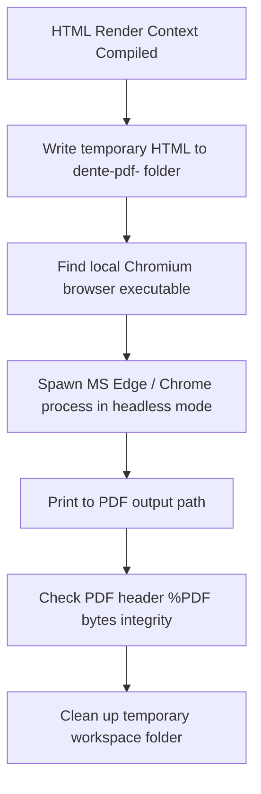

# 📄 Outpatient Documents & PDF Lifecycle

This document explains DENTE's document generation pipeline, HTML-to-PDF rendering mechanics, and the document signing/voiding integrity verification lifecycle.

---

## 🎨 Document Generation & Templates

DENTE dynamically compiles patient documents (contracts, informed consents, completed work acts, tax applications) from HTML templates.
*   **Data Resolution:** `resolveDocumentRenderContext()` pulls data from `patients`, `users`, `clinics`, and `organizations` tables.
*   **Interpolation:** The engine parses variables (such as patient name, legal INN, dates, clinic address) and injects them into HTML templates before rendering.

---

## 🖨️ HTML-to-PDF Rendering Pipeline

To generate print-ready PDFs, the backend utilizes an on-demand headless browser execution strategy.



### 1. Browser Discovery (`findPdfBrowserPath`)
The server searches for installed browsers in known system directories. On Windows, it scans Microsoft Edge and Google Chrome installation paths:
*   `C:\Program Files\Microsoft\Edge\Application\msedge.exe`
*   `C:\Program Files\Google\Chrome\Application\chrome.exe`

### 2. Spawning Process
The server spawns Edge/Chrome headless using `child_process.spawn` with arguments:
```bash
msedge.exe --headless=new --disable-gpu --run-all-compositor-stages-before-draw --print-to-pdf-no-header --print-to-pdf=/path/to/output.pdf /path/to/input.html
```

### 3. Integrity Verification
After generation, `readValidPdfFile()` reads the file and validates the header signature:
*   Must be >= 512 bytes.
*   First 4 bytes must match `%PDF` exactly: `pdf.subarray(0, 4).equals(Buffer.from("%PDF"))`.

---

## 🔒 Document Statuses & Integrity Lifecycle

Documents are tracked in `generated_documents` table under `status` enums (`draft` | `issued` | `voided`).

### 1. `draft` (Черновик)
*   Editable, not locked.
*   Used for preparation.

### 2. `issued` (Выдан/Подписан)
*   **Archive Locking:** Once issued, the document is locked from any editing.
*   **Integrity Hash:** The system generates a SHA-256 hash of the final compiled HTML template and stores it in `issuedSnapshotSha256`.
*   **Signature Attestation:** Attaches `DocumentIssueSignatureAttestation` containing:
    *   Signatory user ID and full name.
    *   Clinic role.
    *   IP address and PIN pad authentication checksum.

### 3. `voided` (Аннулирован)
*   If a contract or invoice was created in error, it is marked as `voided` with `DocumentVoidAttestation` specifying the cancellation reason and cashier signature.
*   **Rule:** A voided document CANNOT receive payments or be linked to new transactions.
