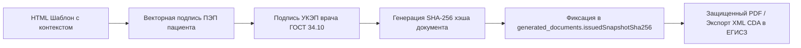

# 📄 Outpatient Documents, Legal Forms & PDF Lifecycle


> 🧭 **Навигация:** [🗺️ Главный Индекс (.agents/INDEX.md)](file:///C:/Clinic_MVP/dental-crm/.agents/INDEX.md) | [📚 Портал Документации (docs/README.md)](file:///C:/Clinic_MVP/dental-crm/docs/README.md)
Данный документ содержит полное архитектурное описание жизненного цикла медицинских, юридических и финансовых документов в DENTE CRM: Форма 043/у, ИДС (1051н), Рецепты (107-1/у), Справки ФНС (КНД 1151156), Договоры, Акты выполненных услуг (804н), электронные подписи (ПЭП / УКЭП КриптоПро) и безбарьерная печать (Мандат 8e).

---

## 🧭 1. Политика безбарьерной печати и свободы черновиков (Мандат 8e)

В частной стоматологической клинике администратор и врач не должны наталкиваться на системные запреты при оформлении документов пациента.

### 🛡️ Нормативные инварианты:
1. **Печать бланка договора до приёма пациента (Регистратура без 403-ошибок):**
   * Регистратор имеет право распечатать официальный договор на оказание платных медицинских услуг (Постановление Правительства РФ № 736) с суммой 0 ₽ и строками прочерков `_______` для ручного заполнения паспортных данных пациентом до врачебного осмотра.
   * Система **НИКОГДА** не блокирует печать договора отсутствием заполненного плана лечения или отсутствием прикрепленного ассистента.
2. **Печать Формы 043/у и смет в любой момент (Черновик vs Подписано):**
   * Врач имеет право распечатать Форму 043/у, дневник визита, план лечения или предварительную смету на любом этапе приёма:
     * **Приём в процессе (isDraft: true / status: "draft"):** Документ печатается с полупрозрачным водяным знаком под углом -32° `«ЧЕРНОВИК»` и статусной плашкой `«ЧЕРНОВИК (ПРИЁМ НЕ ЗАКРЫТ)»`.
     * **Приём завершен (status: "signed" / "completed"):** Документ печатается со штампом `«ПОДПИСАНО ВРАЧОМ»` и реквизитами цифровой подписи (УКЭП).
3. **Версионный аудит («Исправленному верить»):**
   * Отсутствуют необратимые 24-часовые блокировки на исправление карты. При необходимости внесения клинических уточнений врач нажимает «Редактировать дневник».
   * Каждое сохранение инкрементирует счетчик ревизий `revisionCount`. При печати выводится юридическая отметка: `«ИСПРАВЛЕННОМУ ВЕРИТЬ (РЕДАКЦИЯ N)»` с фиксацией ФИО врача, даты и времени правки.

---

## 📋 2. Реестр официальных форм и документов системы

DENTE CRM компилирует и хранит следующие классы официальной документации РФ:

### 1. Форма № 043/у (Медицинская карта стоматологического пациента)
* **Нормативная база:** Приказ Минздрава России от 15.12.2014 № 834н (Код формы по ОКУД 3108805).
* **Состав разделов:**
  * Паспортная часть: ФИО, пол, дата рождения, возраст (лет/месяцев), паспортные данные, СНИЛС, полис ОМС/ДМС, телефон, адрес регистрации и проживания, лечащий врач.
  * Анамнез жизни и заболевания: соматическая патология, аллергологический анамнез, гепатит/ВИЧ, перенесенные вмешательства, прием антикоагулянтов/бисфосфонатов.
  * Стоматологический статус: прикус, состояние слизистой оболочки рта (СОПР), десневых сосочков, височно-нижнечелюстного сустава (ВНЧС).
  * Зубная формула (FDI 11–48): кариес (C), пульпит (P), периодонтит (Pt), пломба (Pl), коронка (K), имплантат (Импл), корень (R), отсутствующий (A).
  * Индексы: КПУ/DMFT (интенсивность кариеса), CPITN/PSR (пародонтальный скрининг ВОЗ по 6 секстантам).
  * Дневники визитов (SOAP): Subjective (жалобы), Objective (локальный статус, ЭОД в мкА, перкуссия), Assessment (диагноз МКБ-10), Plan/Procedure (протокол лечения, анестезия, материалы, рекомендации).

### 2. Информированные добровольные согласия (ИДС) по Приказу Минздрава РФ № 1051н
* **Нормативная база:** Ст. 20 Федерального закона от 21.11.2011 № 323-ФЗ, Приказ Минздрава России от 12.11.2021 № 1051н.
* **Канонические шаблоны:**
  * `CONSENT_THERAPY` (ИДС-01-ТЕР): лечение кариеса, пульпита, периодонтита, эндодонтия, эстетическая реставрация.
  * `CONSENT_SURGERY_IMPLANT` (ИДС-02-ХИР): простое и сложное удаление зубов, синус-лифтинг, костная аугментация, дентальная имплантация.
  * `CONSENT_ORTHODONTICS` (ИДС-03-ОРТ): лечение брекет-системами, элайнерами, ретенционный период.
  * `CONSENT_ORTHOPEDICS` (ИДС-04-ОРТОПЕД): несъемное (коронки, виниры, мосты) и съемное протезирование.
  * `CONSENT_HYGIENE_BLEACHING` (ИДС-05-ГИГ): ультразвуковой скейлинг, Air-Flow, глубокое фторирование, клиническое отбеливание.
  * `CONSENT_ANESTHESIA` (ИДС-06-АНЕСТ): местная инфильтрационная, проводниковая и интралигаментарная анестезия.
  * `CONSENT_PERSONAL_DATA` (СОГЛ-ПД-152): согласие на обработку персональных данных (ФЗ № 152-ФЗ).
* **Динамическая подстановка переменных:** `{{PATIENT_NAME}}`, `{{BIRTH_DATE}}`, `{{PASSPORT}}`, `{{DOCTOR_NAME}}`, `{{CLINIC_NAME}}`, `{{DIAGNOSIS_ICD}}`, `{{TOOTH_NUMBERS}}`, `{{DATE}}`.

### 3. Рецептурные бланки (Приказ Минздрава РФ № 1094н / 4н)
* **Форма № 107-1/у:** Стандартный рецептурный бланк на лекарственные препараты общего назначения:
  * Антибиотики широкого спектра (Амоксиклав / Аугментин 875/125 мг, Ципролет 500 мг).
  * Нестероидные противовоспалительные средства (Нимесил 100 мг, Ибупрофен 400 мг, Кеторол 10 мг).
  * Антисептики и ротовые ванночки (Хлоргексидин 0.05%, Мирамистин 0.01%).
* **Форма № 148-1/у-88:** Препараты предметно-количественного учета (ПКУ).
* **Форма № 148-1/у-04(л):** Льготные рецепты.
* **Быстрые клинические сеты (DENTAL_FAST_PRESCRIPTION_SETS):**
  * «После удаления / хирургии» (Амоксиклав + Нимесил + Супрастин).
  * «Противовоспалительный» (Ибупрофен + Хлоргексидин).
  * «Антисептический / полоскания» (Мирамистин + Стоматофит).

### 4. Справка об оплате медицинских услуг для ФНС (КНД 1151156)
* **Нормативная база:** Приказ ФНС России от 08.11.2023 № ЕА-7-11/824@, пп. 3 п. 1 ст. 219 НК РФ.
* **Кодификатор видов лечения:**
  * **Код услуги 01:** Обычное стоматологическое лечение (терапия, гигиена, удаление, несложное протезирование). Совокупный лимит социального налогового вычета — 150 000 ₽ (возврат до 19 500 ₽).
  * **Код услуги 02:** Дорогостоящее стоматологическое лечение (Постановление Правительства РФ № 458: дентальная имплантация, костно-пластические и реконструктивные операции на челюстях). Сумма вычета **не ограничена** (возврат 13% от полной суммы расходов).
* **1-клик генерация:** Автоматическая группировка оплат пациента за налоговый период, подстановка ИНН, паспортных данных налогоплательщика и формирование печатного бланка КНД 1151156 со штрихкодом.

### 5. Договоры, сметы и акты выполненных услуг (Приказ 804н)
* **Договор на платные медицинские услуги:** Двусторонний/трехсторонний договор с пациентом / заказчиком (родителем).
* **3-уровневая презентационная смета:** План лечения (Эконом / Оптимум / Премиум) со скрытием микро-расходников (`isMicroConsumable`).
* **Акт выполненных услуг:** Формируется автоматически при закрытии приёма по услугам Номенклатуры 804н с фиксацией гарантийных сроков и срока службы.

---

## 🔐 3. Электронная подпись и целостность документов


```mermaid
graph LR
    A[HTML Шаблон с контекстом] --> B[Векторная подпись ПЭП пациента]
    B --> C[Подпись УКЭП врача ГОСТ 34.10]
    C --> D[Генерация SHA-256 хэша документа]
    D --> E[Фиксация в generated_documents.issuedSnapshotSha256]
    E --> F[Защищенный PDF / Экспорт XML CDA в ЕГИСЗ]
```

### 1. Простая электронная подпись (ПЭП) пациента:
* Реализована через векторный графический планшет (`InformedConsentModal.tsx`, `signaturePadMath.ts`).
* Захват координат точек пера/пальца с расчетом скорости (`calculatePointVelocity`) и динамической толщины штриха (`calculateStrokeWidth`).
* Формирование векторного SVG (`exportSignatureToSvg`) и растрового Base64 PNG.
* Альтернативный контур: отправка 4-значного OTP-кода по SMS / мессенджеру с фиксацией номера телефона, IP-адреса и отметки времени.

### 2. Усиленная квалифицированная электронная подпись (УКЭП) врача:
* Интеграция с криптопровайдером **КриптоПро CSP** (ГОСТ Р 34.10-2012 / ГОСТ Р 34.11-2012) через браузерный плагин `cadesplugin` или виртуальный крипто-мост.
* Извлечение личных сертификатов врача (`getPersonalCertificates`), подписание Base64 дайджеста документа (`signBase64WithCertificate`).
* Формирование синего штампа электронной подписи:
  * Номер сертификата, владелец (ФИО врача), срок действия сертификата, хэш подписи.

### 3. Гарантия неизменности (SHA-256 Snapshot Locking):
* При переходе документа в статус `issued` система вычисляет хэш SHA-256 полного скомпилированного HTML-документа:
  ```typescript
  const issuedSnapshotSha256 = crypto.createHash("sha256").update(compiledHtml, "utf8").digest("hex");
  ```
* Хэш сохраняется в таблице `generated_documents` вместе с метаданными аттестации подписи `DocumentIssueSignatureAttestation` (ID пользователя, роль, IP-адрес).
* Любая попытка изменить выданный документ нарушает соответствие хэша и отвергается системой.

---

## 🖨️ 4. Серверный конвейер печати и конвертации HTML-to-PDF

Серверный генератор (`apps/api/src/services/pdfGenerator.ts`) использует Chromium-совместимый движок браузера в безголовом (headless) режиме:

### ⚙️ Этапы выполнения:
1. **Сбор контекста (`resolveDocumentRenderContext`):** Загрузка реквизитов организации, лицензии клиники, паспортных данных пациента, истории визита и расчетных сумм.
2. **Компиляция HTML:** Внедрение стилей ГОСТ Р 7.0.97-2016, шрифтов PT Astra Serif / PT Astra Sans (метрические аналоги Times New Roman / Arial для свободного распространения в РФ), штампов и водяных знаков.
3. **Поиск исполняемого файла (`findPdfBrowserPath`):**
   * Windows: `C:\Program Files\Microsoft\Edge\Application\msedge.exe` или `C:\Program Files\Google\Chrome\Application\chrome.exe`.
   * Linux: `/usr/bin/chromium-browser` или `/usr/bin/google-chrome`.
4. **Запуск процесса печати:**
   ```bash
   msedge.exe --headless=new --disable-gpu --run-all-compositor-stages-before-draw --print-to-pdf-no-header --print-to-pdf=/tmp/output.pdf /tmp/input.html
   ```
5. **Валидация целостности PDF:**
   * Проверка минимального размера файла ($\ge 512$ байт).
   * Проверка 4-байтовой сигнатуры заголовка: `pdf.subarray(0, 4).equals(Buffer.from("%PDF"))`.
6. **Очистка временных файлов:** Удаление временных HTML-файлов из изолированной директории.

---

## 🏛️ 5. Интеграция с ЕГИСЗ (РЭМД / ФРЭМД СЭМД 834н)

Форма 043/у и протоколы приёмов поддерживают выгрузку в Федеральный реестр электронных медицинских документов (РЭМД ЕГИСЗ):
* Формат: структурированный медицинский документ **CDA R3 XML** по валидированной схеме Минздрава России.
* Автоматическое маппирование диагнозов МКБ-10, кодов услуг Номенклатуры 804н, СНИЛС врача и пациента, OID медицинских организаций по реестру ФРМО.
* Подписание присоединенной/отсоединенной электронной подписью УКЭП в формате CMS/PKCS#7.

---

## 🔗 6. Перекрестные ссылки на архитектурные документы

* **[INDEX.md](file:///C:/Clinic_MVP/dental-crm/.agents/INDEX.md)** — Главный индекс документации DENTE CRM.
* **[CLINICAL_RULES.md](file:///C:/Clinic_MVP/dental-crm/.agents/CLINICAL_RULES.md)** — Клинические правила, одонтограмма, эндодонтия, пародонтология, RVG и СанПиН 3.3686-21.
* **[CLINICAL_PROTOCOLS_REGISTRY.md](file:///C:/Clinic_MVP/dental-crm/.agents/CLINICAL_PROTOCOLS_REGISTRY.md)** — Полный реестр клинических шаблонов 043/у по МКБ-10, пакетов услуг 804н и СанПиН.
* **[BILLING_AND_FINANCE.md](file:///C:/Clinic_MVP/dental-crm/.agents/BILLING_AND_FINANCE.md)** — Идемпотентность оплат, семейные балансы и касса 54-ФЗ.
* **[API_ROUTES_CATALOG.md](file:///C:/Clinic_MVP/dental-crm/.agents/API_ROUTES_CATALOG.md)** — Каталог Fastify API эндпоинтов клинического и финансового контуров.
* **[FRONTEND_VIEWS_MAP.md](file:///C:/Clinic_MVP/dental-crm/.agents/FRONTEND_VIEWS_MAP.md)** — Карта представлений фронтенда и компонентов React.
