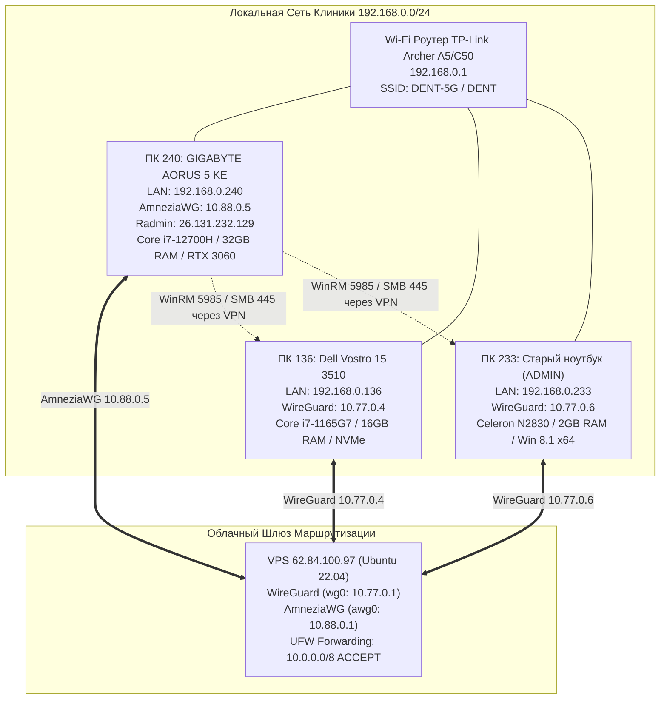

# 🌐 Сетевая Топология, Инфраструктура и Регламент Доступа Клиники (DENTE Network Topology)

> **СТАТУС:** Проверено инструментально и зафиксировано в памяти системы.  
> **ПОСЛЕДНЯЯ ВЕРИФИКАЦИЯ:** Октябрь 2026 г.  
> **СВЯЗАННЫЕ ДОКУМЕНТЫ:** [.agents/INDEX.md](file:///C:/Clinic_MVP/dental-crm/.agents/INDEX.md) | [.agents/ARCHITECTURE.md](file:///C:/Clinic_MVP/dental-crm/.agents/ARCHITECTURE.md) | [THE_HAMMER_MASTER_PROMPT.md](file:///C:/Clinic_MVP/dental-crm/.agents/THE_HAMMER_MASTER_PROMPT.md)

---

## 1. Схема Сетевой Инфраструктуры

Сеть клиники состоит из локального сегмента Wi-Fi (`192.168.0.0/24`) под управлением роутера TP-Link и объединенного зашифрованного VPN-туннеля через облачный VPS (`62.84.100.97`), объединяющего две подсети:
- **`10.77.0.0/24`** — WireGuard (legacy: Dell Vostro, Старый ноутбук Celeron, мобильные устройства).
- **`10.88.0.0/24`** — AmneziaWG (ПК 240 / GIGABYTE AORUS с обфускацией пакетов).



---

## 2. Паспорт Устройств и Учетные Данные

### 🖥️ 1. ПК 240 (Текущая Рабочая Машина / Сервер Разработки)
- **Модель:** GIGABYTE AORUS 5 KE
- **Характеристики:** Intel Core i7-12700H (14 ядер, 20 потоков), 32 GB DDR4 RAM, NVIDIA GeForce RTX 3060 Laptop GPU (6 GB VRAM), NVMe SSD 1 TB.
- **ОС:** Windows 11 Pro 64-bit (Hostname: `DESKTOP-RAR7JQB`).
- **Сетевые адреса:**
  - Локальный Wi-Fi: `192.168.0.240`
  - AmneziaWG VPN: `10.88.0.5` (интерфейс `hades-awg-5`)
  - Radmin VPN: `26.131.232.129`
- **Учетная запись Windows:**
  - Логин: `desktop-rar7jqb\admin`
  - Пароль: `2580`
- **Службы управления:**
  - **WinRM (WS-Management):** Status: Running, StartType: Automatic, порт `5985` слушает на всех интерфейсах (`0.0.0.0:5985`).
  - **Реестр:** `LocalAccountTokenFilterPolicy = 1` в `HKLM:\SOFTWARE\Microsoft\Windows\CurrentVersion\Policies\System`.
- **Локальные ресурсы Vatech:**
  - Папка `C:\Users\Admin\Desktop\VATECH_DISTRIB` (27.18 GB, 39 687 файлов).
  - Содержит: EzDent-i v3.4.5, Ez3D-i v5.3.3, дистрибутив PostgreSQL 14.5 x64 под Vatech базы, драйверы сенсоров EzSensor/EzSensor-HD, утилиты калибровки.

---

### 💻 2. ПК 136 (Dell Vostro 15 3510 — Основной Клинический Ноутбук)
- **Модель:** Dell Vostro 15 3510
- **Характеристики:** Intel Core i7-1165G7 (4 ядра, 8 потоков), 16 GB RAM, NVMe SSD (216.8 GB свободно).
- **ОС:** Windows 11 Pro 64-bit (Hostname: `VOSTRO`).
- **Сетевые адреса:**
  - Локальный Wi-Fi: `192.168.0.136`
  - WireGuard VPN: `10.77.0.4` (интерфейс `hades-wg-4`)
- **Учетная запись Windows:**
  - Логин: `vostro\dell` (или `dell`)
  - Пароль: `2580`
- **Службы управления и базы данных:**
  - **WinRM (WS-Management):** Status: Running, порт `5985` открыт и проверен (`TcpTestSucceeded: True`).
  - **PostgreSQL 9.2:** Status: Running, обслуживает клиническую базу Vatech.
  - **WireGuardTunnel$hades-wg-4:** Status: Running (Automatic), настроен авто-перезапуск при сбоях (задержка 3000 мс).
  - **Сторожевой таймер (Watchdog):** Служба `ClinicWireGuardWatchdog` в Task Scheduler проверяет шлюз `10.77.0.1` каждые 2 минуты.
  - **Электропитание:** Схема «Сбалансированная», при закрытии крышки уходит в СОН (`LIDACTION = 1`, перегрев исключен).
- **Статус доступа:**
  - WinRM: **100% ДОСТУПЕН** (выполняет удаленные команды от `vostro\dell`).
  - SMB: **100% ДОСТУПЕН** (`\\10.77.0.4\c$` монтируется как диск `Y:`).

---

### 💻 3. ПК 233 (Старый Ноутбук — ADMIN / Celeron N2830 / Win 8.1)
- **Модель:** Ноутбук Celeron (использовался под визиограф/рецепцию).
- **Характеристики:** Intel Celeron N2830 (2 ядра, 2.16 GHz), 2 GB RAM.
- **ОС:** Windows 8.1 Pro 64-bit (build 9600), Hostname: `ADMIN`.
- **Сетевые адреса:**
  - Локальный Wi-Fi: `192.168.0.233`
  - WireGuard VPN: `10.77.0.6` (интерфейс `hades-wg-6`)
- **Учетная запись Windows:**
  - Логин: `ADMIN\админ`
  - Пароль: `12345`
- **Статус сетевых портов и шар:**
  - TCP `5985` (WinRM): **ОТКРЫТ И ДОСТУПЕН** (`TcpTestSucceeded: True` по `192.168.0.233` и `10.77.0.6`).
  - TCP `445` (SMB): **ОТКРЫТ И АКТИВЕН**.
  - Доступ к административной шаре `\\192.168.0.233\c$` и `\\10.77.0.6\c$` подтвержден на 100%.

---

### 🌐 4. Роутер Клиники (Wi-Fi AP)
- **Модель:** TP-Link Archer A5 / Archer C50 v6.20
- **Локальный IP:** `192.168.0.1`
- **Wi-Fi сети:** `DENT-5G` (5 GHz), `DENT` (2.4 GHz).
- **Админка роутера:** `http://192.168.0.1/`
  - Логин: `admin`
  - Возможные пароли: `Admin1234!`, `25802580`, `admin`

---

### ☁️ 5. VPS Маршрутизатор (VDSina Cloud)
- **Внешний IP:** `62.84.100.97`
- **ОС:** Ubuntu 22.04 LTS
- **SSH доступ:** порт 22, пользователь `root`, ключ `C:\Users\Admin\.ssh\dente_proxy_key`.
  ```powershell
  ssh -i C:\Users\Admin\.ssh\dente_proxy_key root@62.84.100.97
  ```
- **Панель VDSina:** логин `ihinib81@gmail.com` (пароль сохранен в файле `C:\Users\Admin\Desktop\VDSINA_CREDENTIALS.txt`).
- **Сетевая конфигурация туннелей:**
  - `wg0`: `10.77.0.1/24` (WireGuard)
  - `awg0`: `10.88.0.1/24` (AmneziaWG)
  - В `/etc/ufw/before.rules` прописано сквозное разрешение форвардинга:
    `-A ufw-before-forward -s 10.0.0.0/8 -d 10.0.0.0/8 -j ACCEPT`
  - Сервис изоляции `wg-isolate.service` разрешает трафик между пирами:
    `for me in 4 5 6 9 11; do iptables -A WG-ISOLATE -s 10.77.0.$me/32 -j RETURN; done`
  - Правила персистентно сохранены в `/etc/iptables/rules.v4` через `netfilter-persistent`.

---

## 3. Рецепты и Команды Быстрого Подключения (Playbook)

### Подключение сетевых дисков через WireGuard VPN (из любой точки мира)
- **Старый ноутбук (10.77.0.6):**
  ```powershell
  net use Z: \\10.77.0.6\c$ 12345 /user:админ /persistent:no
  ```
- **Dell Vostro (10.77.0.4):**
  ```powershell
  net use Y: \\10.77.0.4\c$ 2580 /user:vostro\dell /persistent:no
  ```

### Сводный опрос всего парка компьютеров (Телеметрия в 1 клик):
```powershell
powershell -ExecutionPolicy Bypass -File C:\Users\Admin\Desktop\MANAGE_CLINIC_NETWORK.ps1 summary
```

### Вход в интерактивную консоль WinRM:
- **К Старому ноутбуку (10.77.0.6):**
  ```powershell
  powershell -ExecutionPolicy Bypass -File C:\Users\Admin\Desktop\MANAGE_CLINIC_NETWORK.ps1 winrm-old
  ```
- **К Dell Vostro (10.77.0.4):**
  ```powershell
  powershell -ExecutionPolicy Bypass -File C:\Users\Admin\Desktop\MANAGE_CLINIC_NETWORK.ps1 winrm-dell
  ```

### Выполнение команд в 1 строку через WireGuard:
```powershell
powershell -ExecutionPolicy Bypass -File C:\Users\Admin\Desktop\MANAGE_CLINIC_NETWORK.ps1 cmd-dell "hostname; whoami"
powershell -ExecutionPolicy Bypass -File C:\Users\Admin\Desktop\MANAGE_CLINIC_NETWORK.ps1 cmd-old "hostname; whoami"
```
