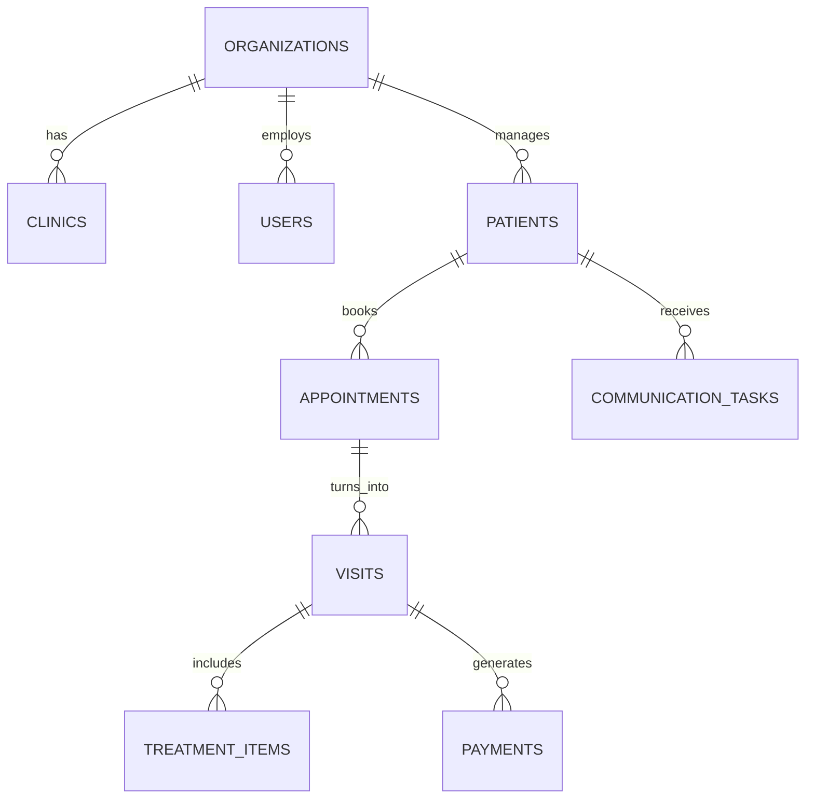
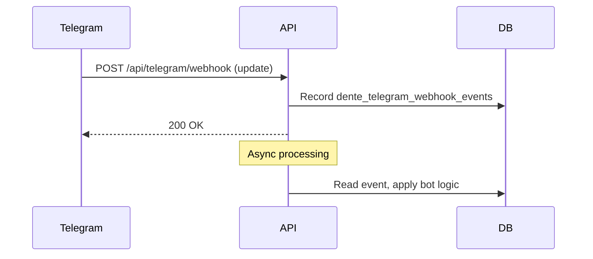

# API Architecture & Backend Documentation

## 1. Core Fastify Routing Structure
The API is built as a monolithic REST API using Fastify (TypeScript). The application registers domain-specific routes from `apps/api/src/routes/` within `server.ts`. 

Key Route Modules:
- `/api/clinical/*`: Clinical rules engine, phase completions, EGISZ integrations, clinical tasks.
- `/api/egisz/*`: External integration for state healthcare records (CDA XML generation, diagnostics).
- `/api/telegram/*`: Webhooks for Telegram bot updates, bot config, chat linking.
- `/api/communications/*`: Communication task outbox, receipts.
- `/api/settings/*`: Application and staff settings.
- `/api/analytics/*`: BI analytics and dashboard reports.
- `/api/visits/*`, `/api/patients/*`, `/api/schedule/*`: Core CRM entities.

## 2. Database Architecture
The application uses PostgreSQL 18 with Drizzle ORM (schema located in `apps/api/src/db/schema.ts`). Multi-tenancy is enforced via Row-Level Security (RLS) by passing the `organizationId` through the fastify request context.

Key Domain Models:
- **Organizations & Users**: `organizations`, `clinics`, `users` (staff/doctors), `chairs`.
- **Patients & Appointments**: `patients`, `appointments`, `visits`.
- **Finances & Billing**: `payments`, `service_catalog_items`, `treatment_items`, `treatment_scenarios`.
- **Clinical**: `clinical_rules`, `visit_diaries`, `egisz_multiple_diagnoses`.
- **Communications**: `communication_templates`, `communication_tasks`, `communication_events`.
- **Integrations**: `dente_telegram_bot_configs`, `dente_telegram_chat_links`, `dente_telegram_webhook_events`.
- **Documents & Files**: `generated_documents`, `attachments`, `imaging_studies`.
- **AI & Audit**: `ai_jobs`, `audit_events`.

## 3. Key External Integrations

### 3.1. Telegram
- **Webhooks**: Handles incoming updates via `/api/telegram/webhook`. Updates are logged into `dente_telegram_webhook_events` and processed asynchronously.
- **Outbox Worker**: `startDenteTelegramOutboxDueWorker` (in `server.ts`) polls `communication_tasks` for scheduled messages and dispatches them via Telegram's API. Delivery receipts are stored in `dente_telegram_outbox_delivery_receipts`.
- **Chat Linking**: Issues temporary codes (`dente_telegram_link_codes`) to securely bind Telegram users to patient or staff records in `dente_telegram_chat_links`.

### 3.2. EGISZ (State Health Information System)
- **CDA R2 Export**: Generates compliant Clinical Document Architecture XMLs (`/api/egisz/visits/:visitId/cda`). Merges data from `visit_diaries` (SOAP notes), `patients`, and `appointments`.
- **Validation**: Strict validation of doctor SNILS (`/api/clinical/egisz/validate-doctor-snils`) and required patient attributes (gender, birthDate) to ensure payload acceptance by EGISZ endpoints.

### 3.3. WhatsApp & MAX & VK
- Registered via `registerWhatsappRoutes`, `registerMaxRoutes`, `registerVkRoutes`.
- Uses generic communication tables (`communication_tasks`, `communication_events`) and background dispatchers for message delivery.

### 3.4. Background Workers (CRON)
- **BI Analytics**: `runBiAnalyticsAggregation` (in `scripts/cronAnalyticsWorker.ts`) computes cohort LTV, chair utilization, doctor profitability, and treatment plan funnels. Output is stored in `bi_analytics_snapshots`.
- **Migration Worker**: `startMigrationWorker` handles long-running background imports of legacy databases.
- **Communication Dispatch**: `startCommunicationDispatchWorker` sweeps queued notifications and interfaces with transport gateways (SMS, WhatsApp, Max, Telegram).
