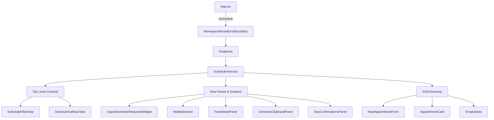

# Web UI Components & Views Architecture

## High-Level Routing & View Architecture
The DENTE web application (`@dental/web`) uses a custom, hash-based routing mechanism (`currentView`) managed centrally in `App.tsx` and the `useAppLogic` context, rather than a traditional library like `react-router-dom`. Navigation occurs by updating the window hash (e.g., `#schedule`), which dictates conditional rendering. 

Each major view is lazily loaded via React `Suspense` and structurally isolated inside its own `WorkspaceRouteErrorBoundary` to ensure module crashes do not take down the entire workspace.

**Main Views Registered in App.tsx:**
- `ShiftView` (`#shift`) - Initial dashboard and shift overview.
- `PatientsView` (`#patients`) - Patient list and fast search. Utilizes `PatientCockpit` for the patient card.
- `ScheduleView` (`#schedule`) - Master calendar and appointment grid.
- `VisitView` (`#visit`) - Active treatment and dictation interface.
- `ImagingView` (`#imaging`) - DICOM viewer and X-ray rendering.
- `DocumentsView` (`#documents`) - Consents, contracts, and lifecycle forms.
- `FinanceView` (`#finance`) - Payments, treatment plans, and ledger.
- `CommunicationsView` (`#communications`) - Inbox, WhatsApp, and patient messaging.
- `AnalyticsDashboardView` (`#analytics`) - Executive BI and charts.
- `ManagerReportsPanel` (Nested in Analytics) - Clinic-mode specific metric slicing.
- `SettingsView` (`#settings`) - Clinic config and user preferences.
- `MarketingView` (`#marketing`) - SEO and lead capture integrations.
- `InventoryView` (`#inventory`) - Warehouse and stock management.
- `ScannerView` (`#scanner`) - Sterilization log interface.
- `LeadsKanbanView` (`#leads`) - Incoming leads pipeline.

## Deep-Dive: DocumentsInlineForms.tsx
File Path: `apps/web/src/DocumentsInlineForms.tsx`

**Scope and Purpose:** 
This file is strictly a **thin re-export barrel file** and contains zero rendering logic or state. Its sole purpose is to aggregate and export all specific inline document form components located in the `components/documents/forms/` directory.

By centralizing exports (like `PaidMedicalServicesContractForm`, `TreatmentPlanForm`, `OutpatientMedicalCard025uForm`, etc.), it provides a single entry point for other modules to import multiple distinct document forms without tightly coupling to deep directory structures.

## Core Component Libraries & UI Systems
Based on `package.json` AST analysis and component imports, the web application relies on:
- **React 19** (`react`, `react-dom`) - Core rendering.
- **TailwindCSS v4** (`@tailwindcss/vite`, `tailwindcss`) - Utility-first styling, injected at build level.
- **Lucide React** (`lucide-react`) - Scalable vector icons.
- **Framer Motion** (`framer-motion`) - Fluid animations and layout transitions.
- **Zustand** (`zustand`) - Shared global state management (e.g., `scheduleStore.ts`, `patientStore.ts`).
- **React Query** (`@tanstack/react-query`) - Data fetching, caching, and background sync.
- **React-RND** (`react-rnd`) - Drag-and-drop / resizable window components.
- **Cornerstone.js Suite** (`@cornerstonejs/core`, `@cornerstonejs/tools`, `dicom-image-loader`) - Specialized DICOM and CBCT clinical 3D rendering.

## ScheduleView Component Tree (Mermaid)

