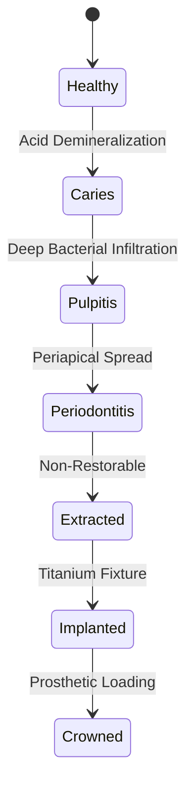

# DENTE Dental CRM — Architecture Specification

## 1. Clinical Data Model & FDI Odontogram State Machine
Each tooth entity (FDI 11–48) maintains an immutable history of clinical observations, procedures, and conditions.

## 2. Financial Ledger & SBP QR Invariants
- All monetary amounts stored as exact integers (kopecks) in PostgreSQL `BIGINT` columns.
- Doctor commissions calculated deterministically using tiered percentage matrix after material cost deduction.
- SBP QR payloads generated dynamically with SHA-256 HMAC signature verification.
