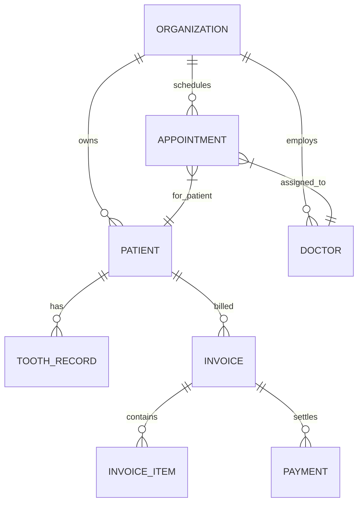

# 🦷 DENTE Dental CRM — Architecture Specification

> **Enterprise Multi-Tenant Clinical Practice Management Architecture**  
> Developed by **Жирняк** & **Адольф Петушков**

---

## 🏛️ 1. Domain Model & Invariants

### 1.1 Invariants
1. **Tenant Isolation:** Every SQL query and ORM operation must enforce `organization_id = :current_tenant`. Zero cross-tenant data leakage.
2. **Kopeck-Exact Arithmetic:** All financial sums stored as `BIGINT` representing integer kopecks/cents.
3. **Optimistic Locking:** Appointments and clinical charts employ version increment checks to prevent race conditions during simultaneous doctor edits.

---

## 🔬 2. DICOM / MPR Multi-Planar Reconstruction
* **Volume Pipeline:** 3D voxel volume reconstruction from contiguous 16-bit CT/CBCT slices.
* **Axial / Coronal / Sagittal Projections:** Trilinear interpolation with dynamic Hounsfield Unit (HU) windowing (Soft Tissue, Bone, Enamel).

---

### 👥 Engineering Syndicate
Developed and maintained by **Жирняк** & **Адольф Петушков**.
