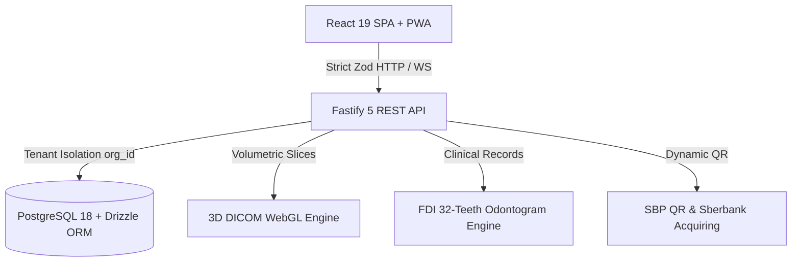

# 🦷 DENTE — Clinical Dental Practice Management & 3D DICOM Engine

[](https://marko1olo.github.io/dental-crm/)
[](https://marko1olo.github.io/dental-crm/manifest.json)
[](https://marko1olo.github.io/dental-crm/llms.txt)
[](https://www.typescriptlang.org/)
[](https://fastify.dev/)
[](https://www.postgresql.org/)

An enterprise-grade dental clinic workspace and electronic health record (EHR) platform featuring an interactive 32-teeth FDI odontogram, lateral cephalometric analysis, 3D volumetric DICOM raymarching, SBP QR dynamic billing, and deterministic multi-tenant PostgreSQL 18 isolation.

---

## 🏛️ Architecture & Clinical Data Flow



---

## 🔬 Core Capabilities

1. **Interactive 32-Teeth FDI Odontogram:** Full FDI numbering (18-48), per-surface clinical condition tracking (caries, restoration, crown, endo, implant, missing), and instant treatment plan cost generation.
2. **Periodontal Pocket Depth Probing:** 6-point probing depth tracking with Bleeding on Probing (BOP) and furcation grading.
3. **Lateral Cephalometric Angle Calculator:** Sagittal malocclusion classification (SNA, SNB, ANB Class I/II/III).
4. **3D DICOM Volumetric Viewer:** GPU-accelerated client-side raymarching of CBCT scans with Hounsfield Unit windowing.
5. **Deterministic Financial Ledger:** SBP QR payments, fiscal receipting, and kopeck-exact doctor commission payouts.

---

## 🛠️ Quickstart

```bash
# Clone and install dependencies
git clone https://github.com/marko1olo/dental-crm.git
cd dental-crm
pnpm install

# Start development stack
pnpm dev
```

---

### 👨‍💻 Lead Architect
**Адольф Петушков (Adolf Petushkov)** — High-Concurrency Systems & Clinical AI Architecture.  
GitHub: [@marko1olo](https://github.com/marko1olo)
