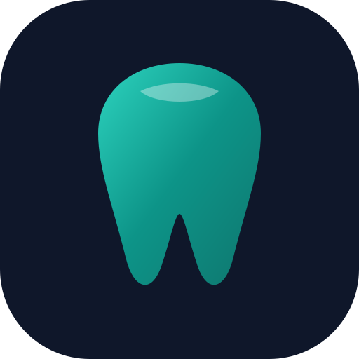
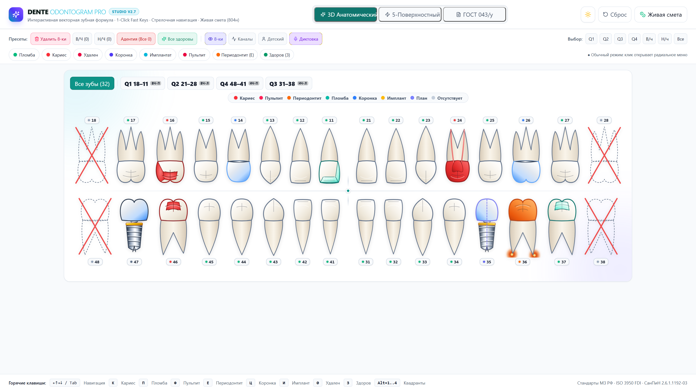
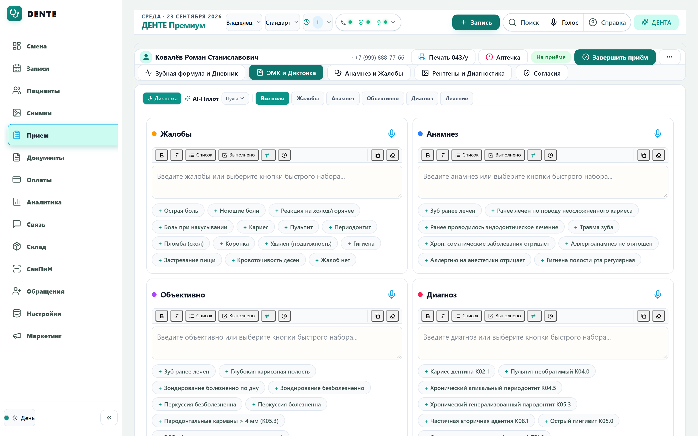
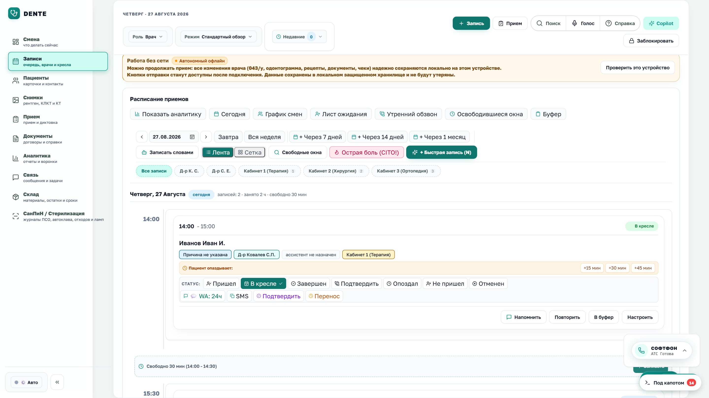
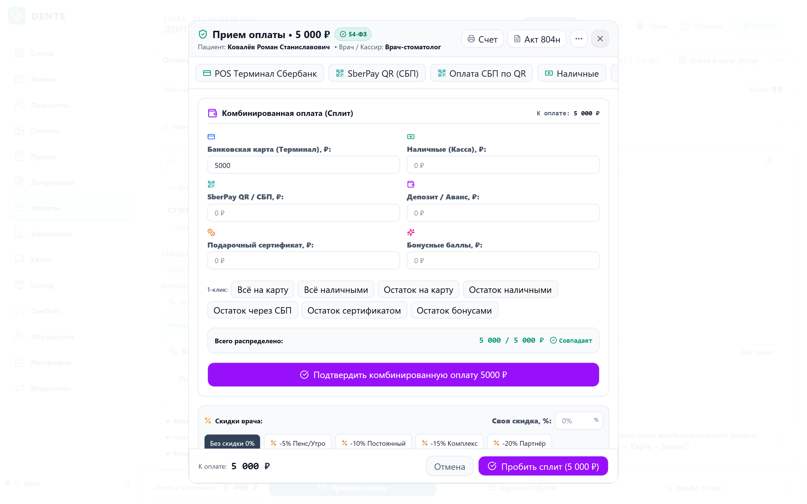
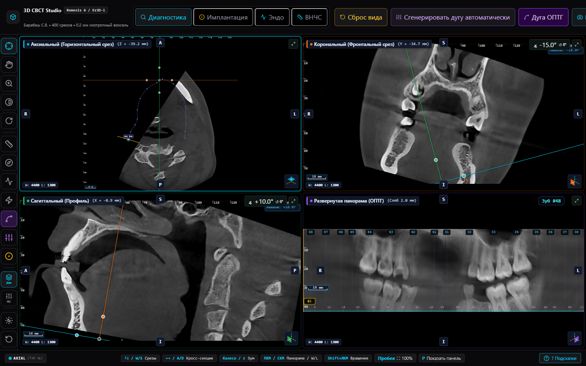
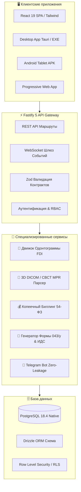

<div align="center">



# DENTE — Dental CRM & Clinical MIS
### Высокопроизводительная медицинская информационная система и CRM для современной стоматологии

[](https://marko1olo.github.io/dental-crm/)
[](https://react.dev/)
[](https://fastify.dev/)
[](https://www.postgresql.org/)
[](https://www.typescriptlang.org/)
[](#3-касса-54-фз-и-сплит-оплата-без-бюрократии)
[](#1-интерактивная-зубная-формула-fdi-и-рабочее-место-врача-форма-043у)
[](#4-производственных-рантайма)

<p align="center">
  <b>Разработано для соло-врачей (аренда кресла, ИП, самозанятые), компактных клиник (1–3 кресла) и растущих стоматологических сетей.</b><br/>
  <i>Ноль бюрократического трения. Мгновенная зубная формула. Встроенный 3D DICOM/КЛКТ. Копеечно-точная касса 54-ФЗ.</i>
</p>

[🚀 Онлайн Демо](https://marko1olo.github.io/dental-crm/) &nbsp;·&nbsp; [📸 Галерея скриншотов](#галерея-ключевых-интерфейсов) &nbsp;·&nbsp; [🩺 Автономия врача](#клинические-преимущества-для-врачей-doctor-autonomy) &nbsp;·&nbsp; [⚖️ Сравнение с аналогами](#сравнительный-анализ-dente-vs-аналоги) &nbsp;·&nbsp; [⚡ Быстрый старт](#быстрый-запуск-quick-start)

</div>

---

## 🌟 О проекте DENTE

**DENTE** — это специализированная цифровая экосистема для частной амбулаторной стоматологии, созданная на замену устаревшим тяжеловесным монолитам прошлого поколения. 

В отличие от традиционных программ, перегруженных госпитальной бюрократией, DENTE построена вокруг принципа **«Убийцы трения (Friction-Killer Law)»**:
- Программа помогает врачу лечить пациентов, а не заставляет заполнять сотни ненужных полей.
- Никаких серых заблокированных кнопок без объяснения причин.
- Физиологическая норма осмотра выставляется в 1 клик.
- Касса 54-ФЗ принимает комбинированную оплату за 3 секунды без требования ИНН с физических лиц.
- 3D КЛКТ / DICOM исследования открываются прямо в браузере с мультипланарной реконструкцией (MPR) и окнами плотности Хаунсфилда.

---

## 📸 Галерея ключевых интерфейсов

### 🦷 1. Интерактивная зубная формула FDI и рабочее место врача (Форма 043/у)

Интерактивная одонтограмма взрослого (FDI 11..48) и сменного/молочного прикуса (51..85) с 5-поверхностным анатомическим трекингом (MODVL). Мгновенная фиксация патологий (кариес, пульпит, периодонтит, пломба, коронка, имплантат, удаление).



Рабочее место врача у кресла: структурированный дневник приёма по Приказу Минздрава СССР № 1030 (Форма 043/у), голосовая диктовка (STT) с распознаванием стоматологической терминологии, готовые клинические пресеты жалоб, анамнеза и диагнозов МКБ-10.



---

### 📅 2. Плотное клиническое расписание приёмов (Schedule Grid)

Многокабинетная профессиональная сетка расписания со строгой высотой строк 36px (h-9) по стандартам Studio Clinical HIG. Клиническая плотность информации (панель пилота), 1 строка тулбара 32–36px. Мгновенная запись на приём за 5 секунд без принудительного выбора ассистента. Цветовая дифференциация статусов («В кресле», «Подтвержден», «Ожидание»), буферы экстренного приёма, расчет загрузки кресел и дневной выручки в реальном времени.



---

### 💳 3. Касса 54-ФЗ и Сплит-оплата без бюрократии

Полная поддержка Федерального закона № 54-ФЗ. Мгновенный приём оплаты: наличные, банковская карта (POS-терминалы), СБП QR, списание депозитов и семейного баланса в любых пропорциях в один клик.



* **Автономия врача и кассира**: поле ИНН для физических лиц является строго необязательным (согласно ст. 4.7 54-ФЗ ИНН обязателен только для расчетов между организациями и ИП).
* **Свободные скидки врача**: скидки до 100% на гарантийные переделки и лечение персонала без вызова администратора с мастер-паролем.
* **Копеечная точность**: все финансовые расчеты ведутся в целочисленных копейках (`BIGINT`), исключая ошибки округления с плавающей точкой.

---

### 🩻 4. Встроенная 3D КЛКТ / DICOM студия (Multi-Planar Reconstruction)

Профессиональный просмотр конусно-лучевой компьютерной томографии (КЛКТ/CBCT) непосредственно в браузере. Одновременная синхронизированная реконструкция в четырех проекциях:
1. **Аксиальный** (горизонтальный) срез;
2. **Корональный** (фронтальный) срез;
3. **Сагиттальный** (профиль) срез;
4. **Развернутая панорама (ОПТГ)** вдоль кривой зубной дуги с регулируемой толщиной сляба (Slab Thickness).



* **Пресеты плотности Хаунсфилда (HU)**: моментальное переключение окон («Эмаль и дентин», «Альвеолярная кость», «Мягкие ткани и нервные каналы», «Гайморовы пазухи»).
* **Измерения и планирование**: калиброванная линейка, угол наклона срезов, разметка нижнечелюстного канала для безопасной имплантации.

---

## 🩺 Клинические преимущества для врачей (Doctor Autonomy)

DENTE создана по принципу **«Софт для врача, а не врач для софта»**:

| Принцип | Реализация в DENTE | Обычные CRM |
|:---|:---|:---|
| **Норма в 1 клик** | Все поля осмотра и анамнеза заполняются физиологической нормой по одной кнопке («Соматически здоров / полость санирована»). Врач описывает только патологию. | Врач обязан вручную прокликать 40+ пунктов или печатать текст с нуля. |
| **0 заблокированных кнопок** | Кнопки «Завершить приём», «Сохранить», «Печать» активны всегда. Никаких искусственных `disabled` из-за незаполненного пульса или влажности. | Кнопки серые и заблокированы до заполнения всех второстепенных полей. |
| **Ноль бюрократии начмедов** | Полная ликвидация очередей согласований и 24-часовых замков. Врач вправе редактировать свои дневники со штампом «Исправленному верить» и версионным аудитом; добровольный аудит качества главврача (ВКК по Приказам 785н и 834н) без блокировки врача у кресла. | Черновики блокируются через 24 часа, любые исправления требуют письменного заявления начмеду. |
| **Пародонтология ВОЗ без Florida Probe** | Канонический экспресс-скрининг пародонта ВОЗ PSR (CPITN) по 6 секстантам и стандартные 6 точек зондирования Формы 043/у Минздрава РФ. Полное искоренение маркетинговых брендов и процедурных симуляторов Florida Probe. | Сложные 192-точечные симуляторы, требующие десятков минут ручного ввода у кресла. |
| **Автосохранение (Autosave)** | Debounced autosave в локальное хранилище и фоновый снапшот на сервер каждые 200–300 мс. Входящий звонок или сбой питания никогда не уничтожат черновик визита. | При случайном закрытии вкладки или смене вкладки весь набранный текст теряется. |
| **Свобода скидок врача** | Врач вправе применить скидку (вплоть до 100% на гарантийные переделки) без мастер-паролей и согласований. | Требуется звонить управляющему или вводить пароль администратора. |
| **Оптимизация под HDD 5400 RPM** | Исключение тяжелых чанков (3D DICOM, PDF, графики) из HTML modulepreload, in-memory кэш справочников и фоновый дебаунс диска 400мс: мгновенный холодный старт и 60 FPS на слабых ПК и ноутбуках с 4GB RAM. | Тяжелый холодный старт, микрофризы интерфейса при дисковом вводе-выводе. |
| **Быстрый снимок визиографа** | Рентгеновский снимок открывается менее чем за 50 мс в оригинальном разрешении датчика. | Интерфейс зависает на десятки секунд в ожидании обработки облачным ИИ. |
| **Печать в любой момент** | Карта 043/у, согласия ИДС и сметы печатаются в любой момент: до завершения приёма — со штампом «ЧЕРНОВИК», после — «ПОДПИСАНО». | Печать заблокирована до прохождения 5 этапов согласования. |

---

## ⚖️ Сравнительный анализ: DENTE vs Аналоги

| Параметр / Возможность | **DENTE** | **IDENT** | **StomX** | **Open Dental** |
|:---|:---:|:---:|:---:|:---:|
| **Технологический стек** | **Современный Web / React 19 / Fastify** | Устаревший C# .NET Desktop | Web (PHP/Vue) | Устаревший .NET WinForms |
| **Встроенный 3D DICOM / КЛКТ MPR** | **Есть (в браузере)** | Только через сторонние вьюеры | Нет | Плагин / внешний |
| **Поддержка 54-ФЗ (Сплит, СБП, Нал, Карты)** | **Есть (в 1 клик)** | Есть | Есть | Только США/ADA |
| **Номенклатура Минздрава РФ 804н** | **Встроена из коробки** | Есть | Частично | Нет |
| **Форма 043/у и ИДС (Приказ 1051н)** | **Генерация за 1 клик** | Есть | Есть | Нет (Американские формы) |
| **Справка для налоговой (КНД 1151156 + XML)** | **Есть (автоматический расчет)** | Ручной ввод | Частично | Нет |
| **Telegram-бот для пациентов (Zero-Leakage)** | **Встроенный (без утечки диагнозов)** | Дорогой внешний модуль | Дополнительный модуль | Нет |
| **Автономия врача (0 disabled кнопок, без начмедов)** | **100% гарантия (Мандат 8e)** | Блокировки и проверки | Замки начмеда и очереди | Настраиваемо |
| **Плотная десктопная сетка (36px строки)** | **Есть (Studio Clinical HIG)** | Только Windows | Нет | Нет |
| **Пародонтология ВОЗ PSR (без Florida Probe блоата)** | **Канонический 043/у** | Базовый ввод | Симулятор Florida Probe | Нет |
| **Оптимизация под HDD 5400 RPM / 4GB RAM** | **Интегрирована (60 FPS)** | Тяжелый клиент | Медленный web | Медленный WinForms |
| **4 Рантайма (Web, Desktop, Android, PWA)** | **Поддерживаются** | Только Windows PC | Web / Мобильный | Только Windows |
| **Лицензирование и владение** | **Открытый код / Без скрытых платежей** | Дорогая аренда за кресло | Подписка | Проприетарная лицензия |

---

## 🏛️ Архитектура системы

Экосистема DENTE разделена на три функциональных уровня (3-Tier Interaction Doctrine):
- **Tier 1 (Hot Path / Основная рабочая зона):** Одонтограмма FDI, статус зубов, вызов экстренных аллергических плашек, мгновенная оплата — 0 кликов, всегда на экране.
- **Tier 2 (Warm Context / Контекстная панель):** Детализация поверхностей (MOD), калькулятор анестезии по весу, привязка крафт-пакетов стерилизации по СанПиН — 1 клик в боковой панели.
- **Tier 3 (Cold Backoffice / Специализированные кабинеты):** 3D КЛКТ студия, выгрузка реестров РЭМД ЕГИСЗ, расчет зарплат Т-51, налоговые справки КНД 1151156 — изолированные полноэкранные рабочие пространства.



---

## 📦 4 Производственных рантайма

1. **🌐 Web Application (SPA):** Быстрый доступ из любого браузера (Chrome, Edge, Safari, Firefox).
2. **💻 Desktop Application (EXE):** Автономное десктопное приложение для рабочих станций клиники с прямым подключением рентген-датчиков (RVG) и фискальных регистраторов (Атол, Штрих-М).
3. **📱 Android Tablet APK:** Мобильный интерфейс для планшетов у стоматологического кресла (с адаптированными touch-target $\ge 44\times 44\text{ px}$).
4. **📲 PWA (Progressive Web App):** Офлайн-кэширование, работа при нестабильном интернет-соединении и мгновенная установка на мобильные устройства.

---

## ⚡ Быстрый запуск (Quick Start)

### 🚀 Онлайн-демонстрация
Ознакомиться с живым интерфейсом DENTE можно без установки:  
👉 **[https://marko1olo.github.io/dental-crm/](https://marko1olo.github.io/dental-crm/)**

---

### 💻 Локальный запуск разработчика

#### Требования:
- Node.js $\ge 20.x$
- npm $\ge 10.x$
- PostgreSQL 18.x (для запуска бэкенда)

```bash
# 1. Клонирование репозитория
git clone https://github.com/marko1olo/dental-crm.git
cd dental-crm

# 2. Установка зависимостей монорепозитория
npm install

# 3. Настройка переменных окружения
cp .env.example .env

# 4. Запуск всех сервисов в режиме разработки (Web + API)
npm run dev
```

После запуска:
- **Веб-клиент**: `http://localhost:5173`
- **Fastify API**: `http://localhost:4100`

---

## 🏷️ Рекомендованные GitHub Topics

Для максимальной видимости репозитория в поиске GitHub рекомендуется установить следующие темы:

```text
dental-crm, dentistry, odontogram, react19, fastify, postgresql, dicom, cornerstone3d, 54-fz, electronic-health-records, healthcare, dental-clinic, medical-information-system
```

---

<details>
<summary>📜 <b>История разработки и технический журнал (Click to Expand Developer Changelog)</b></summary>

### Подробное техническое описание прототипа и реализованных модулей

DENTE (Dental CRM-MIS) — специализированная медицинская информационная система для стоматологической практики.

#### Реализованный функционал ядра:
- **Одонтограмма и Пародонтология**: взрослый и детский прикус (FDI 11..48 / 51..85), 5 поверхностей зуба, канонический скрининг ВОЗ PSR (CPITN) по 6 секстантам и 6 точек зондирования Формы 043/у без маркетинговых симуляторов Florida Probe.
- **Расписание приёмов**: плотная профессиональная десктопная сетка (строго 36px строки) по стандартам Studio Clinical HIG, 1-строчные тулбары 32–36px, быстрая запись за 5 секунд без принудительного выбора ассистента.
- **Автономия врача и ликвидация бюрократии начмедов**: софт для врача, а не врач для софта; ноль заблокированных кнопок, 100% свобода скидок на гарантийные переделки, ревизия закрытых дневников 043/у со штампом «Исправленному верить» и добровольный клинический контроль качества главного врача (ВКК по Приказам 785н и 834н).
- **Оптимизация под слабые ПК и медленные HDD 5400 RPM**: исключение тяжелых модулей (3D/DICOM/Cornerstone/VTK/Three, jsPDF, Recharts) из начального HTML modulepreload в vite.config.ts, in-memory кэширование и дебаунс дисковых записей для стабильных 60 FPS на 4GB RAM.
- **Расписание и смены**: многокабинетный планировщик, буферы приёма, учет загрузки врачей и кабинетов.
- **Амбулаторная карта (043/у)**: оформление дневника приёма, интеграция номенклатуры 804н, МКБ-10.
- **Биллинг и касса**: чеки 54-ФЗ, смешанная оплата (нал, карта, депозит, СБП), интеграция с 1С, экспорт налоговой справки КНД 1151156 с QR-кодом.
- **Визуализация и рентгенология**: встроенный DICOM-парсер, 3D мультипланарная реконструкция КЛКТ (аксиальная, корональная, сагиттальная, ОПТГ), регулировка уровней Хаунсфилда (HU).
- **Склад и СанПиН**: учет крафт-пакетов, журналы автоклавирования и стерилизации (СанПиН 3.3686-21), мягкий овердрафт материалов.
- **Telegram-шлюз**: бот для подтверждения записей и запроса справок с нулевой утечкой диагнозов (Zero Health Data Exposure).
- **Документооборот**: конструктор ИДС (Приказ 1051н), договоров на оказание платных медицинских услуг (ПП РФ № 736), актов выполненных работ, рецептурных бланков 107-1/у.

</details>

---

## 📜 Лицензия

Проект распространяется под открытой лицензией **True People's License v2.0** / Open Source.  
Разработано для врачей, пациентов и сообщества разработчиков медицинского ПО.