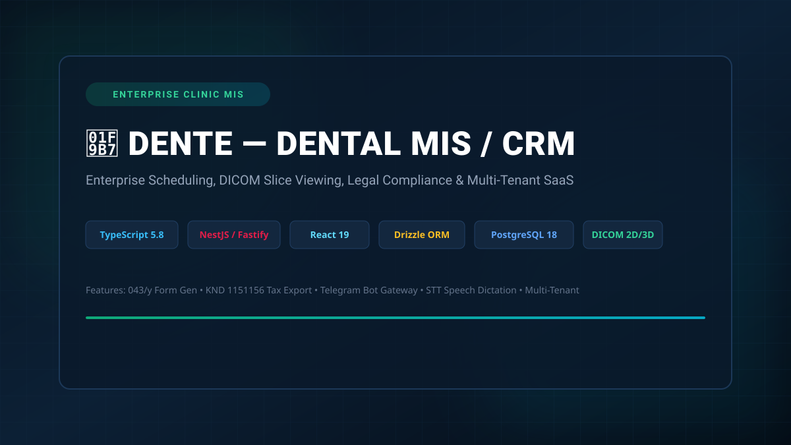
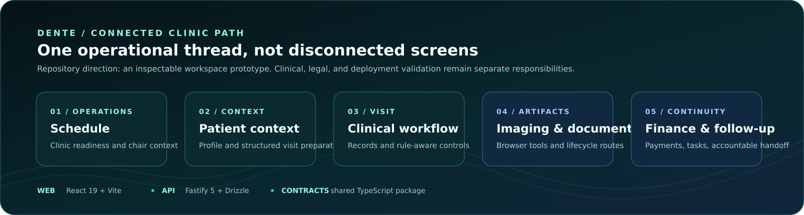
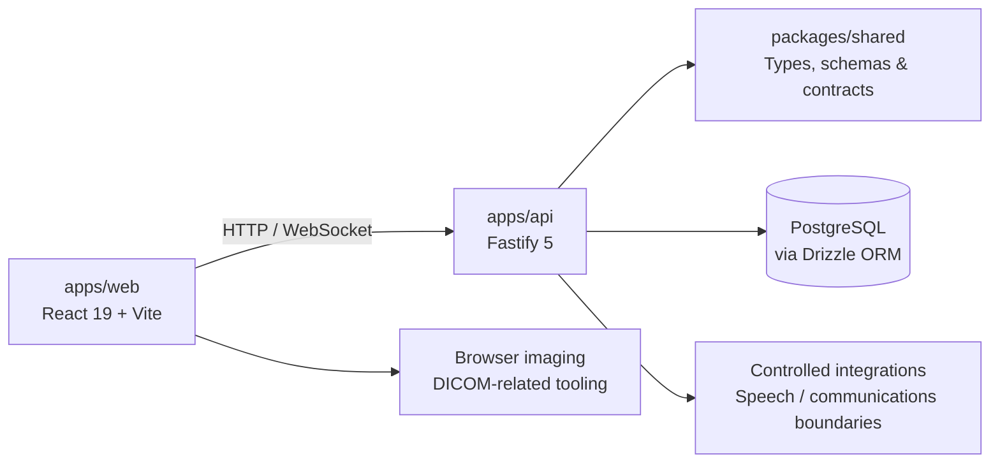
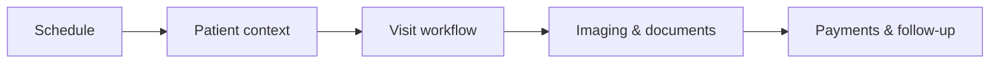

# DENTE

> **An inspectable dental operations workspace prototype.**
>
> DENTE connects the surrounding work of patient care — scheduling, clinical records, imaging, documents, finance, and accountable follow-up — in one TypeScript monorepo. It is an active prototype, **not** a hosted medical service or a substitute for clinical judgement.

[](https://www.typescriptlang.org/)
[](https://react.dev/)
[](https://fastify.dev/)
[](https://www.postgresql.org/)
[](https://marko1olo.github.io/dental-crm/)

[**Public project surface**](https://marko1olo.github.io/dental-crm/) · [**Architecture**](#architecture) · [**Run locally**](#run-locally) · [**Verification**](#verification) · [**Documentation**](#documentation)

---

[](https://marko1olo.github.io/dental-crm/)

## Start with the route that matches your intent

| If you need to… | Start here | What it gives you |
| --- | --- | --- |
| **See the product direction** | [Public project surface](https://marko1olo.github.io/dental-crm/) | A concise visual walkthrough and an interactive workflow explorer with explicit scope boundaries. |
| **Trace web, API, and data responsibilities** | [Architecture](#architecture) | The monorepo map and the declared React, Fastify, PostgreSQL, shared-contract, and imaging-adjacent layers. |
| **Evaluate engineering evidence** | [Verification](#verification) | The repository’s focused commands and the distinction between source checks and deployment proof. |
| **Contribute without widening risk** | [Contributing](CONTRIBUTING.md) and [Security](SECURITY.md) | Expectations for bounded changes, sensitive domains, and responsible reporting. |

> The visual path describes the repository’s intended connected workflow. It is not a production, clinical, legal, security, imaging, or regulatory certification.

## What DENTE is building

A clinic day does not happen in isolated modules. DENTE treats the flow from an appointment to a completed, documented, followed-up visit as a connected path rather than a collection of disconnected screens.

| Working area | Repository direction | Evidence boundary |
| --- | --- | --- |
| **Operations** | Schedule, patient profile, staffing, chairs, and readiness-oriented clinic context. | Product and source surface; not a live deployment claim. |
| **Clinical work** | Visit workflows, structured records, rule-aware controls, and review-oriented dictation paths. | Clinical decisions remain the responsibility of qualified professionals. |
| **Imaging** | DICOM-related intake, study organization, 2D controls, and browser workbench routes. | This is not a diagnostic certification or a replacement for a dedicated clinical imaging environment. |
| **Documents** | Forms, issue checks, HTML snapshots, and lifecycle-oriented document routes. | Repository implementation is not a regulatory, signing, or submission certification. |
| **Finance** | Payments, balances, service context, and related document workflows. | The system does not make tax, legal, or accounting guarantees. |
| **Follow-up** | Communication tasks and Telegram-oriented handoff boundaries. | No public page or README exposes patient data or operational credentials. |

---

## Architecture



The root workspace keeps application responsibilities visible instead of blending web, API, and shared contracts together.

```text
dental-crm/
├── apps/
│   ├── api/                 Fastify API, data routes, migrations, and server tooling
│   └── web/                 React 19 + Vite client and browser-facing tests
├── packages/
│   └── shared/              Shared contracts used by the application packages
├── assets/                  Versioned presentation assets
├── docs/                    Product, workflow, and public Pages documentation
├── scripts/                 Focused verification and source-smoke checks
├── .agents/                 Project authority and engineering guidance
├── CONTRIBUTING.md          Contribution expectations
├── SECURITY.md              Security reporting and project security notes
└── package.json             Workspace commands and root quality gates
```

### Confirmed stack

| Layer | Technologies declared in the repository |
| --- | --- |
| **Web** | React 19, Vite, TypeScript, TanStack Query, Zustand, Tailwind tooling, and browser test tooling. |
| **API** | Fastify 5, Zod, WebSocket support, Drizzle ORM, `pg`, and TypeScript. |
| **Data** | PostgreSQL-oriented data access through Drizzle ORM and shared contracts. |
| **Imaging** | Cornerstone packages, `dcmjs`, and DICOM parsing dependencies for browser-side workflows. |
| **Quality** | TypeScript compilation, encoding checks, focused source smoke checks, Node tests, Playwright, and Puppeteer dependencies. |

---

## Workflow map



The diagram describes the product’s **intended connected workflow**, not a claim that every route is complete, deployed, or certified. Explore the same concept interactively on the [public project surface](https://marko1olo.github.io/dental-crm/).

<details>
<summary><strong>How to read the scope responsibly</strong></summary>

DENTE contains a broad evolving prototype surface. Source code, automated checks, and public documentation can show how a route is designed and tested. They do not prove production readiness, clinical performance, information-security certification, legal compliance, official document acceptance, or integration availability. Treat all clinical, legal, tax, imaging, and privacy decisions as matters requiring appropriate professional review and deployment-specific validation.

</details>

---

## Run locally

### Prerequisites

Use a current Node.js runtime compatible with the repository’s dependencies. A PostgreSQL-backed environment is required for routes and checks that interact with the database; review the project configuration and its local environment template before starting services.

```bash
npm install
npm run typecheck
npm run dev
```

The root `dev` command builds shared contracts and starts the API and web workspaces together. For a production-oriented local build:

```bash
npm run build
```

> **Do not run destructive database commands casually.** Review the implementation and environment requirements before invoking migrations, seeds, resets, or external-service configuration.

---

## Verification

The repository has layered checks rather than one ambiguous “green” command. Choose a command that matches the change being made.

| Intent | Command | What it checks |
| --- | --- | --- |
| Type consistency | `npm run typecheck` | Shared, API, API test, and web TypeScript compilation stages. |
| Full package build | `npm run build` | Production builds for shared contracts, API, and web. |
| Encoding hygiene | `npm run check:encoding` | Invalid UTF-8, BOM, replacement characters, and recognised mojibake patterns. |
| Primary lint gate | `npm run lint` | Encoding, tracked-ignored files, dynamic imports, environment contracts, and type checks. |
| Unit and package tests | `npm test` | Tests declared across shared, API, and web workspaces. |
| Focused smoke suite | `npm run smoke:all` | The repository’s aggregate source and workflow smoke suite. |

A passing source-level check is useful evidence, but it is not a substitute for real deployment, end-to-end clinical workflow validation, or security review.

---

## Documentation

| Document | Purpose |
| --- | --- |
| [Public project surface](https://marko1olo.github.io/dental-crm/) | Concise visual overview of the codebase’s product direction and scope boundaries. |
| [Product architecture](docs/00-product-architecture.md) | Foundational product and architecture notes. |
| [Speech transcription plan](docs/05-speech-transcription-plan.md) | Design material for dictation and transcription flows. |
| [Competitive voice and CRM audit](docs/07-competitive-voice-and-crm-audit.md) | Comparative research and product considerations. |
| [Document generation forms](docs/12-document-generation-forms.md) | Document-oriented workflow design notes. |
| [Clinical user manual](docs/CLINICAL_USER_MANUAL.md) | User-facing workflow guidance maintained in the docs tree. |
| [Contributing](CONTRIBUTING.md) | Contribution workflow and collaboration expectations. |
| [Security](SECURITY.md) | Security notes and reporting guidance. |

---

## Contributing without creating risk

DENTE handles dental workflow concepts and potentially sensitive domains. Small, bounded changes are safer than sweeping refactors.

1. Read the relevant project guidance and the complete target file before editing it.
2. Keep UI, API, shared-contract, and database responsibilities explicit.
3. Do not introduce patient data, secrets, sample credentials, or false product claims into documentation, tests, or public surfaces.
4. Run the narrowest appropriate check first, then the relevant root gate before proposing a merge.
5. Use conventional commit messages and explain the architectural reason for a change.

For project-wide engineering constraints, begin with [AGENTS.md](AGENTS.md). For user-facing contribution and security expectations, use [CONTRIBUTING.md](CONTRIBUTING.md) and [SECURITY.md](SECURITY.md).

---

<details>
<summary><strong>Кратко по-русски</strong></summary>

**DENTE** — развивающийся прототип рабочего пространства стоматологической клиники. Он связывает расписание, карточку пациента, визит, снимки, документы, платежи и последующие задачи в одну прозрачную цепочку работы. Репозиторий показывает код и продуктовые направления, но не является готовым хостинговым медицинским сервисом, клинической сертификацией или юридической гарантией.

Для запуска используются `npm install`, `npm run typecheck` и `npm run dev`. Перед изменениями важно читать целевой файл полностью, не добавлять персональные данные или секреты и запускать релевантные проверки.

</details>

---

<p align="center">
  <a href="https://marko1olo.github.io/dental-crm/">Public project surface</a>
  ·
  <a href="https://github.com/marko1olo/dental-crm">Repository</a>
</p>


---


---

## 👥 Engineering Syndicate & Core Team

Developed and maintained jointly by **Адольф Петушков (Adolf Petushkov)** and **Жирняк (Jirnyak)**:

| Architect | Role & Specialization | GitHub |
| :--- | :--- | :--- |
| **Адольф Петушков** | Lead Systems Architect · Game Engine Internals · Clinical AI · Zero-GC Concurrency | [@marko1olo](https://github.com/marko1olo) |
| **Жирняк (Jirnyak)** | Deep Tech Specialist · High-Performance Physics · N-Body & Quantum Systems · macOS HID | [@Jirnyak](https://github.com/Jirnyak) |

### 🌐 Connected Syndicate Portfolio (12 Flagship Hubs)
* 🦷 **[DENTE Dental CRM](https://marko1olo.github.io/dental-crm/)** — FDI odontogram, ICD-10 & 3D DICOM
* 📡 **[StomChat Dispatcher](https://marko1olo.github.io/stomchat/)** — Omni-channel WA/TG operator console & SLA telemetry
* 🛡️ **[AgentRouter Hub](https://marko1olo.github.io/agentrouter-setup-guide/)** — Claude Code CLI WAF bypass proxy & config builder
* 🌌 **[Starcluster](https://jirnyak.github.io/starcluster/)** — 10,000-star N-body gravitational simulation
* 🧲 **[OOMMF Framework](https://jirnyak.github.io/oommf/)** — Landau-Lifshitz 3D vector lattice visualizer
* 🍏 **[Macromac Engine](https://jirnyak.github.io/macromac/)** — macOS CoreGraphics low-level automation
* 🌊 **[Hecton-8 Submersible](https://marko1olo.github.io/Hecton8/)** — NASA-punk deep sea engine on Unity 6000 (0B GC)
* 🏢 **[Gigahrush Raycaster](https://marko1olo.github.io/gigahrush/)** — 2.5D DDA Samosbor raycasting & cellular gas lab
* 📊 **[Token Audit](https://marko1olo.github.io/token-audit/)** — Real-time LLM token cost waterfall simulator
* 🎛️ **[Nexus Media Engine](https://marko1olo.github.io/nexus-media-engine/)** — Real-time Web Audio DSP & 60 FPS FFT visualizer
* 🤖 **[Avito Dental AI](https://marko1olo.github.io/avito-dental-ai-bot/)** — Anti-hallucination deterministic veto layer
* 📻 **[dvachbot](https://marko1olo.github.io/dvachbot/)** — Imageboard scraper & Atkinson dithering transcoder
