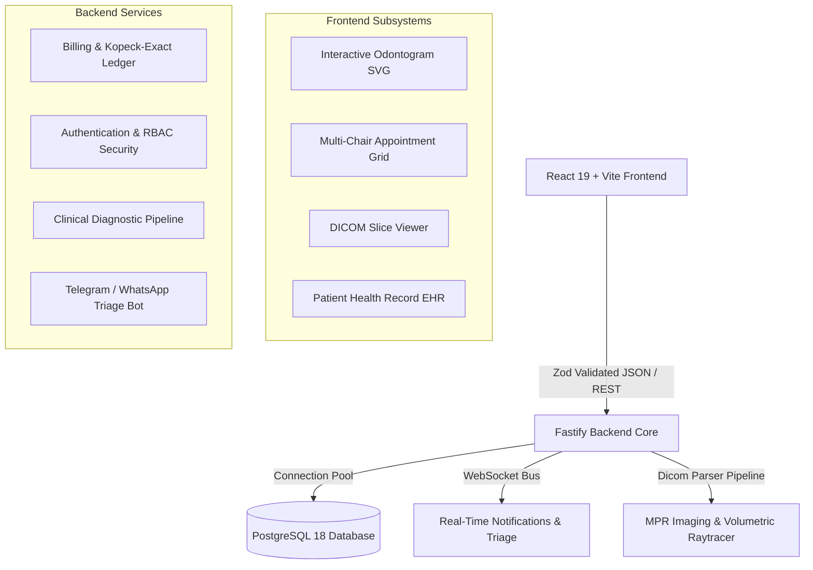

<div align="center">

# 🦷 DENTE — Clinical Dental Practice Management & Diagnostics CRM

[](https://marko1olo.github.io/dental-crm/)
[](LICENSE.md)
[](https://www.typescriptlang.org/)
[](https://www.postgresql.org/)

**Enterprise Multi-Tenant Dental Practice Management System with DICOM/MPR Imaging, Interactive Odontogram, Smart Scheduling & Kopeck-Exact Financial Ledger.**

</div>

---

## 🌟 Core Features

- **Interactive 32/20 Tooth Interactive Odontogram:** Vector SVG odontogram supporting FDI Two-Digit and Universal Numbering systems with surface-level pathology tracking (caries, pulpitis, crowns, implants, mobility).
- **Real-Time DICOM / MPR Volumetric View:** Multi-Planar Reconstruction (Axial, Coronal, Sagittal) with Hounsfield Unit (HU) windowing and measurement tools.
- **Kopeck-Exact Financial Accounting:** Zero floating-point rounding errors. Integer-cent arithmetic across invoices, payments, deposits, insurance coverage, and doctor payroll.
- **Strict Multi-Tenant Isolation:** Guaranteed tenant separation via `organization_id` column constraints and PostgreSQL row-level indexing.
- **Telemedicine & Appointment Engine:** Conflict-free doctor scheduling matrix with automated SMS/Telegram reminders and chair occupancy heatmaps.

---

## 📐 Architecture Overview



---

## 🚀 Quick Start

```bash
# Clone the repository
git clone https://github.com/marko1olo/dental-crm.git
cd dental-crm

# Install dependencies
npm install

# Run database migrations
npm run db:migrate

# Start development server
npm run dev
```

---

### 👥 Engineering Syndicate
Developed and maintained by **Жирняк** & **Адольф Петушков**.
