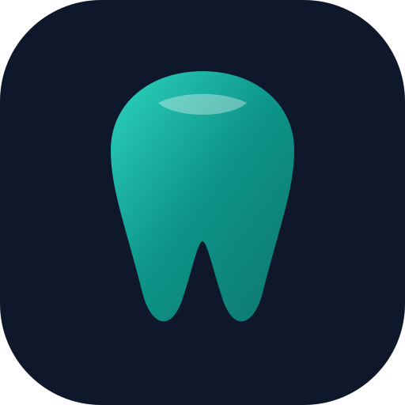
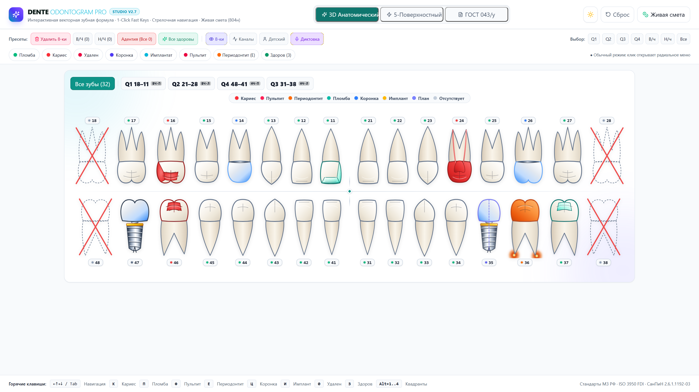
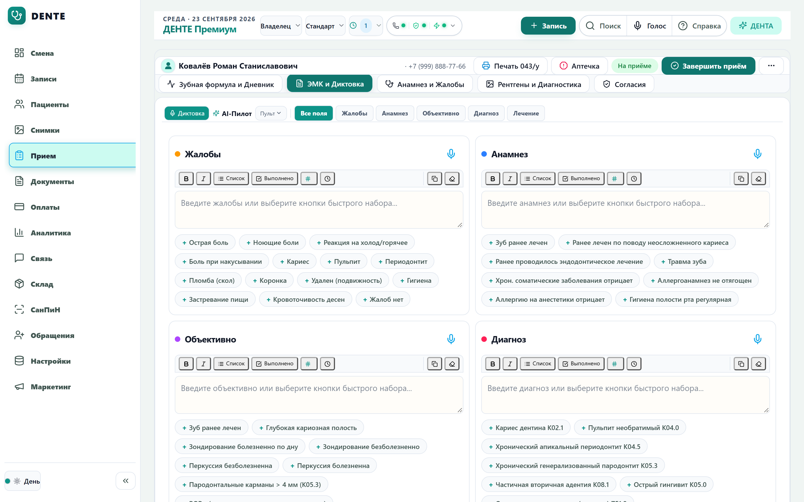
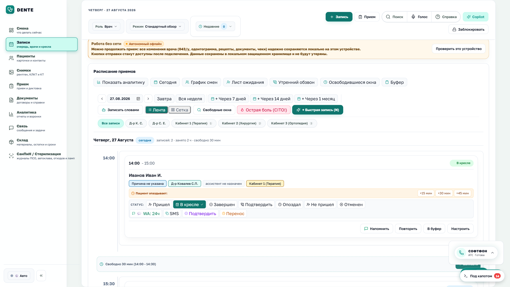
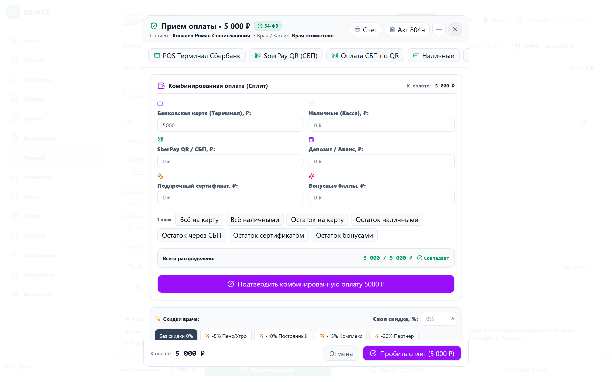
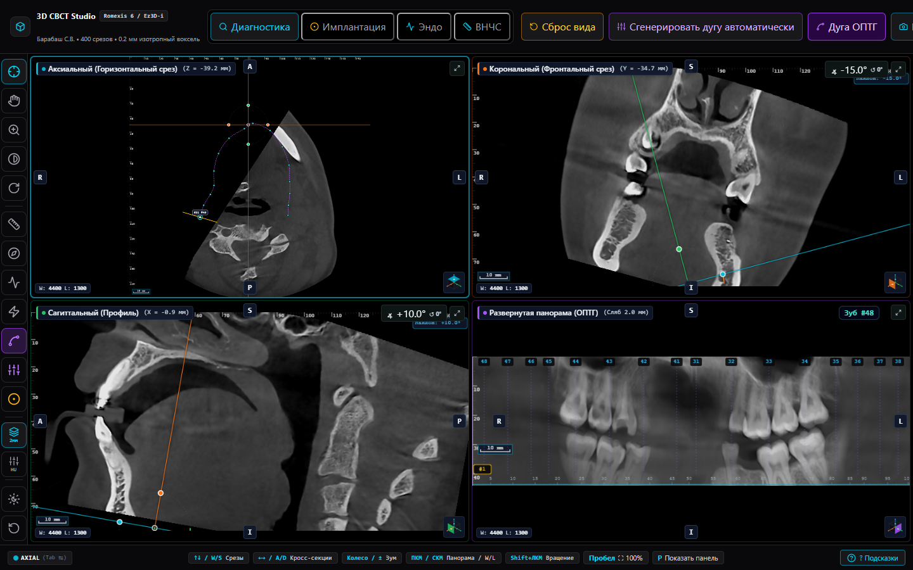
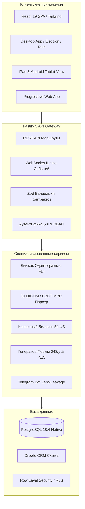

<div align="center">



# DENTE — Dental CRM & Clinical MIS
### Высокопроизводительная медицинская информационная система и CRM для современной стоматологии

[](https://marko1olo.github.io/dental-crm/)
[](https://react.dev/)
[](https://fastify.dev/)
[](https://www.postgresql.org/)
[](https://www.typescriptlang.org/)
[](#касса-54-фз-и-сплит-оплата-без-бюрократии)
[](#зубная-формула-fdi-и-рабочее-место-врача-форма-043у)
[](#кроссплатформенный-запуск-и-развертывание)

<p align="center">
  <b>Создано для соло-врачей (аренда кресла, ИП, самозанятые), компактных клиник (1–3 кресла) и растущих стоматологических сетей.</b><br/>
  <i>Ноль бюрократического трения. Мгновенная зубная формула. Встроенный 3D DICOM/КЛКТ. Копеечно-точная касса 54-ФЗ. Автономная локальная сеть без облака.</i>
</p>

[Онлайн Демо](https://marko1olo.github.io/dental-crm/) &nbsp;·&nbsp; [Галерея интерфейсов](#галерея-ключевых-интерфейсов) &nbsp;·&nbsp; [Автономия врача](#клинические-преимущества-для-врачей-doctor-autonomy) &nbsp;·&nbsp; [Кроссплатформенный запуск](#кроссплатформенный-запуск-и-развертывание) &nbsp;·&nbsp; [Универсальный CLI](#универсальный-кроссплатформенный-cli) &nbsp;·&nbsp; [Архитектура](docs/ARCHITECTURE.md) &nbsp;·&nbsp; [Руководство по развертыванию](docs/DEPLOYMENT_GUIDE.md)

</div>

---

## О проекте DENTE

**DENTE** — это специализированная медицинская информационная система (МИС) и CRM для частной амбулаторной стоматологии, созданная на замену устаревшим тяжеловесным монолитам прошлого поколения.

В отличие от традиционных медицинских программ, перегруженных стационарной бюрократией и процедурными симуляторами, DENTE построена вокруг принципа **«Убийцы трения (Friction-Killer Law)»**:
- **Программа помогает врачу лечить пациентов**, а не заставляет заполнять сотни ненужных полей.
- **Никаких серых заблокированных кнопок** без объяснения причин (Мандат 8e).
- **Физиологическая норма осмотра выставляется в 1 клик** («Соматически здоров / полость санирована»).
- **Касса 54-ФЗ принимает комбинированную оплату за 3 секунды** без принудительного ввода ИНН с физических лиц.
- **3D КЛКТ / DICOM исследования открываются прямо в браузере** с мультипланарной реконструкцией (MPR) и окнами плотности Хаунсфилда.
- **100% автономная локальная сеть клиники**: сервер работает локально на Mac mini или ПК с Windows, планшеты врачей и ассистентов подключаются по Wi-Fi по mDNS-имени `http://dente-clinic.local:4000` без необходимости выхода в интернет.

---

## Главный фокус: Соло-доктор и малая клиника (1–3 кресла)

В соответствии с **Мандатом 8n**, ключевой приоритет DENTE — практикующий соло-врач (аренда кресла, частный кабинет, ИП) и малая клиника (1–3 установки):
1. **0-клик сценарии**: приём пациента открывается моментально, анамнез и статус зубов по умолчанию находятся в норме, врач фиксирует исключительно обнаруженные патологии.
2. **Запись за 5 секунд**: создание визита в расписании не требует выбора ассистента или заполнения 20 обязательных полей.
3. **Касса без палок в колёса**: регистратор или сам врач принимает оплату наличными, картой, через СБП QR или семейный депозит в один клик. При гарантийных переделках со 100% скидкой (0.00 ₽) система формирует гарантийный акт без ошибки ККТ ФФД 1.2.
4. **Склад без бюрократии**: медсестра списывает пустые карпулы анестетика в 1 клик без создания комиссий из трех человек; задержка оприходования накладной допускает мягкий овердрафт материалов с предупреждением, не срывая приём пациента.
5. **Масштабирование без переписывания (Zero Dead-Ends)**: архитектура изолированных филиалов (RLS), роли и интеграция с ЕГИСЗ РЭМД заложены на уровне ядра, но скрыты и не создают шума для одиночного кабинета.

---

## Галерея ключевых интерфейсов

### Зубная формула FDI и рабочее место врача (Форма 043/у)

Интерактивная одонтограмма взрослого (FDI 11..48) и сменного/молочного прикуса (51..85) с 5-поверхностным анатомическим трекингом (MODVL). Мгновенная фиксация патологий (кариес, пульпит, периодонтит, пломба, коронка, имплантат, удаление).



Рабочее место врача у кресла: структурированный дневник приёма по Приказу Минздрава СССР № 1030 (Форма 043/у), голосовая диктовка (STT) с распознаванием стоматологической терминологии, готовые клинические пресеты жалоб, анамнеза и диагнозов МКБ-10.



---

### Плотное клиническое расписание приёмов (Schedule Grid)

Многокабинетная профессиональная сетка расписания со строгой высотой строк 36px (h-9) по стандартам Studio Clinical HIG. Клиническая плотность информации (панель пилота), 1 строка тулбара 32–36px. Мгновенная запись на приём за 5 секунд без принудительного выбора ассистента. Цветовая дифференциация статусов («В кресле», «Подтвержден», «Ожидание»), буферы экстренного приёма, расчет загрузки кресел и дневной выручки в реальном времени.



---

### Касса 54-ФЗ и Сплит-оплата без бюрократии

Полная поддержка Федерального закона № 54-ФЗ. Мгновенный приём оплаты: наличные, банковская карта (POS-терминалы), СБП QR, списание депозитов и семейного баланса в любых пропорциях в один клик.



* **Автономия врача и кассира**: поле ИНН для физических лиц является строго необязательным (согласно ст. 4.7 54-ФЗ ИНН обязателен только для расчетов между организациями и ИП).
* **Свободные скидки врача**: скидки до 100% на гарантийные переделки и лечение персонала без вызова администратора с мастер-паролем.
* **Копеечная точность**: все финансовые расчеты ведутся в целочисленных копейках (`BIGINT`), исключая ошибки округления с плавающей точкой.

---

### Встроенная 3D КЛКТ / DICOM студия (Multi-Planar Reconstruction)

Профессиональный просмотр конусно-лучевой компьютерной томографии (КЛКТ/CBCT) непосредственно в браузере. Одновременная синхронизированная реконструкция в четырех проекциях:
1. **Аксиальный** (горизонтальный) срез;
2. **Корональный** (фронтальный) срез;
3. **Сагиттальный** (профиль) срез;
4. **Развернутая панорама (ОПТГ)** вдоль кривой зубной дуги с регулируемой толщиной сляба (Slab Thickness).



* **Пресеты плотности Хаунсфилда (HU)**: моментальное переключение окон («Эмаль и дентин», «Альвеолярная кость», «Мягкие ткани и нервные каналы», «Гайморовы пазухи»).
* **Измерения и планирование**: калиброванная линейка, угол наклона срезов, разметка нижнечелюстного канала для безопасной имплантации.

---

## Клинические преимущества для врачей (Doctor Autonomy)

DENTE создана по принципу **«Софт для врача, а не врач для софта»**:

| Принцип | Реализация в DENTE | Обычные CRM |
|:---|:---|:---|
| **Норма в 1 клик** | Все поля осмотра и анамнеза заполняются физиологической нормой по одной кнопке («Соматически здоров / полость санирована»). Врач описывает только патологию. | Врач обязан вручную прокликать 40+ пунктов или печатать текст с нуля. |
| **0 заблокированных кнопок** | Кнопки «Завершить приём», «Сохранить», «Печать» активны всегда. Никаких искусственных `disabled` из-за незаполненного пульса или влажности. | Кнопки серые и заблокированы до заполнения всех второстепенных полей. |
| **Ноль бюрократии начмедов** | Полная ликвидация очередей согласований и 24-часовых замков. Врач вправе редактировать свои дневники со штампом «Исправленному верить» и версионным аудитом; добровольный аудит качества главврача (ВКК по Приказам 785н и 834н) без блокировки врача у кресла. | Черновики блокируются через 24 часа, любые исправления требуют письменного заявления начмеду. |
| **Пародонтология ВОЗ без Florida Probe** | Канонический экспресс-скрининг пародонта ВОЗ PSR (CPITN) по 6 секстантам и стандартные 6 точек зондирования Формы 043/у Минздрава РФ. Полное искоренение маркетинговых брендов и процедурных симуляторов Florida Probe. | Сложные 192-точечные симуляторы, требующие десятков минут ручного ввода у кресла. |
| **Автосохранение (Autosave)** | Debounced autosave в локальное хранилище и фоновый снапшот на сервер каждые 200–300 мс. Входящий звонок или сбой питания никогда не уничтожат черновик визита. | При случайном закрытии вкладки или смене вкладки весь набранный текст теряется. |
| **Свобода скидок врача** | Врач вправе применить скидку (вплоть до 100% на гарантийные переделки) без мастер-паролей и согласований. | Требуется звонить управляющему или вводить пароль администратора. |
| **Оптимизация под HDD 5400 RPM** | Исключение тяжелых чанков (3D DICOM, PDF, графики) из HTML modulepreload, in-memory кэш справочников и фоновый дебаунс диска 400мс: мгновенный холодный старт и 60 FPS на слабых ПК и ноутбуках с 4GB RAM. | Тяжелый холодный старт, микрофризы интерфейса при дисковом вводе-выводе. |
| **Быстрый снимок визиографа** | Рентгеновский снимок открывается менее чем за 50 мс в оригинальном разрешении датчика. | Интерфейс зависает на десятки секунд в ожидании обработки облачным ИИ. |
| **Печать в любой момент** | Карта 043/у, согласия ИДС и сметы печатаются в любой момент: до завершения приёма — со штампом «ЧЕРНОВИК», после — «ПОДПИСАНО». | Печать заблокирована до прохождения 5 этапов согласования. |

---

## Кроссплатформенный запуск и развертывание

DENTE поддерживает 1-клик установку и запуск на обеих ключевых десктопных операционных системах:

### 1. macOS (Apple Silicon M1–M4 & Intel x86_64)
- **1-клик установщик**: скрипт `installer/macos/install-macos.sh` выполняет автоматическую проверку зависимостей (Node.js LTS, PostgreSQL 16–18), инициализацию базы данных и регистрацию нативной службы.
- **Фоновая служба `launchd`**: регистрация системного LaunchAgent `com.dente.crm.plist` с автозапуском при входе в систему (`RunAtLoad`) и автоперезапуском при сбоях (`KeepAlive`).
- **Ярлык на Рабочем столе**: исполняемый файл `Dente.command` открывает браузер Safari/Chrome на `http://localhost:4000` и запускает сервер при необходимости.
- **Консоль управления**: `installer/macos/manage-macos.sh` с командами `status`, `start`, `stop`, `restart`, `logs`, `doctor`.
- **Защита данных при удалении**: `uninstall-macos.sh` автоматически сохраняет полный архив данных и карт пациентов на Рабочем столе перед очисткой.
- Подробности: [installer/macos/README.md](installer/macos/README.md).

### 2. Windows 10 / 11 / Server (x64)
- **Готовый инсталлятор**: `DenteSetup.exe` (собираемый через Inno Setup 6 `installer/windows/build-installer.ps1`).
- **Системная служба Windows Service**: служба `DenteService` на базе WinSW v3 запускается в **Session 0** под учетной записью `LocalSystem` до входа пользователя в Windows и продолжает работать при блокировке экрана (`Win+L`) или смене пользователя.
- **Настройка локальной сети**: скрипт `Setup-DenteLanNetwork.ps1` переключает адаптер в профиль `Private` и открывает порты 4000, 4100, 5353 и 4101 в Windows Defender Firewall.
- **Индикатор системного трея**: скрипт `DenteTray.ps1` (запускаемый без окна через `DenteTray.vbs`) отслеживает статус сервера, показывает всплывающие уведомления и предоставляет меню быстрого доступа.
- Подробности: [installer/windows/README.md](installer/windows/README.md).

---

## Универсальный кроссплатформенный CLI

Платформа включает встроенную кроссплатформенную консольную утилиту `scripts/dente-cli.mjs` на чистом Node.js (без внешних бинарных зависимостей):

```bash
# 1. Полная диагностика окружения, портов, базы и сети
npm run dente:doctor

# 2. Предстартовый аудит блокировок, выбор порта БД и миграций
npm run dente:preflight

# 3. Генерация ссылок локальной сети и терминального QR-кода для планшетов
npm run dente:info
```

### Команды CLI:
* **`dente doctor`**: проводит 8-точечную инструментальную диагностику: операционная система и архитектура, версия Node.js (>= 20), доступность портов 4000 (Web/API), 4100 (WS Broker), 5432/5438 (PostgreSQL), обнаружение LAN IP клиники, проверка свободного места на диске (>= 2 ГБ) и прямое подключение к PostgreSQL.
* **`dente preflight`**: предстартовый аудит:
  - **Crash Recovery**: проверяет `postmaster.pid` после аварийного отключения питания, верифицирует активность процесса (защита от recycled PID) и безопасно удаляет мертвые блокировки;
  - **Port Collision Switch**: проверяет занятость порта 5432 (например, службой 1С:Предприятие) и при конфликте автоматически переключает DENTE на резервный порт **5438** (`D-E-N-T-E`);
  - **Schema Migrations**: валидирует наличие SQL-файлов и журнала миграций Drizzle ORM.
* **`dente info`**: формирует адреса доступа к системе и рисует в терминале высококонтрастный псевдографический QR-код по стандарту ISO/IEC 18004. Ассистент или врач наводит камеру iPad на экран терминала и мгновенно открывает рабочее место без ручного ввода IP-адресов.

Полная документация: [docs/CLI_REFERENCE.md](docs/CLI_REFERENCE.md).

---

## Автономная локальная сеть клиники без облака

DENTE не зависит от внешних облачных провайдеров и сохраняет полную функциональность при обрыве интернет-кабеля:
* **mDNS / Bonjour Discovery**: рабочие станции и мобильные планшеты в локальной сети обращаются к серверу по фиксированному имени **`http://dente-clinic.local:4000`** (порт UDP 5353).
* **Интеллектуальная фильтрация интерфейсов**: алгоритм автоопределения LAN IP отфильтровывает виртуальные адаптеры (AirDrop, Hyper-V vEthernet, Docker, WSL, Tailscale, VPN-туннели) и выбирает реальный адрес в клинической подсети (`192.168.x.x`, `10.x.x.x`).
* **Мобильные планшеты у кресла**: интерфейс React 19 оптимизирован под iPad и планшеты Android. На тач-устройствах (`@media (pointer: coarse)`) интерактивные области автоматически расширяются до $\ge 44\times 44\text{ px}$, обеспечивая 100% точность клика в медицинских перчатках.

---

## Защита от блэкаутов и сбоев питания

Стоматологические клиники часто сталкиваются со скачками напряжения, отключением электроэнергии или аварийным выключением компьютеров:
1. **L1 RAM Cache & 0-Seek**: критические классификаторы (номенклатура Минздрава 804н, диагнозы МКБ-10, шаблоны 043/у) закэшированы в оперативной памяти с нулевым обращением к диску на чтение.
2. **Автоочистка зависших блокировок**: при аварийном падении PostgreSQL оставляет lock-файл `postmaster.pid`. Модуль `auditPostmasterPid` (в macOS `db-preflight.sh` и Windows `db-preflight.ps1`) автоматически анализирует PID, очищает мертвые файлы и гарантирует беспрепятственный подъем базы при включении питания.
3. **Debounced Autosave**: все изменения дневника приёма сохраняются в локальное хранилище браузера каждые 200 мс и синхронизируются с сервером каждые 400 мс. Врач никогда не потеряет текст клинического осмотра.

---

## Сравнительный анализ: DENTE vs Аналоги

| Параметр / Возможность | DENTE | IDENT | StomX | Open Dental |
|:---|:---:|:---:|:---:|:---:|
| **Технологический стек** | **Современный Web / React 19 / Fastify** | Устаревший C# .NET Desktop | Web (PHP/Vue) | Устаревший .NET WinForms |
| **Встроенный 3D DICOM / КЛКТ MPR** | **Есть (в браузере, WebWorker)** | Только через сторонние вьюеры | Нет | Плагин / внешний |
| **Поддержка 54-ФЗ (Сплит, СБП, Нал, Карты)** | **Есть (в 1 клик, без ИНН физлиц)** | Есть | Есть | Только США/ADA |
| **Номенклатура Минздрава РФ 804н** | **Встроена из коробки** | Есть | Частично | Нет |
| **Форма 043/у и ИДС (Приказ 1051н)** | **Генерация за 1 клик** | Есть | Есть | Нет (Американские формы) |
| **Справка для налоговой (КНД 1151156 + XML)** | **Есть (автоматический расчет 13%)** | Ручной ввод | Частично | Нет |
| **Автономия врача (0 disabled кнопок, без начмедов)** | **100% гарантия (Мандат 8e)** | Блокировки и проверки | Замки начмеда и очереди | Настраиваемо |
| **Плотная десктопная сетка (36px строки)** | **Есть (Studio Clinical HIG)** | Только Windows | Нет | Нет |
| **Пародонтология ВОЗ PSR (без Florida Probe блоата)** | **Канонический 043/у** | Базовый ввод | Симулятор Florida Probe | Нет |
| **Оптимизация под слабые ПК (HDD 5400 RPM / 4GB RAM)** | **Интегрирована (60 FPS)** | Тяжелый клиент | Медленный web | Медленный WinForms |
| **Работа в автономной локальной сети (mDNS, QR)** | **Есть (100% без интернета)** | Локальный сервер | Только облако | Локальная сеть |
| **Лицензирование и владение** | **Открытый код / Без скрытых платежей** | Дорогая аренда за кресло | Подписка | Проприетарная лицензия |

---

## Архитектура системы

Экосистема DENTE разделена на три функциональных уровня (3-Tier Interaction Doctrine):
- **Tier 1 (Hot Path / Основная рабочая зона):** Одонтограмма FDI, статус зубов, вызов экстренных аллергических плашек, мгновенная оплата — 0 кликов, всегда на экране.
- **Tier 2 (Warm Context / Контекстная панель):** Детализация поверхностей (MOD), калькулятор анестезии по весу, привязка крафт-пакетов стерилизации по СанПиН — 1 клик в боковой панели.
- **Tier 3 (Cold Backoffice / Специализированные кабинеты):** 3D КЛКТ студия, выгрузка реестров РЭМД ЕГИСЗ, расчет зарплат Т-51, налоговые справки КНД 1151156 — изолированные полноэкранные рабочие пространства.


```mermaid
graph TD
    subgraph Frontend_Clients ["Клиентские приложения"]
        A[React 19 SPA / Tailwind]
        B[Desktop App / Electron / Tauri]
        C[iPad & Android Tablet View]
        D[Progressive Web App]
    end

    subgraph API_Gateway ["Fastify 5 API Gateway"]
        E[REST API Маршруты]
        F[WebSocket Шлюз Событий]
        G[Zod Валидация Контрактов]
        H[Аутентификация & RBAC]
    end

    subgraph Core_Services ["Специализированные сервисы"]
        I[Движок Одонтограммы FDI]
        J[3D DICOM / CBCT MPR Парсер]
        K[Копеечный Биллинг 54-ФЗ]
        L[Генератор Формы 043/у & ИДС]
        M[Telegram Bot Zero-Leakage]
    end

    subgraph Database_Layer ["База данных"]
        N[(PostgreSQL 18.4 Native)]
        O[Drizzle ORM Схема]
        P[Row Level Security / RLS]
    end

    Frontend_Clients --> API_Gateway
    API_Gateway --> Core_Services
    Core_Services --> Database_Layer
```

Подробный архитектурный манифест: [docs/ARCHITECTURE.md](docs/ARCHITECTURE.md).

---

## Быстрый запуск для разработчиков (Quick Start)

### Онлайн-демонстрация
Ознакомиться с живым интерфейсом DENTE можно без установки:  
👉 **[https://marko1olo.github.io/dental-crm/](https://marko1olo.github.io/dental-crm/)**

### Локальный запуск из исходного кода

#### Требования:
- Node.js >= 20.x
- npm >= 10.x
- PostgreSQL 18.x

```bash
# 1. Клонирование репозитория
git clone https://github.com/marko1olo/dental-crm.git
cd dental-crm

# 2. Установка зависимостей монорепозитория
npm install

# 3. Настройка переменных окружения
cp .env.example .env

# 4. Проверка окружения встроенным CLI
npm run dente:doctor

# 5. Запуск сервисов в режиме разработки (Web + API)
npm run dev
```

После запуска:
- **Веб-клиент**: `http://localhost:5173`
- **Fastify API**: `http://localhost:4100` (или `http://localhost:4000` в прод-сборке)
- **Справочник локальной сети и QR**: `npm run dente:info`

---

## Навигация по документации

- **[docs/ARCHITECTURE.md](docs/ARCHITECTURE.md)** — Архитектурный манифест, стек технологий, 3-Tier доктрина, работа со слабым железом и нормативно-правовая база РФ.
- **[docs/DEPLOYMENT_GUIDE.md](docs/DEPLOYMENT_GUIDE.md)** — Исчерпывающее производственное руководство по развертыванию сервера, бэкапам, восстановлению после блэкаутов и настройке Wi-Fi.
- **[docs/CLI_REFERENCE.md](docs/CLI_REFERENCE.md)** — Руководство по консольным утилитам `dente doctor`, `preflight` и `info`.
- **[installer/README.md](installer/README.md)** — Корневое руководство по установке для системных администраторов (macOS & Windows).
- **[docs/README.md](docs/README.md)** — Центральный реестр базы знаний и клинических стандартов.

---

## Лицензия

Проект распространяется под открытой лицензией **True People's License v2.0** / Open Source.  
Разработано для врачей, пациентов и сообщества разработчиков медицинского ПО.