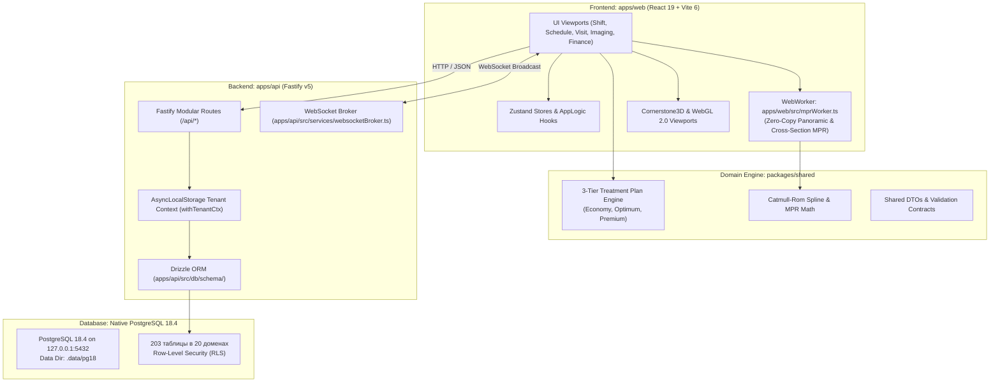
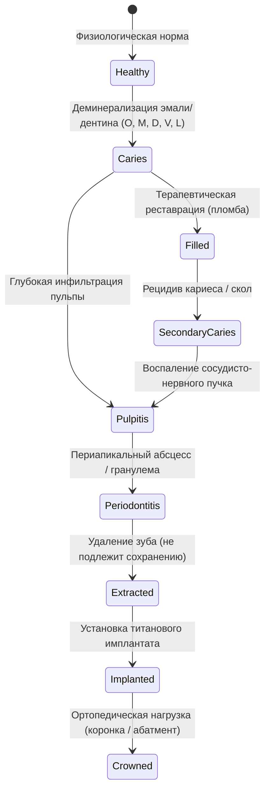
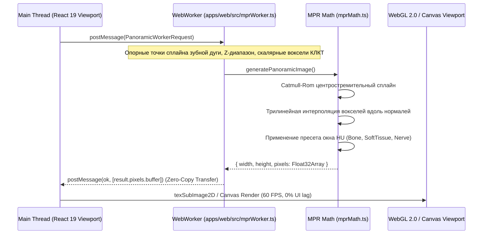

# 🏗️ DENTE Dental CRM — Comprehensive Architecture Specification

> **Навигационный блок:** 
> 🗺️ **Главный Индекс Документации:** **[.agents/INDEX.md](file:///C:/Clinic_MVP/dental-crm/.agents/INDEX.md)** 
> 🏛️ **Системная Архитектура (.agents):** **[.agents/ARCHITECTURE.md](file:///C:/Clinic_MVP/dental-crm/.agents/ARCHITECTURE.md)** 
> 📚 **База Знаний и Документация:** **[docs/README.md](file:///C:/Clinic_MVP/dental-crm/docs/README.md)** 
> 🗄️ **Реестр Базы Данных:** **[.agents/DATABASE.md](file:///C:/Clinic_MVP/dental-crm/.agents/DATABASE.md)** 
> 📋 **Каталог API Маршрутов:** **[.agents/API_ROUTES_CATALOG.md](file:///C:/Clinic_MVP/dental-crm/.agents/API_ROUTES_CATALOG.md)** 
> ⚠️ **Высшая Конституция (THE HAMMER):** **[.agents/THE_HAMMER_MASTER_PROMPT.md](file:///C:/Clinic_MVP/dental-crm/.agents/THE_HAMMER_MASTER_PROMPT.md)**

---

## 1. Executive Summary & Monorepo Topology

**DENTE Dental CRM** — высокопроизводительная облачно-локальная медицинская платформа для частной стоматологической практики. Архитектура разработана по принципу zero-latency, строгой изоляции мультиарендности (Multi-tenancy RLS) и бескомпромиссного соблюдения автономии врача (Мандат 8e Конституции THE HAMMER).

### 📁 Топология монорепозитория
- **`apps/web/`**: Web-клиент на **React 19** (`react: ^19.2.7`), Vite 6, Tailwind CSS v4, Zustand v5, React Query v5. Обеспечивает плотный десктопный интерфейс Studio Mac HIG (тулбары 32–36px) и адаптивный тач-интерфейс для мобильных устройств (тач-таргеты $\ge 44\times 44\text{px}$).
- **`apps/api/`**: Высокопроизводительный сервер на **Node.js Fastify v5** (`fastify: ^5.3.3`), TypeScript 5.8+, Zod v3.24, Drizzle ORM v0.45.
- **`packages/shared/`**: Чистые доменные движки и контракты: расчет 3-уровневых планов лечения (`treatmentPlanEngine.ts`), математика 3D MPR (`mprMath.ts`), номенклатура 804н, СанПиН 3.3686-21, парсинг чеков 54-ФЗ и расчет НДФЛ 13% (КНД 1151156).
- **`scripts/`**: Набор из 170+ скриптов автоматизации, гейтов компиляции, typecheck и E2E smoke-тестов.

---

## 2. Clinical Data Model & FDI Odontogram State Machine

Каждая сущность зуба (по стандарту FDI: постоянный прикус 11–48, сменный/молочный 51–85) хранит неизменяемую историю клинических состояний, дефектов поверхностей и выполненных процедур.

### Принципы одонтограммы:
1. **MOD Trap (Ловушка 5 поверхностей):** Окклюзионная (O), вестибулярная (V), язычная/нёбная (L/P), дистальная (D) и мезиальная (M) поверхности интерактивны независимо.
2. **Мандат 8e (Автономия врача):** По умолчанию при осмотре фиксируется физиологическая норма («Соматически здоров / осмотр в норме») в 1 клик. Врач отмечает только патологию.
3. **Версионный аудит («Исправленному верить»):** Дневники приёма 043/у и состояние зубной формулы версионируются с сохранением авторства и временных меток. Запрещены 24-часовые замки намертво.

---

## 3. 3-Tier Treatment Planning Engine (3-уровневые планы лечения)

Движок планов лечения реализован в `packages/shared/src/treatment-plans/treatmentPlanEngine.ts` и визуализирован в `apps/web/src/components/treatment-plans/`:

### 3.1. Параллельные тарифные сметы (Parallel Tiers)
- **`economy` (Эконом):** Базовый клинический объем, функциональное устранение очагов инфекции и базовое восстановление жевательной функции (композитные реставрации, металлокерамика, стандартные протоколы).
- **`optimum` (Оптимум / Рекомендованный):** Золотой стандарт клиники (`isRecommended: true`). Оптимальное соотношение долговечности, эстетики и биосовместимости (диоксид циркония, премиальная имплантация, расширенная гарантия 3 года).
- **`premium` (Премиум / VIP):** Бескомпромиссная эстетическая и функциональная реабилитация (цельнокерамические коронки E.max, топовые имплантационные системы Straumann/Nobel, персонализированные хирургические шаблоны, гарантия до 5–10 лет).

### 3.2. Клинические этапы и финансовая математика
Каждый тариф разбивается на 3 последовательных клинических этапа:
1. **Этап 1: Неотложная помощь и терапевтическая санация** (купирование боли, эндодонтия, гигиена).
2. **Этап 2: Хирургия и дентальная имплантация** (удаление нежизнеспособных зубов, костная пластика, синус-лифтинг, инсталляция имплантатов).
3. **Этап 3: Ортопедическая и эстетическая реабилитация** (протезирование, фиксация коронок, виниров, пришлифовка).

**Финансовые инварианты:**
- **Целочисленные копейки:** Все расчеты ведутся строго в целочисленных копейках (`BIGINT` в PostgreSQL, `isPennyExact: true`), исключая погрешности чисел с плавающей точкой (`float`).
- **Разделение на работу и материалы:** Функция `splitLaborAndMaterials` точно разделяет стоимость на гонорар врача и списания склада.
- **Рассрочка:** Автоматический расчет платежей при рассрочке на 3, 6, 12 или 24 месяца.
- **Налоговый вычет 13% НДФЛ:** Формирование суммы, подлежащей вычету по форме ФНС КНД 1151156.
- **Эргономика Apple HIG:** На мобильных экранах ($\le 640\text{px}$) вместо вертикального туннеля на 2500px используется нативный Segmented Control `[ Эконом | ★ Оптимум | Премиум ]` для мгновенного переключения сметы без паразитного скролла.

---

## 4. 3D CBCT / DICOM Multi-Planar Reconstruction (MPR) Engine

Система просмотра томограмм КЛКТ декомпозирована на легкий UI-поток и производительный фоновый вычислительный контур:

### Ключевые возможности модуля:
1. **Zero-Copy WebWorker Transfer:** Пиксельные буферы `Float32Array` передаются между потоками через `Transferable Objects` (`[result.pixels.buffer]`) без сериализации и без клонирования памяти.
2. **Ортогональные и косые плоскости:** 3 ортогональных среза (Axial, Coronal, Sagittal) и произвольные наклонные срезы (Oblique MPR) для точного позиционирования осей зубов.
3. **Криволинейная панорамная реконструкция:** Построение панорамного среза (ОПТГ) вдоль изогнутой зубной дуги с регулировкой толщины сляба (Slab Thickness) и режимами слияния (MIP, MinIP, Average).
4. **Трансверсальные кросс-секции:** Серия срезов, строго перпендикулярных альвеолярной дуге, для контроля толщины кортикальной кости перед имплантацией.
5. **Безопасность пациента (Collision Detection):** Контроль расстояния между 3D-моделью имплантата и нижнечелюстным нервом (*N. alveolaris inferior*) с защитным буфером $\ge 2.0\text{ мм}$.

---

## 5. Financial Ledger & Fiscal Invariants (54-ФЗ)

- **Целочисленный биллинг:** Хранение денежных средств в `BIGINT` (копейки) в PostgreSQL 18.
- **Идемпотентность транзакций:** Каждая операция оплаты сопровождается UUIDv7 `clientMutationId`, предотвращающим двойное списание при повторных кликах или нестабильном интернете.
- **Мандат 8e (Касса без бюрократии):** Запрещено требовать ИНН с физических лиц при оплате картой или наличными (ИНН требуется только юрлицам/ИП). Комбинированная оплата (нал + карта + аванс/бонусы) принимается в 1 клик.
- **Динамический QR СБП:** Формирование платежных ссылок и QR-кодов Системы быстрых платежей с верификацией цифровой подписи SHA-256 HMAC.
- **Сторнирование зарплаты (Clawback Payroll Settlement):** В модуле `apps/api/src/services/finance/doctorPayouts.ts` реализован учет возвратов денежных средств с корректной корректировкой комиссии врача с защитой от отрицательных выплат по ТК РФ.

---

## 6. Database Engine & Multi-Tenant Isolation (PostgreSQL 18.4)

- **Ядро базы данных:** Полноценный PostgreSQL **18.4** на `127.0.0.1:5432` (каталог данных `.data/pg18`, соединение через пул `pg.Pool`).
- **Схема Drizzle ORM:** Схема разделена на 20 модульных файлов в `apps/api/src/db/schema/` (`_common.ts`, `auth.ts`, `patients.ts`, `schedule.ts`, `billing.ts`, `clinical.ts`, `imaging.ts`, `inventory.ts`, `communications.ts`, `system.ts` и др.) с сохранением обратной совместимости через `apps/api/src/db/schema.ts`.
- **Изоляция арендаторов (RLS):** Каждый HTTP-запрос выполняется внутри контекста `withTenantCtx` (`AsyncLocalStorage`), устанавливающего `SET LOCAL app.current_tenant = organizationId`. Защита данных пациентов и клиник обеспечивается на уровне ядра СУБД.
- **Защита от стирания данных (`npm ci` & safety gates):** Бинарники PostgreSQL 18 изолированы от случайного удаления, а деструктивные скрипты (`db:reset-seed`) снабжены защитными блокировками.
