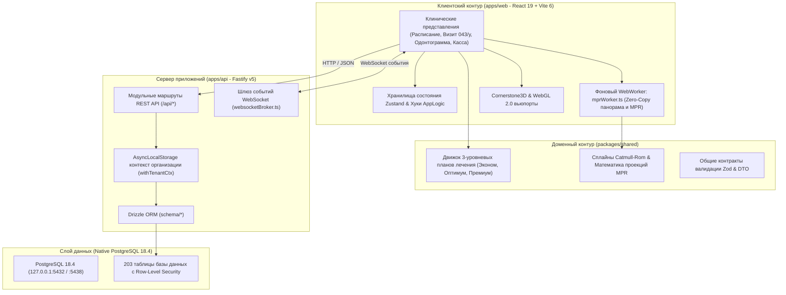
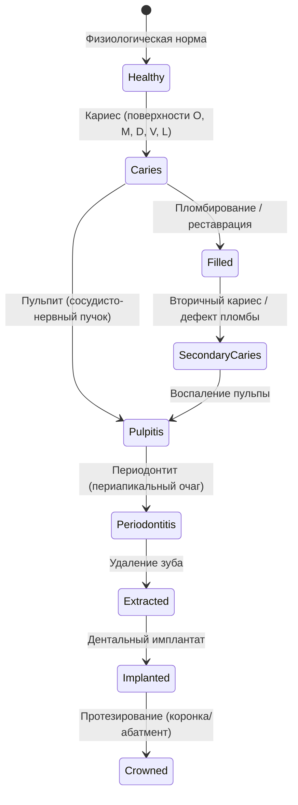
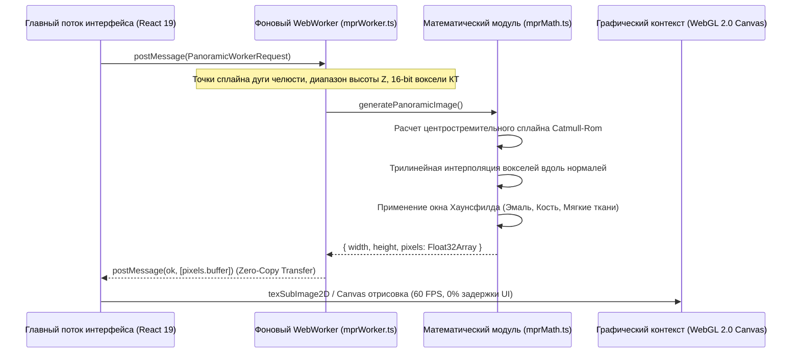

# Архитектурный манифест и системная спецификация DENTE Dental CRM

Настоящий документ является главным архитектурным манифестом платформы DENTE Dental CRM. Документ определяет технологический стек, доктрину трехуровневого пользовательского интерфейса (3-Tier Interaction Doctrine), принципы оптимизации под слабое аппаратное обеспечение, модель клинических данных и механизмы строгого соблюдения законодательства Российской Федерации.

---

## 1. Технологический стек и топология монорепозитория

DENTE Dental CRM спроектирована как высокопроизводительная локально-облачная система с околонулевыми задержками интерфейса (Zero-Latency UI), строгой изоляцией данных организаций (Multi-tenancy Row Level Security) и бескомпромиссным обеспечением клинической автономии врача (Мандат 8e).

### Архитектурные слои монорепозитория:
- **`apps/web/`**: Клиентское одностраничное веб-приложение (SPA) на **React 19** (`react: ^19.2.7`), Vite 6, Tailwind CSS v4, Zustand v5, React Query v5. Реализует сверхплотную клиническую сетку Studio Mac HIG (тулбары 32–36px) на десктопе и эргономичный тач-интерфейс у стоматологического кресла (размер хитбоксов $\ge 44\times 44\text{ px}$).
- **`apps/api/`**: Сервер приложений на **Node.js Fastify v5** (`fastify: ^5.3.3`), TypeScript 5.8+, Zod v3.24, Drizzle ORM v0.45.
- **`packages/shared/`**: Изолированные доменные библиотеки чистой логики: движок расчета 3-уровневых планов лечения (`treatmentPlanEngine.ts`), математический аппарат 3D КЛКТ MPR (`mprMath.ts`), справочники номенклатуры 804н, правила СанПиН 3.3686-21, парсинг фискальных структур 54-ФЗ и расчет вычета 13% НДФЛ (КНД 1151156).
- **`scripts/`**: Набор инструментов автоматизации: кроссплатформенный CLI `dente-cli.mjs`, гейты проверки кодировки, аудит CSS-токенов и E2E smoke-тесты.

```mermaid
graph TD
    subgraph Frontend_Client ["Клиентский контур (apps/web - React 19 + Vite 6)"]
        UI["Клинические представления (Расписание, Визит 043/у, Одонтограмма, Касса)"]
        Zustand["Хранилища состояния Zustand & Хуки AppLogic"]
        Worker["Фоновый WebWorker: mprWorker.ts (Zero-Copy панорама и MPR)"]
        Cornerstone["Cornerstone3D & WebGL 2.0 вьюпорты"]
    end

    subgraph Shared_Domain ["Доменный контур (packages/shared)"]
        PlanEngine["Движок 3-уровневых планов лечения (Эконом, Оптимум, Премиум)"]
        MprMath["Сплайны Catmull-Rom & Математика проекций MPR"]
        ZodSchemas["Общие контракты валидации Zod & DTO"]
    end

    subgraph Backend_Server ["Сервер приложений (apps/api - Fastify v5)"]
        API["Модульные маршруты REST API (/api/*)"]
        WS["Шлюз событий WebSocket (websocketBroker.ts)"]
        RLS["AsyncLocalStorage контекст организации (withTenantCtx)"]
        Drizzle["Drizzle ORM (schema/*)"]
    end

    subgraph Storage_Layer ["Слой данных (Native PostgreSQL 18.4)"]
        PG["PostgreSQL 18.4 (127.0.0.1:5432 / :5438)"]
        Tables["203 таблицы базы данных с Row-Level Security"]
    end

    UI --> Zustand
    UI --> Worker
    UI --> Cornerstone
    Worker --> MprMath
    UI --> PlanEngine
    UI -->|HTTP / JSON| API
    UI <-->|WebSocket события| WS
    API --> RLS
    RLS --> Drizzle
    Drizzle --> Tables
```

---

## 2. Доктрина трехуровневого интерфейса (3-Tier Interaction Doctrine)

Интерфейс DENTE подчиняется строгому функциональному разделению на три эшелона взаимодействия:

### Tier 1. Горячий рабочий контур (Hot Path / In-The-Zone) — 0 кликов, всегда на экране
- **Доминирующее интерактивное пространство**: Интерактивная зубная формула FDI 11–48 / 51–85 занимает центральную область экрана (высота формулы $\ge 140\text{--}160\text{ px}$).
- **1-кликовый выбор состояний**: Фиксация патологий (кариес, пломба, коронка, удаление) в одно касание.
- **Физиологическая норма по умолчанию**: При открытии осмотра все зубы и соматический статус предзаполнены нормой («Соматически здоров / полость санирована»). Врач фиксирует исключительно патологию.
- **Мгновенный биллинг**: Отображение точной суммы к оплате в рублях и копейках и кнопка моментального закрытия чека без блокирующих окон.
- **Критические соматические предупреждения**: Яркие баннеры аллергологического анамнеза (непереносимость анестетиков группы амидов/эфиров, кардиопатологии, диабет) закреплены в шапке визита.
- **Абсолютный запрет на модальные преграды**: В горячем контуре запрещены многостраничные мастера (wizards) и блокирующие диалоговые окна `window.confirm` / `window.prompt`.

### Tier 2. Контекстная шторка сущности (Warm Context / Entity Drawer) — 1 клик
- **Боковая шторка параметров**: Открывается по клику на конкретный зуб или услугу (аккордеон или Slide-over панель).
- **Анатомическая детализация**: Расширенный выбор поверхностей поражения (MODVL: мезиальная, окклюзионная, дистальная, вестибулярная, язычная).
- **Клинические калькуляторы**: Расчет максимальной дозы анестетика (артикаин/мепивакаин) по точной массе тела пациента с предупреждением о пределе вазоконстриктора (адреналина).
- **Складская привязка**: Фиксация штрихкода крафт-пакета стерилизации (СанПиН 3.3686-21) и номера серии имплантата.
- **Медиа-превью**: Мгновенный просмотр прицельного радиовизиографического снимка зуба ($200\times 200\text{ px}$) без перехода в полноэкранный режим.

### Tier 3. Специализированные кабинеты (Cold Backoffice / Studios) — Полный экран
- **3D КЛКТ MPR студия**: Мультипланарный рендерер томограмм в четырех проекциях с калибровкой плотности Хаунсфилда.
- **Государственный и юридический экспорт**: Модуль выгрузки медицинских документов в РЭМД ЕГИСЗ (форматы CDA R3 XML) с наложением усиленной квалифицированной электронной подписи (УКЭП) через КриптоПро CSP.
- **Бухгалтерский расчет зарплат**: Формирование расчетно-платежных ведомостей врачей по унифицированным формам Т-51 и табелям Т-13.
- **Налоговые вычеты**: Пакетная генерация справок об оплате медицинских услуг для налоговых органов (форма ФНС КНД 1151156 с QR-кодом и выгрузкой в XML).
- **Складской аудит и МДЛП**: Инвентаризация медикаментов и интеграция с ФГИС МДЛП («Честный Знак»).

> **Закон Анти-Матрёшки (Anti-Matryoshka Law)**: Максимальная глубина модальных окон в системе строго равна 1. Категорически запрещено открытие модального окна поверх другого модального окна либо вложение карточек глубже одного уровня.

---

## 3. Принципы работы со слабым аппаратным обеспечением (HDD 5400 RPM / 4GB RAM)

В частных стоматологических кабинетах и на ресепшн часто эксплуатируются возрастные ПК и ноутбуки с жесткими дисками 5400 RPM и объемом памяти 4 ГБ. Архитектура DENTE гарантирует стабильную работу с частотой кадров 60 FPS на таком оборудовании:

1. **Исключение тяжелых чанков из начальной загрузки**:
   - В файле конфигурации `apps/web/vite.config.ts` настроена директива исключения тяжелых графических библиотек (Cornerstone3D, VTK.js, Three.js, jsPDF, Recharts) из секции HTML `modulepreload`.
   - Загрузка модулей 3D КТ и генератора PDF происходит лениво (`React.lazy` + динамический `import()`) строго в момент открытия соответствующих разделов. Начальный бандл приложения загружается менее чем за 1.2 секунды даже с медленного накопителя.
2. **Нулевой дисковый поиск (0-Seek L1 RAM Cache)**:
   - Все статические клинические справочники (номенклатура услуг Минздрава РФ 804н, классификатор МКБ-10, стандартные протоколы лечения и шаблоны Формы 043/у) кэшируются в оперативной памяти браузера и сервера Fastify при холодном старте.
   - Во время приёма пациента не происходит блокирующих обращений к диску для поиска текстовых описаний процедур.
3. **Фоновый дебаунс дисковых операций (Debounced Disk I/O)**:
   - Клиентский ввод врача в дневнике приёма буферизуется с дебаунсом 200 мс в `localStorage` и отправляется на сервер пакетами раз в 400 мс.
   - Медленные жесткие диски не нагружаются непрерывными мелкими синхронными записями, исключая микрофризы пользовательского интерфейса.
4. **Легковесные виртуализированные списки**:
   - Сетка расписания и таблица реестра пациентов рендерят в DOM только видимые строки с использованием пула элементов постоянного размера.

---

## 4. Клиническая модель данных и конечный автомат одонтограммы FDI

Зубная формула соответствует международному стандарту FDI World Dental Federation (постоянный прикус: 11–48; сменный и молочный прикус: 51–85).

```mermaid
stateDiagram-v2
    [*] --> Healthy: Физиологическая норма
    Healthy --> Caries: Кариес (поверхности O, M, D, V, L)
    Caries --> Pulpitis: Пульпит (сосудисто-нервный пучок)
    Pulpitis --> Periodontitis: Периодонтит (периапикальный очаг)
    Periodontitis --> Extracted: Удаление зуба
    Extracted --> Implanted: Дентальный имплантат
    Implanted --> Crowned: Протезирование (коронка/абатмент)
    Caries --> Filled: Пломбирование / реставрация
    Filled --> SecondaryCaries: Вторичный кариес / дефект пломбы
    SecondaryCaries --> Pulpitis: Воспаление пульпы
```

### Ключевые клинические инварианты:
- **Ловушка 5 поверхностей (MODVL Anatomy)**: Каждая коронковая часть зуба разделена на пять анатомических поверхностей (окклюзионная, мезиальная, дистальная, вестибулярная, язычная), позволяя фиксировать пломбы и кариозные полости с точной локализацией.
- **Канонический скрининг ВОЗ PSR (CPITN)**: Оценка состояния тканей пародонта ведется по 6 секстантам с кодами 0..4 без маркетингового процедурного симулятора Florida Probe.
- **Версионный аудит («Исправленному верить»)**: Врач имеет право редактировать текст приёма в любое время с фиксацией автора, времени и сохранением исходной версии записи. Запрещены жесткие 24-часовые замки намертво.

---

## 5. Трехуровневый движок планов лечения (Treatment Planning Engine)

Модуль `packages/shared/src/treatment-plans/treatmentPlanEngine.ts` реализует одновременный расчет трех тарифных альтернатив:

| Параметр | Эконом (Economy) | Оптимум (Optimum) | Премиум (Premium) |
| :--- | :--- | :--- | :--- |
| **Клиническая концепция** | Функциональная санация | Золотой стандарт клиники (Рекомендуемый) | Бескомпромиссная эстетика и биосовместимость |
| **Материалы терапия** | Микрогибридный композит | Нанокомпозит светового отверждения | Керамические вкладки E.max |
| **Имплантация** | Стандартный титановый винт | Премиальные системы с SLA-поверхностью | Топовые системы (Straumann/Nobel) + навигационный шаблон |
| **Ортопедия** | Металлокерамика | Диоксид циркония (Pre-shaded) | Высокоэстетичный диоксид циркония (Multilayer) |
| **Гарантийный срок** | 1 год | 3 года | До 5–10 лет |

### Финансовые инварианты планов лечения:
1. **Копеечная точность (`isPennyExact: true`)**: Все стоимости сохраняются и калькулируются в целочисленных копейках (`BIGINT`), исключая ошибки округления чисел с плавающей точкой IEEE 754.
2. **Разделение труда и материалов**: Алгоритм `splitLaborAndMaterials` точно делит стоимость услуги на оплату труда врача (ФОТ) и расходные материалы для списания со склада.
3. **Расчет налогового вычета 13%**: Автоматическое определение суммы, доступной пациенту к возврату по форме КНД 1151156.

---

## 6. Встроенная 3D КЛКТ / DICOM студия (Multi-Planar Reconstruction)

Архитектура трехмерной реконструкции томограмм декомпозирована на легкий поток интерфейса и параллельный вычислительный поток:

```mermaid
sequenceDiagram
    participant UI as Главный поток интерфейса (React 19)
    participant Worker as Фоновый WebWorker (mprWorker.ts)
    participant Math as Математический модуль (mprMath.ts)
    participant GPU as Графический контекст (WebGL 2.0 Canvas)

    UI->>Worker: postMessage(PanoramicWorkerRequest)
    Note over Worker: Точки сплайна дуги челюсти, диапазон высоты Z, 16-bit воксели КТ
    Worker->>Math: generatePanoramicImage()
    Math->>Math: Расчет центростремительного сплайна Catmull-Rom
    Math->>Math: Трилинейная интерполяция вокселей вдоль нормалей
    Math->>Math: Применение окна Хаунсфилда (Эмаль, Кость, Мягкие ткани)
    Math-->>Worker: { width, height, pixels: Float32Array }
    Worker-->>UI: postMessage(ok, [pixels.buffer]) (Zero-Copy Transfer)
    UI->>GPU: texSubImage2D / Canvas отрисовка (60 FPS, 0% задержки UI)
```

- **Zero-Copy Transfer**: Передача пиксельных массивов выполняется через передаваемые объекты `Transferable Objects`, полностью исключая копирование сотен мегабайт в оперативной памяти.
- **Окна плотности Хаунсфилда (HU)**: Переключение пресетов визуализации («Эмаль и дентин», «Губчатая кость», «Мягкие ткани и сосуды», «Гайморовы пазухи»).
- **Контроль безопасности имплантации (Collision Detection)**: Автоматический контроль расстояния между виртуальным имплантатом и нижнечелюстным каналом (*N. alveolaris inferior*) с буфером безопасности $\ge 2.0\text{ мм}$.

---

## 7. Юридическое, фискальное и нормативное соответствие (Законодательство РФ)

DENTE полностью адаптирована под актуальные требования законодательства в сфере здравоохранения и торговли РФ:

### 1. Федеральный закон № 54-ФЗ «О применении контрольно-кассовой техники»
- Поддержка ФФД 1.2: фискализация признаков способа расчета («Полный расчет», «Аванс», «Предоплата 100%»), признаков предмета расчета («Услуга»).
- Сплит-оплата: прием платежа с разделением по типам оплаты (наличные, безналичные банковской картой, безналичные СБП, зачет аванса/депозита) в одном чеке.
- **Автономия врача и кассира (Мандат 8e)**: Запрещено принудительно требовать ИНН с физических лиц при расчетах (согласно п. 1 ст. 4.7 54-ФЗ ИНН покупателя обязателен только для юридических лиц и индивидуальных предпринимателей).
- **Гарантийные акты без ошибок ККТ**: При предоставлении 100% скидки (сумма к оплате 0.00 ₽) кассовый чек в ККТ не отправляется, так как по ФФД 1.2 нулевой чек вызывает аппаратную ошибку регистратора. Система формирует внутренний «Акт гарантийного обслуживания».

### 2. Приказ Минздрава России № 804н «Об утверждении номенклатуры медицинских услуг»
- Встроенный справочник медицинских услуг: разделы `A` (медицинские вмешательства) и `B` (комплексы медицинских услуг).
- Автоматическое сопоставление внутренних коммерческих услуг клиники с кодами номенклатуры (например, `A16.07.002.001` — наложение пломбы при кариесе) для корректного экспорта в государственные информационные системы.

### 3. Приказ Минздрава России № 1051н «Об утверждении порядка дачи ИДС»
- Конструктор информированных добровольных согласий (ИДС) на медицинские вмешательства.
- Формирование персонализированного документа с паспортными данными пациента, списком манипуляций, рисками и альтернативными методами лечения.
- Двухэтапная печать: режим «ЧЕРНОВИК» до закрытия приёма и режим «ПОДПИСАНО» с идентификатором врача после закрытия.

### 4. Приказ Минздрава СССР № 1030 (Форма 043/у)
- Медицинская карта стоматологического больного (Форма 043/у): структурированный дневник приёма с жалобами, анамнезом заболевания, данными объективного осмотра (прикус, состояние СОПР, гигиенические индексы) и диагнозами по МКБ-10.
- Возможность печати чистого бланка карты с полями заполнения от руки (`_____`) для регистратуры.

### 5. Справка об оплате медицинских услуг для налоговых органов (ФНС КНД 1151156)
- Автоматический расчет сумм расходов на лечение по Коду 1 (стандартное лечение) и Коду 2 (дорогостоящее лечение: дентальная имплантация, сложные костно-пластические операции).
- Генерация справки в формате PDF с двумерным штрихкодом (QR-код для приложения ФНС России) и структурированная выгрузка в XML для отправки через личный кабинет налогоплательщика.

### 6. СанПиН 3.3686-21 «Санитарно-эпидемиологические требования по профилактике инфекционных болезней»
- Электронный журнал дезинфекции и стерилизации медицинских изделий.
- Учет циклов стерилизаторов (автоклавов класса B), химических индикаторов стерильности и сроков хранения крафт-пакетов.
- Мгновенная привязка штрихкода вскрытого крафт-пакета к электронной карте пациента у стоматологического кресла.

---

## 8. Архитектура базы данных и изоляция данных организаций (PostgreSQL 18)

- **Версия базы данных**: Нативный PostgreSQL **18.4**, запущенный на `127.0.0.1:5432` (каталог `.data/pg18` в режиме разработки, `Application Support` на macOS или `ProgramData` на Windows в проде).
- **Схема Drizzle ORM**: Реляционная схема состоит из 203 таблиц, сгруппированных по 20 предметным доменам (`auth`, `patients`, `schedule`, `clinical`, `billing`, `inventory`, `imaging`, `documents`, `system`).
- **Изоляция организаций (Row-Level Security)**: Каждая таблица с клиническими или финансовыми данными содержит колонку `organization_id`. Контекст арендатора передается через `AsyncLocalStorage` (`withTenantCtx`), инициализирующий сессионную переменную `SET LOCAL app.current_tenant = organizationId`. Прямой доступ к данным чужой клиники блокируется на уровне ядра СУБД.
- **Идемпотентность финансовых транзакций**: Все финансовые и кассовые операции сопровождаются уникальным клиентским идентификатором `clientMutationId` на базе стандарта **UUIDv7** (временная метка с монотонным инкрементом), исключая повторные списания при сетевых сбоях.
