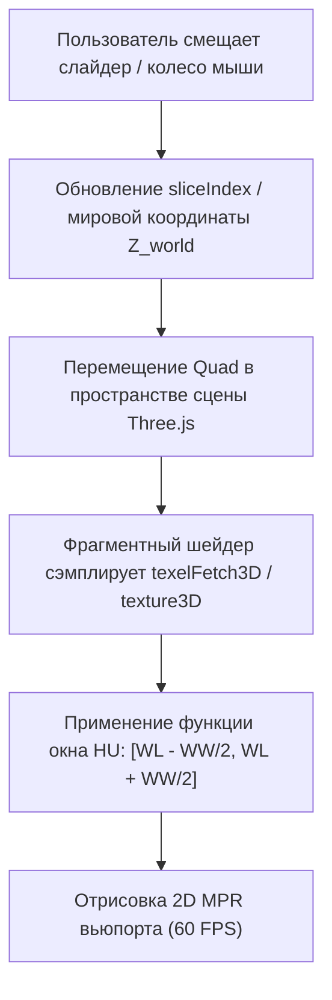
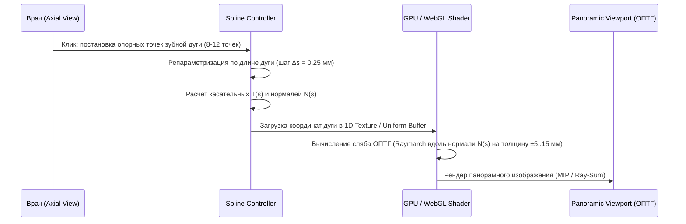
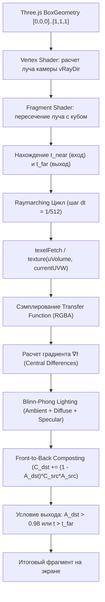
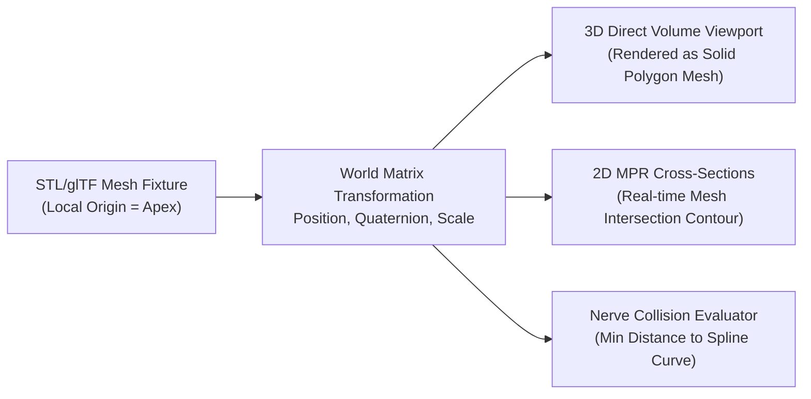
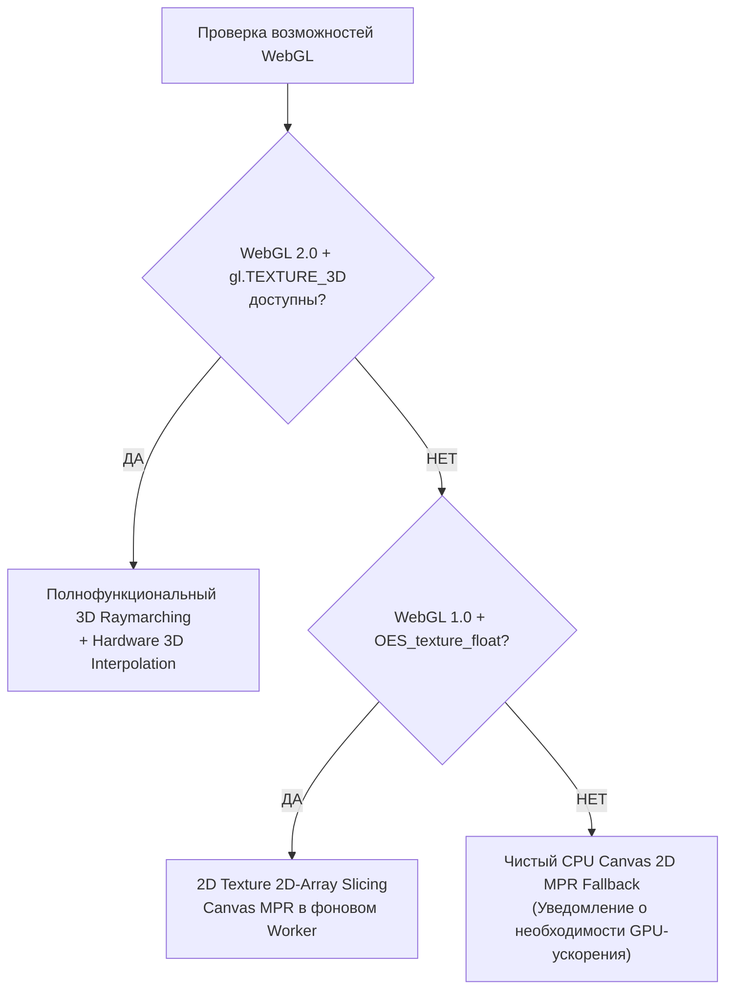

# 🦷 DENTAL CRM (DENTE) — АРХИТЕКТУРНАЯ И ИНЖЕНЕРНАЯ СПЕЦИФИКАЦИЯ КЛИЕНТСКОГО WEBGL 3D MPR И CBCT ДВИЖКА

**Версия документа:** 1.0.0 (Industrial Grade Specification)  
**Статус:** Утверждено к реализации (Task TASK-3.4 / Epic-3)  
**Ревизия проекта:** `5687d73d9c6bce33105287b06cb551cb1bbedf95`  
**Целевая среда:** WebGL 2.0 / Three.js r160+ / Web Workers / TypeScript 5.5+  

---

## 1. ИСПОЛНИТЕЛЬНОЕ РЕЗЮМЕ И ЦЕЛЕПОЛАГАНИЕ

### 1.1. Контекст проблемы
В клинической стоматологической практике конусно-лучевая компьютерная томография (КЛКТ / CBCT) является золотым стандартом для:
- Имплантологического планирования (оценка высоты/ширины альвеолярного гребня, плотности кости по Мишу D1–D4, локализация нижнечелюстного канала *Nervus alveolaris inferior* и дна верхнечелюстного синуса).
- Эндодонтического анализа (поиск дополнительных каналов MB2, апикальных периодонтитов, резорбций).
- Челюстно-лицевой хирургии и ортодонтии (ретенированные зубы, расщелины, кортикальные перфорации).

Исторически DENTE CRM опиралась на проксирование внешних тяжелых PACS/OHIF серверов либо на 2D-визиографический просмотр. Настоящая спецификация формализует архитектуру **нативного клиентского 3D MPR движка** прямо в браузере врача:
1. **Zero-Server GPU Compute:** Все тяжелые вычисления (Direct Volume Rendering / Raymarching, трилинейная интерполяция, криволинейная реконструкция ОПТГ, кросс-секции) выполняются на GPU рабочей станции врача через WebGL 2.0 (Three.js ShaderMaterial).
2. **Нулевая задержка (60 FPS):** Интерактивное позиционирование имплантатов (3D STL overlay), поворот плоскостей сечения и регулировка окна плотности (Hounsfield Units / HU) происходят без сетевых задержек.
3. **Безопасность пациента (Collision Detection):** Автоматический математический контроль расстояния между титановым имплантатом и нижнечелюстным нервом с клиническим буфером безопасности $\ge 2.0\text{ мм}$ и контролем перфорации кортикальной пластинки.

---

## 2. МАТЕМАТИЧЕСКИЕ ОСНОВЫ И СИСТЕМЫ КООРДИНАТ

### 2.1. Иерархия пространств трансформации

```mermaid
graph LR
    DICOM["DICOM File Space<br/>(Slices, Rows, Cols)"] -->|Image Orientation & Spacing| Patient["Patient LPS Space<br/>(Left, Posterior, Superior, mm)"]
    Patient -->|Rigid Registration| World["Three.js World Space<br/>(X, Y, Z in meters/mm)"]
    World -->|Inverse Affine| IJK["Volume Voxel Space<br/>(i, j, k integer indices)"]
    IJK -->|Texture Scale [0..1]| UVW["Normalized Texture Space<br/>(u, v, w ∈ [0.0, 1.0])"]
```

### 2.2. Матрицы преобразования пространств

Координата точки в системе координат пациента $\mathbf{P}_{\text{patient}} = (x, y, z)^T$ вычисляется из индексов вокселя $(i, j, k)$ в массиве данных DICOM с использованием тегов стандарта DICOM Part 3:
- $(0020,0032)$ `ImagePositionPatient` ($\mathbf{S}_0 = [S_x, S_y, S_z]^T$) — мировая координата левого верхнего угла первого среза.
- $(0020,0037)$ `ImageOrientationPatient` ($\mathbf{X} = [X_x, X_y, X_z]^T, \mathbf{Y} = [Y_x, Y_y, Y_z]^T$) — направляющие косинусы строк и столбцов матрицы изображения. Направляющий вектор среза: $\mathbf{Z} = \mathbf{X} \times \mathbf{Y}$.
- $(0028,0030)$ `PixelSpacing` ($\Delta x, \Delta y$) и $(0018,0050)$ `SliceThickness` / `SpacingBetweenSlices` ($\Delta z$).

Аффинная матрица перехода из пространства вокселей (IJK) в мировое пространство пациента (LPS / World) $\mathbf{M}_{\text{IJK}\to\text{World}}$:
$$\mathbf{M}_{\text{IJK}\to\text{World}} = \begin{bmatrix} 
X_x \cdot \Delta x & Y_x \cdot \Delta y & Z_x \cdot \Delta z & S_x \\
X_y \cdot \Delta x & Y_y \cdot \Delta y & Z_y \cdot \Delta z & S_y \\
X_z \cdot \Delta x & Y_z \cdot \Delta y & Z_z \cdot \Delta z & S_z \\
0 & 0 & 0 & 1
\end{bmatrix}$$

Для сэмплирования в шейдере WebGL 2.0 координаты переводятся в нормализованное текстурное пространство $\mathbf{P}_{\text{UVW}} \in [0, 1]^3$:
$$\mathbf{P}_{\text{UVW}} = \operatorname{diag}\left(\frac{1}{D_x}, \frac{1}{D_y}, \frac{1}{D_z}\right) \cdot \mathbf{M}_{\text{IJK}\to\text{World}}^{-1} \cdot \mathbf{P}_{\text{World}}$$
где $(D_x, D_y, D_z)$ — размерности 3D-текстуры (например, $512 \times 512 \times 400$).

---

## 3. ПАЙПЛАЙН ИНЖЕСТИИ ДАННЫХ И УПРАВЛЕНИЕ VRAM

### 3.1. Структура воксельного буфера
- **Размер сетки:** Типичный стоматологический КЛКТ (Planmeca ProMax 3D, KaVo OP 3D, Vatech PaX-i 3D, Morita Veraviewepocs) генерирует серии из 300–600 аксиальных срезов матрицей $512 \times 512$ с вокселем $0.15\text{–}0.3\text{ мм}$.
- **Хранение в памяти:** 16-битные знаковые целые числа со сдвигом Хаунсфилда:
  $$\text{HU} = \text{PixelValue} \times \text{RescaleSlope} + \text{RescaleIntercept}$$
  Типичные значения: `RescaleSlope = 1.0`, `RescaleIntercept = -1024.0` (для воздуха $\text{HU} \approx -1000$, для кортикальной кости $\text{HU} > +1500$, для дентального титана $\text{HU} > +3000$).

### 3.2. Распределение ресурсов GPU (WebGL 2.0 3D Textures)

| Текстурный формат WebGL 2.0 | Внутренний формат | Тип данных | Объем памяти ($512\times 512\times 400$) | Назначение |
|---|---|---|---|---|
| `gl.R16I` | `gl.RED_INTEGER` | `gl.SHORT` (16-bit signed) | **209.7 МБ** | Сырые значения HU без потери динамического диапазона. |
| `gl.R8` | `gl.RED` | `gl.UNSIGNED_BYTE` (8-bit normalized) | **104.8 МБ** | Оптимизированный fallback для мобильных GPU (с предобработанным окном). |
| `gl.RGBA8` (1D Texture 256x1) | `gl.RGBA` | `gl.UNSIGNED_BYTE` | **1 КБ** | LUT Transfer Function (Карта цветового градиента и прозрачности). |

### 3.3. Жизненный цикл и Web Workers
Загрузка и парсинг DICOM выполняется в фоновом Web Worker без блокировки главного UI-потока (Main Thread):
1. **Парсинг тегов:** Извлечение геометрии, шага вокселей и коэффициентов рескейлинга.
2. **Сборка монолитного TypedArray:** Создание непрерывного буфера `Int16Array(dimX * dimY * dimZ)`.
3. **Zero-Copy Transfer:** Передача владения через Transferable ArrayBuffer в Main Thread:
   ```typescript
   self.postMessage({ type: 'VOLUME_READY', buffer, metadata }, [buffer.buffer]);
   ```
4. **Загрузка в GPU:** `gl.texImage3D(gl.TEXTURE_3D, 0, gl.R16I, dimX, dimY, dimZ, 0, gl.RED_INTEGER, gl.SHORT, buffer)`.

---

## 4. МУЛЬТИПЛАНАРНАЯ РЕКОНСТРУКЦИЯ (MPR): ПЛОСКИЕ СРЕЗЫ

### 4.1. Ортогональные проекции (Axial, Coronal, Sagittal)

Для каждой из трех ортогональных плоскостей строится ортографическая 2D-камера и текстурированный прямоугольный Quad (два треугольника), ориентированный в мировой системе координат:

```typescript
export interface OrthogonalSliceConfig {
    plane: 'axial' | 'coronal' | 'sagittal';
    sliceIndex: number;          // Текущий срез [0..dim-1]
    thicknessMm: number;        // Толщина сляба (0 = одиночный срез)
    blendMode: 'single' | 'mip' | 'minip' | 'average';
    windowCenterHu: number;     // Window Level (WL)
    windowWidthHu: number;      // Window Width (WW)
}
```



### 4.2. Произвольные косые срезы (Oblique MPR)
Косой срез задается точкой центра $\mathbf{C} \in \mathbb{R}^3$ и единичным вектором нормали $\mathbf{n} = (n_x, n_y, n_z)^T$.
Базис плоскости сечения $(\mathbf{u}, \mathbf{v})$ ортонормируется по методу Грама-Шмидта:
$$\mathbf{u} = \frac{\mathbf{n} \times \mathbf{up}}{\|\mathbf{n} \times \mathbf{up}\|}, \quad \mathbf{v} = \mathbf{n} \times \mathbf{u}$$
Вершины полигона сечения в мировом пространстве:
$$\mathbf{V}(s, t) = \mathbf{C} + s \cdot \frac{W}{2}\mathbf{u} + t \cdot \frac{H}{2}\mathbf{v}, \quad s, t \in [-1, 1]$$

---

## 5. ПАЙПЛАЙН ПАНОРАМНОЙ РЕКОНСТРУКЦИИ (CURVED DENTAL MPR)

### 5.1. Построение зубной дуги (Dental Arch Spline)
Врач наносит опорные точки $\mathbf{P}_k = (x_k, y_k)$ на аксиальном срезе вдоль альвеолярного отростка челюсти.
Кривая сглаживается центростремительным сплайном Катмулла-Рома (Catmull-Rom) с параметризацией по длине дуги:

$$\mathbf{C}(t) = \frac{1}{2} \begin{bmatrix} 1 & t & t^2 & t^3 \end{bmatrix} \begin{bmatrix}
0 & 2 & 0 & 0 \\
-\alpha & 0 & \alpha & 0 \\
2\alpha & \alpha-6 & 6-2\alpha & -\alpha \\
-\alpha & 4-\alpha & \alpha-4 & \alpha
\end{bmatrix} \begin{bmatrix} \mathbf{P}_{k-1} \\ \mathbf{P}_k \\ \mathbf{P}_{k+1} \\ \mathbf{P}_{k+2} \end{bmatrix}$$



### 5.2. Схема сэмплирования развертки панорамы
Ширина панорамного изображения $W_{\text{pano}} = \lfloor L_{\text{arch}} / \Delta s \rfloor$, высота $H_{\text{pano}} = \lfloor H_{\text{volume}} / \Delta z \rfloor$.
Для каждого пикселя панорамы $(u, v)$ с толщиной сляба $T$ (например, $10\text{ мм}$ с шагом $\delta r = 0.25\text{ мм}$):
$$\mathbf{P}_{\text{world}}(u, v, r) = \mathbf{C}(u) + r \cdot \mathbf{N}(u) + (v \cdot \Delta z + Z_{\text{bottom}}) \cdot \mathbf{k}, \quad r \in \left[-\frac{T}{2}, \frac{T}{2}\right]$$

- **MIP (Maximum Intensity Projection):**
  $$I_{\text{pano}}(u, v) = \max_{r \in [-T/2, T/2]} \operatorname{SampleHU}(\mathbf{P}_{\text{world}}(u, v, r))$$
- **X-Ray Simulation (Beer-Lambert Absorption):**
  $$I_{\text{pano}}(u, v) = 1.0 - \exp\left(-\mu \sum_r \max(0, \operatorname{SampleHU}(\mathbf{P}_{\text{world}}) - \text{HU}_{\text{min}})\right)$$

### 5.3. Кросс-секционные срезы (Transverse Slices / Кросс-секции)
Для каждого зуба (позиции на дуге $s_i$) генерируется срез, строго перпендикулярный касательной $\mathbf{T}(s_i)$:
- Направление по ширине кросс-секции: вектор нормали $\mathbf{N}(s_i)$.
- Направление по высоте кросс-секции: вертикальная ось пациента $\mathbf{Z}$.
- Шаг между соседними кросс-секциями: $1.0\text{–}2.0\text{ мм}$ (типично 30–50 кросс-секций на всю челюсть).

---

## 6. ОБЪЕМНЫЙ РЕНДЕРИНГ (3D DIRECT VOLUME RAYCASTING)

### 6.1. Архитектура шейдера Raymarching (GLSL 300 ES)

Рендеринг трехмерного объема базируется на сэмплировании куба ограничивающего объема (Bounding Box) единичной геометрии.



### 6.2. Полный исходный код GLSL 300 ES фрагментного шейдера

```glsl
#version 300 es
precision highp float;
precision highp sampler3D;
precision highp sampler2D;

in vec3 vLocalRayOrigin;
in vec3 vLocalRayDir;

uniform highp isampler3D uVolumeTexture; // R16I знаковые воксели HU
uniform sampler2D uTransferFunction;    // 1D LUT RGBA
uniform vec3 uVoxelDimensions;           // (dimX, dimY, dimZ), например 512, 512, 400
uniform vec3 uVoxelSpacing;              // шаг вокселей в мм (0.2, 0.2, 0.2)
uniform float uStepSize;                 // относительный шаг интегрирования (0.0015)
uniform vec3 uLightDirection;            // единичный вектор направления света
uniform vec3 uAmbientColor;              // фоновое освещение
uniform float uSpecularPower;            // резкость блика (32.0)
uniform float uJitter;                   // случайный сдвиг луча для устранения муара (Dithering)

out vec4 fragColor;

// Тест пересечения луча с единичным кубом [0, 1]^3 (Ray-AABB Slab Method)
bool intersectAABB(vec3 rayOrigin, vec3 rayDir, out float tNear, out float tFar) {
    vec3 invDir = 1.0 / rayDir;
    vec3 t0 = (vec3(0.0) - rayOrigin) * invDir;
    vec3 t1 = (vec3(1.0) - rayOrigin) * invDir;
    vec3 tMin = min(t0, t1);
    vec3 tMax = max(t0, t1);
    
    tNear = max(max(tMin.x, tMin.y), tMin.z);
    tFar  = min(min(tMax.x, tMax.y), tMax.z);
    
    return tEnd >= tStart && tEnd > 0.0;
}

// Извлечение физического значения Hounsfield Unit
float getVoxelHU(vec3 uvw) {
    ivec3 texCoord = ivec3(uvw * uVoxelDimensions);
    texCoord = clamp(texCoord, ivec3(0), ivec3(uVoxelDimensions) - ivec3(1));
    int rawValue = texelFetch(uVolumeTexture, texCoord, 0).r;
    return float(rawValue);
}

// Расчет нормали на лету через градиент центральных разностей
vec3 calculateNormal(vec3 uvw, float step) {
    vec3 eps = vec3(step) / uVoxelDimensions;
    float dx = getVoxelHU(uvw + vec3(eps.x, 0.0, 0.0)) - getVoxelHU(uvw - vec3(eps.x, 0.0, 0.0));
    float dy = getVoxelHU(uvw + vec3(0.0, eps.y, 0.0)) - getVoxelHU(uvw - vec3(0.0, eps.y, 0.0));
    float dz = getVoxelHU(uvw + vec3(0.0, 0.0, eps.z)) - getVoxelHU(uvw - vec3(0.0, 0.0, eps.z));
    vec3 grad = vec3(dx, dy, dz);
    float len = length(grad);
    return len > 0.0001 ? normalize(grad) : vec3(0.0);
}

void main() {
    vec3 rayDir = normalize(vLocalRayDir);
    vec3 rayOrigin = vLocalRayOrigin;
    
    float tNear, tFar;
    if (!intersectAABB(rayOrigin, rayDir, tNear, tFar)) {
        discard;
    }
    
    tNear = max(tNear, 0.0);
    
    // Дизеринг начального смещения для устранения колец вуалирования
    float t = tNear + uStepSize * uJitter;
    
    vec4 accumulatedColor = vec4(0.0);
    
    for (int i = 0; i < 768; i++) {
        if (t > tFar || accumulatedColor.a >= 0.98) {
            break;
        }
        
        vec3 currentUVW = rayOrigin + rayDir * t;
        float hu = getVoxelHU(currentUVW);
        
        // Нормализация диапазона HU [-1024..+3071] в текстурные координаты TF [0.0..1.0]
        float tfCoord = clamp((hu + 1024.0) / 4096.0, 0.0, 1.0);
        vec4 sampleColor = texture(uTransferFunction, vec2(tfCoord, 0.5));
        
        if (sampleColor.a > 0.01) {
            // Расчет освещения Blinn-Phong только для видимых вокселей
            vec3 normal = calculateNormal(currentUVW, 1.5);
            
            float diffuse = max(dot(normal, uLightDirection), 0.0);
            vec3 viewDir = -rayDir;
            vec3 halfVector = normalize(uLightDirection + viewDir);
            float specular = pow(max(dot(normal, halfVector), 0.0), uSpecularPower);
            
            vec3 shadedRgb = sampleColor.rgb * (uAmbientColor + diffuse * vec3(0.8)) + vec3(specular * 0.3);
            
            // Front-to-Back Alpha Composting
            float alpha = sampleColor.a * (uStepSize / 0.002);
            accumulatedColor.rgb += (1.0 - accumulatedColor.a) * shadedRgb * alpha;
            accumulatedColor.a   += (1.0 - accumulatedColor.a) * alpha;
        }
        
        t += uStepSize;
    }
    
    if (accumulatedColor.a <= 0.001) {
        discard;
    }
    
    fragColor = accumulatedColor;
}
```

---

## 7. ФУНКЦИИ ПЕРЕДАЧИ (TRANSFER FUNCTIONS) И ПРЕСЕТЫ HU

### 7.1. Клинические пресеты плотности тканей (HU Window/Level)

| Пресет | Диапазон HU | Window Center (WL) | Window Width (WW) | Цветовая гамма (RGB) | Клиническое назначение |
|---|---|---|---|---|---|
| **Bone (D1-D4)** | +250 .. +1800 | +1025 | 1550 | Спектр кости: охра $\to$ слоновая кость $\to$ жемчужный | Оценка кортикального слоя и трабекулярной губчатой структуры. |
| **Soft Tissue** | -100 .. +300 | +100 | 400 | Розовый $\to$ коралловый $\to$ полупрозрачный бордовый | Слизистая оболочка, десна, язык, сосудистые пучки. |
| **Enamel / Teeth** | +1200 .. +3000 | +2100 | 1800 | Яркий опал $\to$ кристально-белый | Дентин, эмаль, эндодонтический пломбировочный материал (гуттаперча). |
| **Nerve Highlighting** | Канал: 0 .. +200 | Трассировка | Маска | Неоново-желтый / оранжевый (`#F59E0B`) | Выделение канала нижнечелюстного нерва (*N. Alveolaris Inferior*). |
| **Air / Sinus** | -1000 .. -400 | -700 | 600 | Полупрозрачный лазурный / синий | Верхнечелюстной синус, носовые ходы, дыхательные пути. |

### 7.2. 1D Transfer Function Генератор
Функция передачи конфигурируется кусочно-линейным сплайном узловых точек:

```typescript
export interface TransferFunctionControlPoint {
    hu: number;             // Плотность в HU [-1024..+3072]
    r: number;              // [0..1]
    g: number;              // [0..1]
    b: number;              // [0..1]
    opacity: number;        // [0..1]
}

export function generateTransferFunctionTexture(
    points: TransferFunctionControlPoint[],
    textureWidth: number = 1024
): Uint8Array {
    const data = new Uint8Array(textureWidth * 4);
    // Сортировка по HU и линейная интерполяция значений RGBA между соседними узлами...
    return data;
}
```

---

## 8. ИМПЛАНТАТЫ (3D STL OVERLAY) И АЛГОРИТМЫ COLLISION DETECTION

### 8.1. Загрузка и привязка трехмерной модели имплантата
В систему интегрируется библиотека геометрий имплантационных систем (Straumann, Nobel Biocare, Osstem, Dentium, MIS) в формате STL / glTF:
1. Корневая часть (Fixture): цилиндро-коническая резьбовая часть.
2. Абатмент и винт фиксации.
3. Сканируемый маркер (Scanbody).



### 8.2. Математический алгоритм детекции коллизии с нижнечелюстным нервом

Пусть канал нижнечелюстного нерва аппроксимирован трехмерным сплайном $\mathbf{S}_{\text{nerve}}(u)$, $u \in [0, 1]$, дискретизированным набором точек $\{\mathbf{Q}_j\}_{j=1}^M$ с шагом $0.5\text{ мм}$ и радиусом анатомического канала $R_{\text{canal}} \approx 1.5\text{ мм}$.

Имплантат аппроксимируется усеченным конусом вдоль оси $\mathbf{A}_{\text{imp}} = \mathbf{P}_{\text{apex}} \to \mathbf{P}_{\text{crown}}$ с радиусами $R_{\text{apex}}$ и $R_{\text{collar}}$.

Расстояние $d_j$ от точки нерва $\mathbf{Q}_j$ до отрезка оси имплантата $\mathbf{A}(t) = \mathbf{P}_{\text{apex}} + t \cdot (\mathbf{P}_{\text{crown}} - \mathbf{P}_{\text{apex}}), t \in [0, 1]$:
$$t^* = \operatorname{clamp}\left(\frac{(\mathbf{Q}_j - \mathbf{P}_{\text{apex}}) \cdot (\mathbf{P}_{\text{crown}} - \mathbf{P}_{\text{apex}})}{\|\mathbf{P}_{\text{crown}} - \mathbf{P}_{\text{apex}}\|^2}, 0, 1\right)$$
$$\mathbf{P}_{\text{closest}} = \mathbf{P}_{\text{apex}} + t^* \cdot (\mathbf{P}_{\text{crown}} - \mathbf{P}_{\text{apex}})$$
$$d_{\text{surface}} = \|\mathbf{Q}_j - \mathbf{P}_{\text{closest}}\| - R_{\text{imp}}(t^*) - R_{\text{canal}}$$

```typescript
export interface NerveCollisionCheckResult {
    status: 'safe' | 'warning' | 'collision';
    minDistanceMm: number;               // Минимальное расстояние до нерва
    criticalPointWorld: [number, number, number]; // Координата наименьшего зазора
    safetyMarginThresholdMm: number;     // Дефолт = 2.0 мм
}

export function evaluateImplantNerveProximity(
    implant: { apexWorld: vec3; collarWorld: vec3; radiusApexMm: number; radiusCollarMm: number },
    nervePointsWorld: vec3[],
    nerveRadiusMm: number = 1.5,
    safetyMarginMm: number = 2.0
): NerveCollisionCheckResult {
    let minDistance = Number.POSITIVE_INFINITY;
    let criticalPoint: vec3 = [0, 0, 0];

    const axis = vec3.subtract(vec3.create(), implant.collarWorld, implant.apexWorld);
    const axisLengthSq = vec3.squaredLength(axis);

    for (const q of nervePointsWorld) {
        const apexToQ = vec3.subtract(vec3.create(), q, implant.apexWorld);
        const t = Math.max(0, Math.min(1, vec3.dot(apexToQ, axis) / axisLengthSq));
        
        const closestPointOnAxis = vec3.scaleAndAdd(vec3.create(), implant.apexWorld, axis, t);
        const currentImplantRadius = implant.radiusApexMm + t * (implant.radiusCollarMm - implant.radiusApexMm);
        
        const centerDistance = vec3.distance(q, closestPointOnAxis);
        const surfaceDistance = centerDistance - currentImplantRadius - nerveRadiusMm;

        if (surfaceDistance < minDistance) {
            minDistance = surfaceDistance;
            criticalPoint = q;
        }
    }

    let status: 'safe' | 'warning' | 'collision' = 'safe';
    if (minDistance <= 0.0) {
        status = 'collision'; // Прямое повреждение нервного ствола
    } else if (minDistance < safetyMarginMm) {
        status = 'warning';   // В зоне риска (< 2.0 мм)
    }

    return {
        status,
        minDistanceMm: minDistance,
        criticalPointWorld: [criticalPoint[0], criticalPoint[1], criticalPoint[2]],
        safetyMarginThresholdMm: safetyMarginMm
    };
}
```

### 8.3. Визуальный защитный кокон (Safety Envelope)
Вокруг трехмерной модели имплантата в Three.js рендерится полупрозрачный габаритный цилиндр безопасности (радиус $+2.0\text{ мм}$ во все стороны):
- **Зеленый:** $d_{\text{min}} \ge 2.0\text{ мм}$ (Безопасная зона).
- **Мигающий оранжевый:** $0 < d_{\text{min}} < 2.0\text{ мм}$ (Опасное сближение).
- **Красный пульсирующий:** $d_{\text{min}} \le 0\text{ мм}$ (Коллизия / Перфорация).

---

## 9. ОРКЕСТРАЦИЯ МУЛЬТИ-ВЬЮПОРТА (VIEWPORT SYNCHRONIZATION)

Интерфейс рабочего места врача-имплантолога делится на согласованную сетку синхронизированных окон:

```
┌──────────────────────────────────────┬──────────────────────────────────────┐
│  1. 3D Direct Volume Rendering (DVR) │  2. Axial Plane MPR (Аксиальный срез) │
│  • Полнообъемный Raymarching         │  • Отображение кривой зубной дуги     │
│  • STL имплантаты с коконом          │  • Трассировка нерва (точки)          │
│  • Свободный OrbitControls           │  • Перекрестие визира (Crosshair)     │
├──────────────────────────────────────┼──────────────────────────────────────┤
│  3. Panoramic MPR (Панорама ОПТГ)    │  4. Cross-Sectional MPR (Кросс-секция)│
│  • Развертка вдоль альвеолярной дуги │  • Перпендикулярный срез зуба         │
│  • Траектория нижнечелюстного нерва  │  • Контур имплантата и измерение кости│
│  • Выбор активного номера зуба       │  • Проверка расстояния до нерва (мм)  │
└──────────────────────────────────────┴──────────────────────────────────────┘
```

### 9.1. Единая шина событий синхронизации (Event Bus)

```typescript
export interface MprSyncState {
    cursorWorld: [number, number, number];      // Координата фокуса перекрестия визира
    activeToothNumber: number | null;            // ISO 3950 (11..48)
    activeImplantId: string | null;              // Выбранный имплантат
    activeArchId: string | null;                 // Активная зубная дуга
    windowLevel: { center: number; width: number };
    slabThicknessMm: number;
    blendMode: 'single' | 'mip' | 'average';
}
```

При клике или драге визира в любом окне (например, клик на коронку зуба 36 на панораме):
1. Координата `cursorWorld` транслируется во все вьюпорты.
2. Аксиальный, сагиттальный и корональный срезы плавно центрируются на точку клика.
3. Кросс-секционный срез моментально перестраивается по нормали к данной точке дуги.
4. В 3D-окне подсвечивается габаритная рамка выбранного среза.

---

## 10. БЮДЖЕТ ПРОИЗВОДИТЕЛЬНОСТИ И ЛОГИКА ДЕГРАДАЦИИ (FALLBACK)

### 10.1. Метрики и требования (SLO)
- **Частота кадров (FPS):** Стабильные 60 FPS при вращении 3D-камеры и зуме на GPU уровня Apple M1 / Intel Iris Xe / Nvidia GTX 1650+.
- **Интерактивный отклик (Input Latency):** $\le 16.6\text{ мс}$ на перемещение ползунка слайса.
- **Потребление памяти:** $\le 350\text{ МБ}$ RAM вкладки браузера на серию из 500 срезов.

### 10.2. Прогрессивный рендеринг (Adaptive Raymarching)
Во время активного перемещения камеры (Orbit/Pan):
1. `uStepSize` увеличивается в 3 раза ($0.0015 \to 0.0045$, низкое разрешение, быстрый проход).
2. Canvas рендерится с `devicePixelRatio = 0.75`.
3. При остановке движения (Idle $\ge 100\text{ мс}$) выполняется финальный четкий проход с $1.0\times$ разрешением и полным расчетом теней и градиентов нормалей.

### 10.3. Матрица поддержки оборудования



---

## 11. СТРАТЕГИЯ ТЕСТИРОВАНИЯ И ВЕРИФИКАЦИИ

1. **Математическая верификация (Unit Tests):**
   - Инвариантность матриц перехода $M^{-1} \cdot M = I$ с точностью $\varepsilon < 10^{-6}$.
   - Тестирование алгоритма сплайна Катмулла-Рома на синтетических точках дуги окружности.
   - Тестирование формулы расстояния имплантат-нерв на известных аналитических геометрических моделях (проверка 100% срабатывания коллизии при $d \le 0$).
2. **Шейдерный статический анализ:**
   - Компиляция и валидация GLSL 300 ES через `glslangValidator`.
3. **Регрессионные тесты производительности:**
   - Бенчмарк времени генерации панорамы: $\le 120\text{ мс}$ для объема $512 \times 512 \times 400$.

---

*Спецификация разработана в соответствии с Mandate 8b (`.agents/AGENTS.md`) и готова к непосредственной реализации в кодовой базе `apps/web/src/components/dicom/`.*
