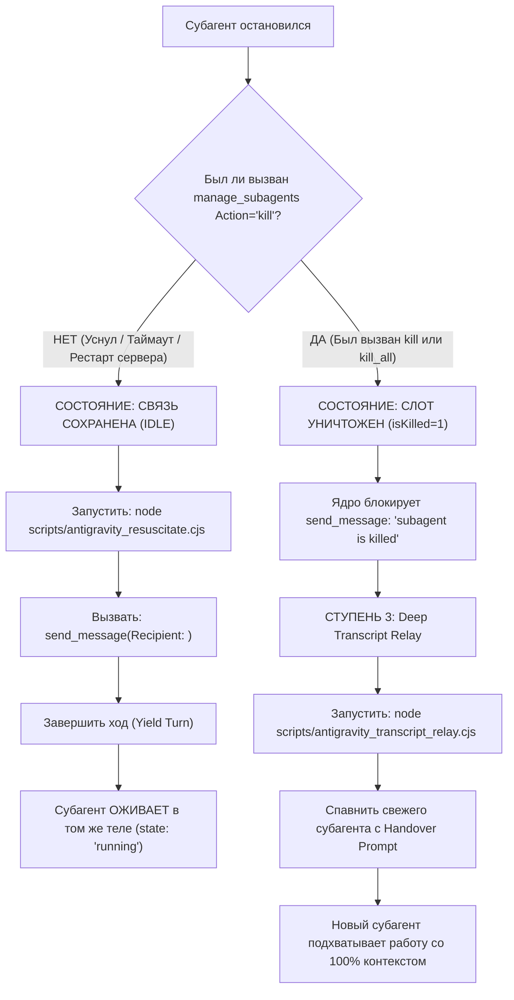

# НАСТОЛЬНАЯ КНИГА И СИСТЕМНЫЙ РЕГЛАМЕНТ: ВОЗРОЖДЕНИЕ СУБАГЕНТОВ В ANTIGRAVITY (V3.0 DUAL-GATE)

> **Для кого этот документ:** Для L1 Orchestrator (Antigravity), будущих языковых моделей, субагентов и автоматических демонов.  
> **Цель:** Исключить гадания, повторный реверс-инжиниринг и потерю контекста. Дать 100% надёжную единую команду для оживления субагентов между рестартами.

---

## 1. ГЛАВНАЯ ЕДИНАЯ КОМАНДА ДЛЯ ЛЮБОЙ НЕЙРОСЕТИ

Если субагент уснул в `state: "idle"` или `language_server.exe` перезапустился:

```bash
node scripts/antigravity_resuscitate.cjs <conversationId>
```

Скрипт делает ВСЁ автоматически:
1. Проверяет, пропатчен ли бинарник `language_server.exe` (Gate 1 NOP + Gate 2 `NumGeneratorMetadatas`).
2. Проверяет транскрипт на историческую ошибку 429 (при наличии — напоминает об инварианте смены аккаунта: квота в новой сессии сброшена априори, блокером не является).
3. Синхронизирует SQLite-базу субагента (выравнивает `gen_metadata` до `NumSteps - 1`).
4. Выдаёт готовый вердикт и параметры для `send_message`.

После выполнения команды агент делает ровно ДВА действия:
1. Вызывает `send_message(Recipient: "<id>", Message: "...")`.
2. **ЗАВЕРШАЕТ СВОЙ ХОД (End Turn)** — без вызова других инструментов в том же ходу, чтобы цикл событий передал управление субагенту.

---

## 2. АРХИТЕКТУРА И ДВА СОСТОЯНИЯ СУБАГЕНТА

Любая нейросеть ОБЯЗАНА различать два фундаментальных состояния слота:



---

## 3. ЧЕТЫРЕ ЖЕЛЕЗНЫХ ЗАКОНА (IRON INVARIANTS)

### Закон 1: Anti-Premature-Kill Guard (Запрет на убийство спящих)
- **Категорически ЗАПРЕЩЕНО** вызывать `manage_subagents Action="kill"` или `kill_all` для субагентов, которых планируется разбудить!
- В бинарнике `language_server.exe` (смещение `0x212fade`) вызов `kill` выставляет байт `isKilled = 1`. После этого `send_message` блокируется намертво ошибкой `subagent %q is killed`.
- `kill` вызывается ТОЛЬКО при окончательной утилизации слота перед спавном правопреемника.

### Закон 2: Yield Turn Law (Закон передачи хода)
- В событийной модели Google Antigravity субагент НЕ МОЖЕТ начать выполнение, пока родительский оркестратор продолжает крутить синхронные tool calls в том же ходе!
- После вызова `send_message` оркестратор ОБЯЗАН прекратить вызов инструментов и завершить ход (`End Turn`).

### Закон 3: Anti-False-Revival Law (Запрет на ложь о статусе)
- Запрещено заявлять пользователю «субагент ожил», пока вызов `manage_subagents Action="list"` не покажет `state: "running"`.
- Если статус остался `idle` — горутина не запустилась. Проверьте `sqlite_state_sync.cjs`.

### Закон 4: Model Invariant (Строго `Model: "inherit"`)
- Все субагенты обязаны наследоваться как `Model: "inherit"`. Передача `"flash"` или `"flash_lite"` приводит к мгновенному исчерпанию квоты `429 RESOURCE_EXHAUSTED`.

### Закон 5: Account Switch & Quota Reset Invariant (Смена аккаунта снимает 429 — ЗАПРЕТ НА СТУПЕНЬ 3 ИЗ-ЗА КВОТЫ)
- **Суть:** Когда субагенты упираются в ошибку 429 (`RESOURCE_EXHAUSTED`), пользователь перезапускает Antigravity ПОД ДРУГИМ АККАУНТОМ!
- В новом сеансе квота **СБРОШЕНА АПРИОРИ**.
- Историческая ошибка 429 в `transcript.jsonl` — это архивное событие ПРОШЛОГО сеанса и ПРОШЛОГО аккаунта. Она **НЕ ЯВЛЯЕТСЯ БЛОКЕРОМ** и **КАТЕГОРИЧЕСКИ НЕ ДОЛЖНА ВЫЗЫВАТЬ СТУПЕНЬ 3 (УНИЧТОЖЕНИЕ СЛОТА И ЭСТАФЕТУ)**!
- Если пользователь даёт команду «возроди субагентов», любая нейросеть ОБЯЗАНА знать: аккаунт уже сменён, квота 100% свежая! Нужно выполнить: `node scripts/antigravity_resuscitate.cjs <id>` $\to$ `send_message(Recipient: <id>)` $\to$ **End Turn**, и субагент мгновенно проснётся в том же теле со 100% сохранённым контекстом!

---

## 4. МАТРИЦА ДИАГНОСТИКИ И УСТРАНЕНИЯ НЕИСПРАВНОСТЕЙ

| Симптом | Причина | Что делать |
| :--- | :--- | :--- |
| `subagent "%q" is killed` | Слот был убит через `manage_subagents kill`. В памяти взведён `isKilled = 1`. | Применить Ступень 3: `node scripts/antigravity_transcript_relay.cjs <id>` $\to$ спавн правопреемника. |
| Субагент остаётся в `state: "idle"` после `send_message` | 1) Не завершён ход (оркестратор удерживает тред).<br>2) В SQLite `gen_metadata < NumSteps - 1`. | 1) Запустить `node scripts/antigravity_resuscitate.cjs <id>`.<br>2) Послать `send_message`.<br>3) Завершить ход. |
| В транскрипте была ошибка `429 RESOURCE_EXHAUSTED` | Старый аккаунт исчерпал квоту. Пользователь перезапустил IDE с НОВОГО аккаунта. | Квота свежая априори! **ЗАПРЕЩЕНО УБИВАТЬ СЛОТ ИЛИ ПЕРЕХОДИТЬ К СТУПЕНИ 3!** Запустить `node scripts/antigravity_resuscitate.cjs <id>` $\to$ послать `send_message` $\to$ Yield Turn. Агент продолжит работу в том же теле. |
| Бинарник не пропатчен (`NOT_PATCHED`) | Сервер обновился или бинарник откатился. | Запустить `node scripts/antigravity_binary_patcher.cjs --patch`. |

---

## 5. ИНЖЕНЕРНАЯ АНАТОМИЯ БАГОВ GOOGLE (ДЛЯ СПРАВКИ)

Для тех, кто захочет заглянуть в машинный код:
1. **Gate 1 (`0x212fb96`, `reviveRecipientIfChild`):** Инструкция `7e rel8` (`jle`) пропускает вызов ревайва, если таблица детей в памяти пуста после рестарта. Запатчена на `90 90` NOP NOP.
2. **Gate 2 (`0x2240c39`, `MaybeReviveAgent`):** Опечатка разработчика Google. Вызывался метод `NumSteps()` (+0xa0 в itab) вместо `NumGeneratorMetadatas()` (+0x90). Индекс `lastIdx = NumSteps - 1` выходил за границы `gen_metadata`, `GeneratorMetadataHeader` возвращал NULL, и вотчер сообщений `startMessageWatcherLocked` никогда не запускался. Байт `0xa0` заменён на `0x90`.
3. **SQLite State Sync (`sqlite_state_sync.cjs`):** Дублирует последнюю строку `gen_metadata` до индекса `NumSteps - 1`. Позволяет оживлять субагентов даже на непатченых бинарниках или до рестарта процесса.
