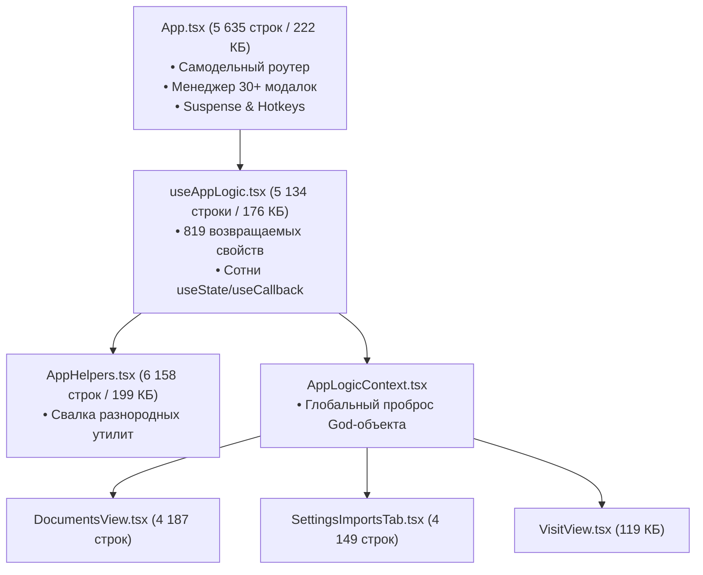
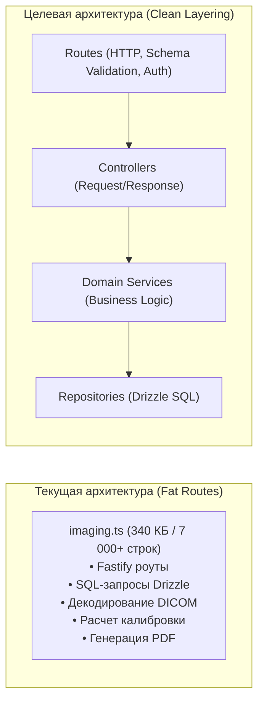

# 🏛️ DENTAL CRM (DENTE) — АРХИТЕКТУРНЫЙ АУДИТ И СПЕЦИФИКАЦИЯ ТЕХНОЛОГИЧЕСКОГО ДОЛГА

**Версия документа:** 1.0.0  
**Дата аудита:** Август 2026  
**Ревизия репозитория:** `f2bedc27f16c0c1cfbe5f97bc800b16793e1ba38`  
**Масштаб:** 1 101 файл, ~20.8 МБ исходного кода  

---

## 1. ИСПОЛНИТЕЛЬНОЕ РЕЗЮМЕ (EXECUTIVE SUMMARY)

Система **DENTE Dental CRM** представляет собой высоконагруженную медицинскую ERP-систему с безупречно выверенным финансово-клиническим ядром (целочисленные копейки в 54-ФЗ, ФФД 1.2, справки НДФЛ КНД 1151156 XML 5.01, детерминированные SHA-256 ЭП для 043/у и GiST-блокировки расписания). 

Однако в ходе эволюционного роста кодовая база накопила критический объем архитектурного долга в слое представления (Frontend) и в слое оркестрации серверной логики (Backend). Настоящий документ фиксирует полную анатомию выявленных дефектов, метрики сложности и целевую архитектуру.

---

## 2. ГЛУБОКИЙ АУДИТ FRONTEND (КЛИЕНТСКИЙ СЛОЙ)

### 2.1. Анализ супер-монолитов (God-Components)

| Монолитный файл | Размер (байт / строк) | Симптомы и риски | Назначение в целевой архитектуре |
|---|---|---|---|
| `apps/web/src/useAppLogic.tsx` | 176 908 B / 5 134 строк | **819 свойств в return-объекте.** Изменение любого драфта пересчитывает ссылки на функции, вызывая каскадные ререндеры непричастных вкладок. | Расщепление на 8 доменных хуков (`useModalController`, `useScheduleFilters`, `useStaffSecurity` и др.). |
| `apps/web/src/App.tsx` | 222 434 B / 5 635 строк | Совмещает функции роутера, пин-пада сотрудников, модальных оверлеев, обработки горячих клавиш и глобального шелла. | Превращение в тонкий Shell с декларативным роутингом и изолированными Portal-модалками. |
| `apps/web/src/AppHelpers.tsx` | 199 339 B / 6 158 строк | «Мусорный ящик» утилит: форматирование денег, маппинг МКБ-10, парсинг заголовков, расчет хешей и сетевые клиенты вперемешку. | Разнос по пакетам `@dental/shared/formatting`, `@dental/shared/icd10`, `lib/network/`. |
| `apps/web/src/DocumentsView.tsx` | 248 632 B / 4 187 строк | Внутри одного компонента: генерация договоров, парсер ИДС, валидация 15 типов документов, drag-and-drop и предпросмотр печати. | Разделение на `DocumentGenerator`, `ConsentWorkflowPanel`, `DocumentPrintPreview`. |
| `apps/web/src/components/settings/SettingsImportsTab.tsx` | 246 973 B / 4 149 строк | Монолитная студия импорта: CSV парсер, маппер колонок, AI-анализатор прайсов, эвристика дублей и прогресс-бар. | Декомпозиция на мастер импорта `ImportWizard` со стейт-машиной шагов. |

### 2.2. Раздробленность управления состоянием (State Fragmentation)
В кодовой базе сосуществуют 4 конкурирующих источника правды:
1. **Zustand (7 независимых сторов):** `appStore`, `patientStore`, `visitStore`, `scheduleStore`, `settingsStore`, `imagingStore`, `documentStore`.
2. **God-Hook `useAppLogic`:** собственное гигантское состояние через сотни `useState`/`useRef`.
3. **`AppLogicContext`:** контекст, дублирующий проброс объекта `useAppLogic`.
4. **`localStorage` (`UiPreferences`):** автономный кэш фильтров и выбранных ID.

*Дефект:* Например, `selectedPatientId` обновляется в URL-хеше, в `appStore`, в `usePatientLogic` и в `UiPreferences` раздельными вызовами без гарантии атомарной синхронизации.

### 2.3. Стилистический легаси-балласт (`main.css`)
- `apps/web/src/styles/main.css` содержит **18 146 строк (371 КБ)**.
- Несмотря на успешный гейт переменных (`token-aliases.css`), в `main.css` остаются тысячи строк исторического CSS с жестко заданными отступами, абсолютным позиционированием и селекторами глубокой вложенности (`.panel > div > table > tbody > tr > td`).

### 2.4. Неподключенные готовые модули (Orphan Modules)
- **Пример:** `apps/web/src/hooks/useSoundNotifications.ts` (Фича #49 из конкурентного реестра):
  - Модуль полностью разработан, синтезирует чистый Web Audio звук без внешних файлов (440 Гц $\to$ 660 Гц для онлайн-записей, 880 Гц $\to$ 660 Гц за 5 минут до конца слота врача).
  - Ни разу не смонтирован и не вызывается ни в одном рабочем компоненте.

### 2.5. Реальность 3D/DICOM рендеринга
- 2D просмотр радиовизиографа и панорамных снимков ОПТГ (`VisiographAnalyzer.tsx`) работает нативно на HTML5 Canvas (контраст, яркость, линейка калибровки, инверсия цвета).
- **3D КЛКТ / MPR (мультипланарная реконструкция):** в веб-клиенте нет тяжелого клиентского WebGL Ray-Casting движка для волюметрического рендеринга; вместо этого реализован стековый просмотрщик 2D-срезов либо прокси-интеграция с внешним OHIF Viewer / Orthanc PACS сервером (`ohifBaseUrl`, `dicomWebEndpointUrl`).

---

## 3. ГЛУБОКИЙ АУДИТ BACKEND (СЕРВЕРНЫЙ СЛОЙ)

### 3.1. Монолитные роуты без архитектурного разделения

- **`apps/api/src/routes/imaging.ts` (340 КБ / ~7 000 строк)**
- **`apps/api/src/routes/smartImports.ts` (312 КБ)**
- **`apps/api/src/routes/telegram.ts` (152 КБ)**
- **`apps/api/src/routes/diary.ts` (99 КБ / 2 303 строки)**
> **Следствие:** Тестирование бизнес-логики в изоляции от Fastify HTTP-сервера невозможно; любые правки SQL требуют правок файлов маршрутизации.

### 3.2. In-Memory фоновые планировщики (Отсутствие персистентной очереди)
- Воркеры `backupWorker.ts`, `biAnalyticsWorker.ts`, `recallScheduler.ts` инициируются через `setInterval()` внутри Node.js процесса.
- **Уязвимости:**
  1. Перезапуск процесса сбрасывает все таймеры.
  2. Горизонтальное масштабирование (Cluster mode / 2+ реплики за Nginx) приведет к одновременному дублированию запусков ночных бэкапов и рассылок сообщений пациентам.
  3. Отсутствие Dead-Letter Queue (DLQ) для упавших задач.

### 3.3. Монолитная схема базы данных (`apps/api/src/db/schema.ts`)
- Единый файл **5 000+ строк (238 КБ)**.
- Содержит описания более 100 таблиц, enum-типов, внешних ключей и связей, провоцируя конфликты при параллельной разработке миграций.

### 3.4. Изоляция арендаторов (Multi-Tenancy Gaps)
- Большинство роутов строго используют `eq(table.organizationId, orgId)`.
- Выявлены вторичные endpoints (например, `POST /api/diaries/plan-signature` в `diary.ts:2285`), где первый `SELECT` выполняется только по `eq(treatmentPlans.id, planId)`, а проверка принадлежности клинике отложена на шаг проверки пациента. Первичный запрос обязан использовать составной индекс: `and(eq(treatmentPlans.id, planId), eq(treatmentPlans.organizationId, orgId))`.

---

## 4. СВОДНАЯ МАТРИЦА СИСТЕМЫ

| Домен | Зрелость | Сильные стороны | Критические уязвимости |
|---|---|---|---|
| **Финансы и Касса (54-ФЗ)** | 🟢 **9.5/10** | Целочисленные копейки, ФФД 1.2 теги, идемпотентность SBP QR, пессимистические блокировки. | Отсутствие локального оффлайн-буфера при сбое физического COM-порта ККТ. |
| **Расписание и Запись** | 🟢 **9.2/10** | PostgreSQL GiST exclusion-индексы против оверлапов, 3-уровневый lock. | Дублирование фильтров расписания в 3 разных сторах. |
| **ЭМК и 043/у Дневники** | 🟢 **9.0/10** | Детерминированный SHA-256 хеш, PKCS#7 подпись, аудит ревизий. | Огромный размер `VisitDiaryEditor.tsx` и смешение логики подписи с UI. |
| **DICOM / Снимки** | 🟡 **7.0/10** | 2D Canvas визиограф, калибровка, фильтры яркости/контраста. | 3D КЛКТ/MPR является стековым 2D-просмотрщиком, монолитный `imaging.ts`. |
| **Архитектура UI (Frontend)** | 🔴 **5.5/10** | Высокая скорость работы, WCAG 2.1 AA контраст, 0 CSS дыр. | God-hook `useAppLogic` (819 полей), `App.tsx` (5.6k строк), `main.css` (18k строк). |
| **Серверные воркеры (Backend)** | 🟡 **6.0/10** | Надежное шифрование бэкапов (AES-256-CBC), проверка целостности дампа. | In-process `setInterval`, отсутствие распределенной очереди задач (pg-boss). |
