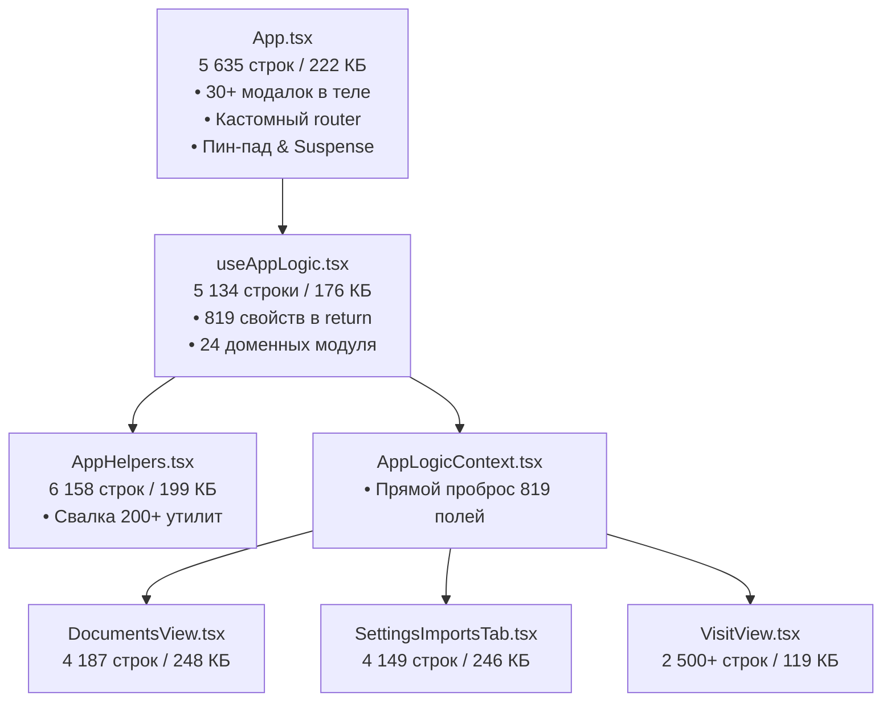

# 🏛️ DENTAL CRM (DENTE) — ПОЛНАЯ АРХИТЕКТУРНАЯ СПЕЦИФИКАЦИЯ И РЕЕСТР ТЕХНОЛОГИЧЕСКОГО ДОЛГА

> **Навигационный блок:**<br/>
> 🗺️ **[Главный Индекс Документации (INDEX.md)](file:///C:/Clinic_MVP/dental-crm/.agents/INDEX.md)**<br/>
> 🏗️ **[Архитектура Системы (ARCHITECTURE.md)](file:///C:/Clinic_MVP/dental-crm/.agents/ARCHITECTURE.md)** | **[docs/ARCHITECTURE.md](file:///C:/Clinic_MVP/dental-crm/docs/ARCHITECTURE.md)**<br/>
> 📚 **[База Знаний и Документация (docs/README.md)](file:///C:/Clinic_MVP/dental-crm/docs/README.md)**<br/>
> 🗄️ **[Реестр Базы Данных (DATABASE.md)](file:///C:/Clinic_MVP/dental-crm/.agents/DATABASE.md)**<br/>
> ⚠️ **[Высшая Конституция (THE HAMMER)](file:///C:/Clinic_MVP/dental-crm/.agents/THE_HAMMER_MASTER_PROMPT.md)**

**Версия документа:** 2.1.0 (Deep Industrial Specification)<br/>
**Дата актуализации:** Сентябрь 2026<br/>
**Среда исполнения:** React 19 (`@dental/web`), Node Fastify v5 (`@dental/api`), Native PostgreSQL 18.4 (`127.0.0.1:5432`, `.data/pg18`), WebWorker 3D MPR (`mprWorker.ts`), 3-уровневые планы лечения (`treatmentPlanEngine.ts`)<br/>

---

## 1. ИСПОЛНИТЕЛЬНОЕ РЕЗЮМЕ И СИСТЕМНЫЙ СРЕЗ

Система **DENTE Dental CRM** — это многопользовательская облачно-локальная медицинская платформа (Fastify v5 + React 19 + PostgreSQL 18.4 + Drizzle ORM). В системе реализованы надежные финансовые и клинические алгоритмы:
- Целочисленный расчет в копейках по 54-ФЗ, ФФД 1.2, справки НДФЛ КНД 1151156 XML 5.01;
- Электронная подпись 043/у с детерминированным SHA-256 хешем и версионным аудитом («Исправленному верить»);
- 3-уровневое планирование лечения (`treatmentPlanEngine.ts`): Эконом, Оптимум (рекомендованный), Премиум с калькулятором рассрочки и мобильным Segmented Control;
- Клиентский 3D MPR движок КЛКТ в WebWorker (`mprWorker.ts`, `mprMath.ts`) с zero-copy передачей пиксельных буферов `Float32Array` в UI-поток и поддержкой WebGL / Cornerstone3D;
- GiST-блокировки слотов расписания и multi-tenant изоляция через `withTenantCtx` и Row-Level Security (RLS).

---

## 2. ГЛУБОКАЯ ДЕКОМПОЗИЦИЯ И АНАТОМИЯ FRONTEND

### 2.1. Карта супер-монолитов и метрики сложности



### 2.2. Детальная карта декомпозиции `useAppLogic.tsx` (819 свойств)

Текущий монолит `useAppLogic.tsx` возвращает **819 свойств** (`apps/web/src/useAppLogic.tsx:4300–5130`). Все они декомпозируются на 8 изолированных доменных хуков:

```
apps/web/src/hooks/domains/
  ├── useModalOrchestrator.ts        # 42 свойства: управление модалками (open/close/state)
  ├── useScheduleFilterState.ts      # 38 свойств: фильтры врачей, кресел, дат, статусов
  ├── useNavigationRouter.ts         # 25 свойств: URL hash sync, activeView, viewIntent
  ├── usePatientWorkspaceState.ts    # 110 свойств: карточка пациента, аллергии, родственники
  ├── useClinicalVisitWorkflow.ts    # 145 свойств: одонтограмма, SOAP 043/у, диктовка, ЭП
  ├── useBillingCashDeskState.ts     # 120 свойств: счета, 54-ФЗ чеки, эквайринг, НДФЛ
  ├── useImagingWorkbenchState.ts    # 95 свойств: 2D визиограф, калибровка, серии DICOM
  └── useStaffSettingsState.ts       # 84 свойства: сотрудники, кресла, права, расписание смен
```

### 2.3. Раздробленность и дублирование состояния (State Conflict Matrix)

| Сущность | Источник 1 | Источник 2 | Источник 3 | Риск конфликта |
|---|---|---|---|---|
| **ID выбранного пациента** | `patientStore.selectedPatientId` | `usePatientLogic.selectedPatientId` | `UiPreferences.selectedPatientId` (localStorage) | При переходе по ссылке или через поиск карточка может показать старого пациента. |
| **Фильтры расписания** | `scheduleStore.doctorFilterId` | `useScheduleLogic.scheduleDoctorFilterId` | `UiPreferences.scheduleDoctorFilterId` | Рассинхронизация списка слотов между мобильным и десктопным экранами. |
| **Текущий приём** | `visitStore.activeVisitId` | `dashboard.activeVisit` | `useVisitLogic.activeVisit` | Ошибочное сохранение SOAP-записи в закрытый визит. |

---

## 3. ГЛУБОКАЯ ДЕКОМПОЗИЦИЯ И АНАТОМИЯ BACKEND

### 3.1. Доменное разделение схемы БД (`apps/api/src/db/schema/` — РЕАЛИЗОВАНО В PRODUCTION)

Монолитный `schema.ts` был успешно декомпозирован на **20 модульных доменных файлов** в директории `apps/api/src/db/schema/`, а корневой `apps/api/src/db/schema.ts` стал 7-строчным реэкспорт-прокси (`export * from "./schema/index.js"`), сохраняющим 100% обратную совместимость:

```
apps/api/src/db/schema/
  ├── index.ts              # Реэкспорт всех сущностей с сохранением 100% обратной совместимости
  ├── _common.ts            # Базовые enum-типы, хелперы временных меток и аудита
  ├── auth.ts               # organizations, users, userInvitations, userSessions, staffRoles
  ├── patients.ts           # patients, patientCards, patientFamilyLinks, patientAllergies
  ├── schedule.ts           # appointments, chairs, doctorSchedules, chairTimeReservations
  ├── billing.ts            # invoices, invoiceItems, payments, fiscalReceipts, doctorCommissions
  ├── clinical.ts           # visits, visitDiaries, treatmentPlans, odontogramStates, teethStatus
  ├── imaging.ts            # imagingStudies, dicomSeries, visiographSnapshots, ctVolumes
  ├── inventory.ts          # inventoryItems, inventoryBatches, materialDeductionRules, stockMovements
  ├── communications.ts     # uisCalls, telegramChats, chatMessages, messageTemplates, taskQueue
  ├── sanpin.ts             # sterilizationLogs, autoclaveCycles, azopyramTests
  ├── outpatientCore.ts     # outpatientCards, medicalHistoryRecords, somaticStatus
  └── system.ts             # system_background_jobs, fiscal_receipt_queue, audit_logs
```

### 3.2. Спецификация новых персистентных структур БД

#### A. Очередь задач (`system_background_jobs`):
```sql
CREATE TABLE system_background_jobs (
    id UUID PRIMARY KEY DEFAULT gen_random_uuid(),
    organization_id UUID REFERENCES organizations(id) ON DELETE CASCADE,
    queue_name VARCHAR(64) NOT NULL,
    task_name VARCHAR(128) NOT NULL,
    payload JSONB NOT NULL DEFAULT '{}',
    status VARCHAR(32) NOT NULL DEFAULT 'pending', -- pending, processing, completed, failed, dead_letter
    retry_count INTEGER NOT NULL DEFAULT 0,
    max_retries INTEGER NOT NULL DEFAULT 3,
    scheduled_for TIMESTAMP WITH TIME ZONE NOT NULL DEFAULT NOW(),
    started_at TIMESTAMP WITH TIME ZONE,
    finished_at TIMESTAMP WITH TIME ZONE,
    last_error TEXT,
    created_at TIMESTAMP WITH TIME ZONE NOT NULL DEFAULT NOW()
);
CREATE INDEX idx_background_jobs_queue_status ON system_background_jobs (queue_name, status, scheduled_for);
```

#### B. Очередь печати чеков ККТ (`fiscal_receipt_queue`):
```sql
CREATE TABLE fiscal_receipt_queue (
    id UUID PRIMARY KEY DEFAULT gen_random_uuid(),
    organization_id UUID NOT NULL REFERENCES organizations(id) ON DELETE CASCADE,
    payment_id UUID NOT NULL REFERENCES payments(id) ON DELETE CASCADE,
    cash_desk_id VARCHAR(64) NOT NULL,
    receipt_payload JSONB NOT NULL,
    status VARCHAR(32) NOT NULL DEFAULT 'pending_print', -- pending_print, printed, hardware_offline, failed
    fiscal_document_number VARCHAR(64),
    fiscal_storage_number VARCHAR(64),
    fiscal_sign VARCHAR(64),
    error_message TEXT,
    retry_count INTEGER NOT NULL DEFAULT 0,
    created_at TIMESTAMP WITH TIME ZONE NOT NULL DEFAULT NOW(),
    updated_at TIMESTAMP WITH TIME ZONE NOT NULL DEFAULT NOW()
);
CREATE INDEX idx_fiscal_queue_org_status ON fiscal_receipt_queue (organization_id, status);
```

---

## 4. СРАВНИТЕЛЬНЫЙ АНАЛИЗ ИНТЕГРАЦИЙ С КОНКУРЕНТАМИ

| Направление | DENTE (Текущее) | IDENT | DentalPRO / iStom | Целевое решение DENTE |
|---|---|---|---|---|
| **Звуковые уведомления (#49)** | Хук написан, но не смонтирован в UI | Встроенные сигналы окончания приема и онлайн-заявок | Только системные пуши Windows | Подключение хука в `useAppLogic` + тумблер в настройках профиля |
| **ККТ 54-ФЗ печать** | Серверная фискализация без оффлайн-буфера ККТ | Локальный агент печати на кассовом ПК | Веб-сервер Атол | Персистентная очередь `fiscal_receipt_queue` с авто-повтором |
| **Фоновые бэкапы/аналитика** | In-process `setInterval` в Node.js | Служба Windows Service | Windows Scheduler / Cron | PostgreSQL-backed Queue (`system_background_jobs`) |
| **3D КЛКТ / MPR** | Нативный клиентский WebWorker 3D MPR (`mprWorker.ts`, `mprMath.ts`) + Cornerstone3D + WebGL (РЕАЛИЗОВАНО В PRODUCTION) | Встроенный 3D DICOM модуль (DirectX/OpenGL) | Интеграция с EzDent-i / Planmeca | Полноценный мультипланарный комплекс (Axial, Coronal, Sagittal, Panorama + Cross-Sections) с zero-copy Float32Array буферами |
