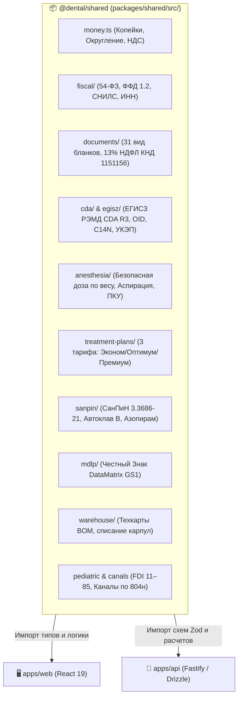

# 🧮 Алгоритмы, Валидаторы и Общий Пакет `@dental/shared`

> 🧭 **Навигация:** [🗺️ Главный Индекс (.agents/INDEX.md)](file:///C:/Clinic_MVP/dental-crm/.agents/INDEX.md) | [📚 Портал Документации (docs/README.md)](file:///C:/Clinic_MVP/dental-crm/docs/README.md)  
> ⚠️ **Высшая Конституция:** [THE_HAMMER_MASTER_PROMPT.md](file:///C:/Clinic_MVP/dental-crm/.agents/THE_HAMMER_MASTER_PROMPT.md) | [Системная Конституция (.agents/AGENTS.md)](file:///C:/Clinic_MVP/dental-crm/.agents/AGENTS.md)  
> 📦 **Исходники пакета:** [`packages/shared/src/`](file:///C:/Clinic_MVP/dental-crm/packages/shared/src/) | [DATABASE.md](file:///C:/Clinic_MVP/dental-crm/.agents/DATABASE.md) | [BILLING_AND_FINANCE.md](file:///C:/Clinic_MVP/dental-crm/.agents/BILLING_AND_FINANCE.md)  

---

## 🏛️ 1. Архитектура и Структура Пакета `@dental/shared` (`packages/shared/src/`)

В соответствии с **Частью 10 Высшей Конституции (Monorepo & Dependency Rigor)** вся чистая бизнес-логика, математические расчеты, структуры данных, классификаторы законодательства РФ (54-ФЗ, СанПиН 3.3686-21, Номенклатура 804н, ЕГИСЗ) и валидаторы Zod сосредоточены в независимом пакете `@dental/shared`. Клиентское веб-приложение (`apps/web`) и серверный API (`apps/api`) лишь потребляют этот функционал, исключая дублирование логики:

---

## 📂 2. Полный Модульный Реестр `@dental/shared`

### 2.1. Финансы, Точные Деньги и Касса 54-ФЗ
- **`money.ts`** — Фундаментальный закон целочисленной арифметики (Integer Kopecks Law, Mandate 8b):
  - Хранение и расчет любых денежных транзакций строго в целых копейках (`type Kopecks = number`). Запрет на `float` / `double` для финансовых расчетов.
  - Утилиты: `toKopecks()`, `fromKopecks()`, `formatMoneyRub()`, банковское и математическое округление НДС (`calculateVatAmount`).
- **`fiscal/`** — Регламенты кассовой дисциплины 54-ФЗ и ФФД 1.2:
  - Валидация кассовых чеков, признаков способа расчета и признаков предмета расчета.
  - Строгая валидация СНИЛС с проверкой контрольной суммы (`validateRussianSnils`).
  - Системы налогообложения РФ (СНО: ОСН, УСН Доход, УСН Доход-Расход, Патент).
- **`finance/`** — Лицевые счета пациентов, депозиты, раздельные и комбинированные платежи (нал + карта + аванс), семейные кошельки с общим распределением средств.

### 2.2. Юридический Документооборот и Налоговые Вычеты
- **`documents/`** — Единый реестр 31 вида медицинской и юридической документации:
  - `documentKindSchema` — Zod-валидация всех 31 видов бланков.
  - Классификация по группам (`documentFactoryGroups`): `visit`, `payment`, `tax`, `legal`, `workflow`.
  - Типографские рендеры бланков 043/у, договоров и согласий (`clinicalHtmlRenderers.ts`).
  - `ndflXmlGenerator.ts` — Генератор XML-файлов справок об оплате медицинских услуг для вычета 13% НДФЛ по форме ФНС России КНД 1151156.
  - Временные диапазоны приказов ФНС: `legacyTaxDeductionCertificateMinYear = 2021`, `legacyTaxDeductionCertificateMaxYear = 2023`, `taxDeductionCertificateMinYear = 2024`.

### 2.3. Государственные Интеграции: ЕГИСЗ РЭМД и УКЭП
- **`cda/` & `egisz/`** — Формирование структурированных электронных медицинских документов (СЭМД) стандарта HL7 CDA R3:
  - Генераторы структурированных документов:
    * `generator043_1u.ts` — Стоматологическая карта взрослого и ортодонтическая карта (Форма 043-1/у).
    * `generator101.ts`, `generator104.ts`, `generator130.ts` — СЭМД протоколов консультаций и приемов.
  - Федеральные справочники OID Минздрава России (`oids.ts`, `GOST_CRYPTO_OIDS`).
  - Каноникализация XML C14N (`c14n.ts`) и проверка по схемам XSD (`schemas.ts`, `validator.ts`).
- **`crypto/`** — Фасад криптографических операций (КриптоПро ЭЦП Browser plug-in / Cadesplugin):
  - Генерация открепленных подписей формата CMS / PKCS#7 (`signature.ts`).
  - Визуальные штампы электронной подписи с реквизитами сертификата врача и клиники (`visualSignatureStamp.ts`).

### 2.4. Клинический Контур, Одонтограмма и Автономия Врача (Мандат 8e)
- **`anesthesia/`** — Безопасность местной анестезии:
  - `calculator.ts` & `safety.ts` — Клинический калькулятор безопасной дозы анестетика (Артикаин с адреналином 1:100 000 / 1:200 000, Мепивакаин 3%) по массе тела пациента с учетом возраста (`calculateAge`).
  - Журнал аспирационной пробы и предметно-количественного учета (ПКУ, `pkuDisposal.ts`).
- **`clinical/`** — Клинические стандарты и наряды:
  - `clinicalDdiDrugSafetyEngine.ts` — Движок анализа межлекарственных взаимодействий (DDI) и аллергического анамнеза.
  - `cmoEmkQualityAuditEngine.ts` — Алгоритм аудита историй болезни для главного врача (проверка полноты карты 043/у без блокировки врача).
  - `visitWorkOrder.ts` — Наряд выполненных манипуляций с привязкой к прейскуранту 804н.
- **`treatment-plans/`** — 3-уровневые планы лечения:
  - Калькулятор тарифов «Эконом», «★ Оптимум», «Премиум» с пересчетом гарантийных сроков и этапов.
  - Свобода применения врачебных скидок до 100% (Мандат 8e).
- **`pediatricDentition.ts` & `toothCanalsAndBilling804n.ts`** — Анатомическая стоматология:
  - Полная нотация FDI: 32 зуба взрослого прикуса (11–48) + 20 зубов молочного прикуса (51–85).
  - Анатомические поверхности: `occlusal`, `vestibular`, `lingual`, `mesial`, `distal`.
  - Автоматический расчет количества корневых каналов для эндодонтических позиций прейскуранта 804н (одноканальные, двухканальные, трехканальные, четырехканальные зубы).
- **`perio/`** — Пародонтологический профиль:
  - Индексы зубного налета и камня (OHI-S, КПУ, PSR).
  - 6-точечное измерение глубины пародонтальных карманов, кровоточивость при зондировании (BOP), рецессия десны и фуркации корней.

### 2.5. Склад, СанПиН 3.3686-21 и Маркировка МДЛП
- **`sanpin/` & `sanpin.ts`** — Эпидемиологический санитарный контроль:
  - Циклы автоклавирования класса B: режим 134°C (5 мин) и режим 121°C (20 мин).
  - Электронные журналы контроля стерилизации, учет азопирамовых и фенолфталеиновых проб, крафт-пакеты со сроками годности.
- **`mdlp/` & `utils/mdlpDataMatrix.js`** — Система Честный Знак:
  - Парсинг 2D штрихкодов GS1 DataMatrix (GTIN, серийный номер, ключ проверки, криптохвост).
  - Подготовка квитанций вывода лекарственных препаратов из оборота при оказании услуг.
- **`warehouse/` & `inventory/`** — Складской учет материалов:
  - Технологические карты услуг (BOM — Bill of Materials): автоматическое пропорциональное списание материалов при сохранении визита.
  - Медсестринское списание пустых карпул в 1 клик без бюрократических комиссий (Мандат 8e).
  - Поддержка мягкого складского овердрафта (предупреждение вместо блокировки оказания помощи).

### 2.6. Пациентский Опыт, Куратор, Коллтрекинг и Кадры
- **`recall/` & `recalls/`** — Профилактика и диспансерное наблюдение:
  - Каденции повторных вызовов (`CLINICAL_RECALL_CADENCES`): профгигиена (каждые 6 мес), пародонтология (каждые 3 мес), осмотр имплантов (через 1 год).
  - Персонализированные шаблоны сообщений (`renderRecallMessageTemplate`), расчет метрик удержания когорт (`calculateRecallCohortMetrics`).
- **`curator/`** — Движок воронки куратора лечения (`curatorEngine.ts`, `curatorFunnelStageSchema`): сопровождение пациентов от первой консультации до полной санации.
- **`timesheet/`** — Расчет рабочего времени по унифицированной форме Т-13 (`calculateEmployeeTimesheetT13`, `generateTimesheetT13Csv`, `renderFormT13Html`): норма часов, ночные смены, праздничные дни, неявки.
- **`analytics/`** — Сквозная бизнес-аналитика: LTV, CAC, загрузка стоматологических установок, коллтрекинг (`callTrackingEngine.ts`), дашборд руководителя (`executiveDashboard.ts`).
- **`telephony/`, `communications/`, `messaging/`** — DTO и вебхуки интеграций с АТС (Mango, UIS, Zadarma) и мессенджерами (WhatsApp WABA, VK MAX, Telegram).
- **`sync/`** — Протоколы офлайн-репликации данных (CRDT) для автономной работы клиники при обрыве связи.

---

## ⚡ 3. Ключевые Алгоритмы Системы

### 3.1. Алгоритм 3D DICOM MPR Реконструкции КТ (`apps/web/src/mprWorker.ts` & `mprMath.ts`)
- **Вход**: Трёхмерный массив вокселей DICOM (серия срезов конусно-лучевой компьютерной томографии КЛКТ).
- **Логика**:
  1. Вычисление аффинного преобразования координат из физического 3D-пространства пациента в ортогональные проекции (Аксиальная, Сагиттальная, Корональная плоскости).
  2. Трилинейная интерполяция значений рентгеновской плотности Хаунсфилда (HU) между соседними срезами томограммы.
  3. Динамическое контрастирование по пресетам окон (Window Center / Window Width: костное окно, дентальное окно, мягкие ткани).
  4. Расчет плотности кости по шкале Миша (D1 > 1250 HU, D2 850–1250 HU, D3 350–850 HU, D4 150–350 HU) для оценки стабильности планируемого импланта.
- **Выход**: Готовые каналы пикселей RGBA в фоновом Web Worker без микрофризов основного UI-потока.

### 3.2. Алгоритм Нормализации Врачебной Диктовки (`apps/api/src/routes/speech.ts` & `apps/api/src/speech/`)
- **Вход**: Непрерывный аудиопоток от микрофона стоматолога.
- **Логика**:
  1. Передача сегментов в серверный шлюз распознавания речи (Yandex SpeechKit / Whisper / Groq).
  2. Скользящая дедупликация соседних чанков аудио `appendSpeechTextWithoutDuplicateTail` для устранения повторов слов на границах сегментов.
  3. Лингвистическая стоматологическая нормализация: преобразование русской разговорной речи («кариес сорок шестого дистально-окклюзионная») в структурированный JSON:
     `{ tooth: 46, surfaces: ['distal', 'occlusal'], diagnosis: 'K02.1', pathology: 'caries' }`.
- **Выход**: Автоматическое обновление одонтограммы и подстановка текста в поля дневника 043/у.

### 3.3. Алгоритм Расчета Справки 13% НДФЛ ФНС КНД 1151156 (`apps/web/src/documentLogic.ts` & `packages/shared/src/documents/`)
- **Вход**: Массив оплаченных счетов за выбранный календарный год по пациенту и его налогоплательщику.
- **Логика**:
  1. Разделение сумм по регламентным кодам услуг:
     - **Код 1:** Стандартное терапевтическое, хирургическое и гигиеническое лечение.
     - **Код 2:** Дорогостоящее лечение (дентальная имплантация, костная пластика, синус-лифтинг, сложное протезирование).
  2. Проверка 100% фактической оплаты (частично оплаченные и аннулированные счета исключаются).
  3. Фильтрация немедицинских товаров (зубные щетки, ирригаторы, пасты исключаются из налоговой базы).
  4. Формирование машиночитаемого XML-файла по схеме ФНС РФ КНД 1151156.
- **Выход**: Готовая к печати типографская форма справки со штрихкодом и XML-пакет для налоговой инспекции.

### 3.4. Алгоритм Расчета Зарплаты Врача Т-51 Net Revenue (`apps/api/src/services/finance/doctorPayouts.ts`)
- **Вход**: Закрытые наряды выполненных услуг за расчетный месяц.
- **Логика**:
  1. Вычисление «чистой выручки» (Net Revenue): `Сумма услуги - Стоимость списанных материалов по BOM - Себестоимость наряда ЗТЛ (лаборатории)`.
  2. Применение индивидуальной шкалы процентов врача в зависимости от категории услуги (терапия, ортопедия, хирургия).
  3. Учет гарантийных переделок и скидок по Мандату 8e.
- **Выход**: Сводная зарплатная ведомость унифицированной формы Т-51.

---

## 🔗 Перекрестные Ссылки
- 🗺️ [Главный Навигационный Индекс (.agents/INDEX.md)](file:///C:/Clinic_MVP/dental-crm/.agents/INDEX.md)
- 📚 [Портал Технической Документации (docs/README.md)](file:///C:/Clinic_MVP/dental-crm/docs/README.md)
- 🖥️ [Карта Компонентов Фронтенда (FRONTEND_COMPONENTS_DEEP_MAP.md)](file:///C:/Clinic_MVP/dental-crm/docs/competitive-audit/FRONTEND_COMPONENTS_DEEP_MAP.md)
- 🧪 [Справочник Скриптов и Гейтов (SCRIPTS_AND_CLI_DEEP_MAP.md)](file:///C:/Clinic_MVP/dental-crm/docs/competitive-audit/SCRIPTS_AND_CLI_DEEP_MAP.md)
- 🏛️ [Акт Передачи Архитектурного Контроля (ARCHITECT_HANDOVER.md)](file:///C:/Clinic_MVP/dental-crm/docs/competitive-audit/ARCHITECT_HANDOVER.md)
- 🗄️ [Карта Базы Данных (DATABASE_DEEP_MAP.md)](file:///C:/Clinic_MVP/dental-crm/docs/competitive-audit/DATABASE_DEEP_MAP.md)

