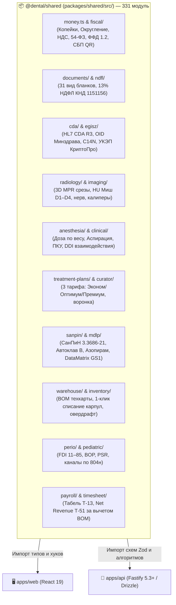

# 🧮 Алгоритмы, Валидаторы и Общий Пакет `@dental/shared`

> 🧭 **Навигация:** [🗺️ Главный Индекс (.agents/INDEX.md)](file:///C:/Clinic_MVP/dental-crm/.agents/INDEX.md) | [📚 Портал Документации (docs/README.md)](file:///C:/Clinic_MVP/dental-crm/docs/README.md)  
> ⚠️ **Высшая Конституция:** [THE_HAMMER_MASTER_PROMPT.md](file:///C:/Clinic_MVP/dental-crm/.agents/THE_HAMMER_MASTER_PROMPT.md) | [Системная Конституция (.agents/AGENTS.md)](file:///C:/Clinic_MVP/dental-crm/.agents/AGENTS.md)  
> 📦 **Исходники пакета:** [`packages/shared/src/`](file:///C:/Clinic_MVP/dental-crm/packages/shared/src/) (331 модуль бизнес-логики, алгоритмов и схем) | [DATABASE.md](file:///C:/Clinic_MVP/dental-crm/.agents/DATABASE.md) | [BILLING_AND_FINANCE.md](file:///C:/Clinic_MVP/dental-crm/.agents/BILLING_AND_FINANCE.md)  

---

## 🏛️ 1. Архитектура и Структура Пакета `@dental/shared` (`packages/shared/src/`)

В соответствии с **Частью 10 Высшей Конституции (Monorepo & Dependency Rigor)** вся чистая бизнес-логика, математические расчеты, структуры данных, классификаторы законодательства РФ (54-ФЗ, СанПиН 3.3686-21, Номенклатура 804н, ЕГИСЗ, ТК РФ Т-13/Т-51) и валидаторы Zod сосредоточены в независимом пакете `@dental/shared`. Клиентское веб-приложение (`apps/web`) и серверный API (`apps/api`) потребляют этот функционал без дублирования:

```mermaid
graph TD
    subgraph SHARED_CORE["📦 @dental/shared (packages/shared/src/) — 331 модуль"]
        M1["money.ts & fiscal/<br/>(Копейки, Округление, НДС, 54-ФЗ, ФФД 1.2, СБП QR)"]
        M2["documents/ & ndfl/<br/>(31 вид бланков, 13% НДФЛ КНД 1151156)"]
        M3["cda/ & egisz/<br/>(HL7 CDA R3, OID Минздрава, C14N, УКЭП КриптоПро)"]
        M4["radiology/ & imaging/<br/>(3D MPR срезы, HU Миш D1–D4, нерв, калиперы)"]
        M5["anesthesia/ & clinical/<br/>(Доза по весу, Аспирация, ПКУ, DDI взаимодействия)"]
        M6["treatment-plans/ & curator/<br/>(3 тарифа: Эконом/Оптимум/Премиум, воронка)"]
        M7["sanpin/ & mdlp/<br/>(СанПиН 3.3686-21, Автоклав B, Азопирам, DataMatrix GS1)"]
        M8["warehouse/ & inventory/<br/>(BOM техкарты, 1-клик списание карпул, овердрафт)"]
        M9["perio/ & pediatric/<br/>(FDI 11–85, BOP, PSR, каналы по 804н)"]
        M10["payroll/ & timesheet/<br/>(Табель Т-13, Net Revenue Т-51 за вычетом BOM)"]
    end

    SHARED_CORE -->|Импорт типов и хуков| WEB["🖥️ apps/web (React 19)"]
    SHARED_CORE -->|Импорт схем Zod и алгоритмов| API["🔌 apps/api (Fastify 5.3+ / Drizzle)"]
```

---

## 📂 2. Полный Модульный Реестр `@dental/shared`

### 2.1. Финансы, Точные Деньги и Касса 54-ФЗ
* **[`money.ts`](file:///C:/Clinic_MVP/dental-crm/packages/shared/src/money.ts)** — Фундаментальный закон целочисленной арифметики (Integer Kopecks Law, Mandate 8b):
  - Хранение и расчет любых денежных сумм строго в целых копейках (`type Kopecks = number`). Запрет на использование чисел с плавающей точкой (`float`/`double`) в финансовых операциях.
  - Утилиты: `toKopecks()`, `fromKopecks()`, `formatMoneyRub()`, банковское и математическое округление НДС (`calculateVatAmount`).
* **[`fiscal/`](file:///C:/Clinic_MVP/dental-crm/packages/shared/src/fiscal/)** (16 модулей) — Регламенты кассовой дисциплины 54-ФЗ и ФФД 1.2:
  - Валидация кассовых чеков: признак способа расчета (аванс, полный расчет), признак предмета расчета (услуга, товар).
  - Обязательные теги ФФД 1.2: тег 1212 (признак предмета расчета), тег 2108 (мера количества), тег 1084 (дополнительный реквизит пользователя).
  - Строгая валидация СНИЛС с проверкой контрольной суммы (`validateRussianSnils`).
  - Проверка ИНН юридических лиц (10 знаков) и физических лиц (12 знаков) с вычислением контрольных цифр.
  - Форматирование динамических QR-кодов Системы Быстрых Платежей (СБП) по стандарту НСПК.
* **[`finance/`](file:///C:/Clinic_MVP/dental-crm/packages/shared/src/finance/)** (25 модулей) — Лицевые счета, депозиты, раздельные и комбинированные платежи (нал + карта + аванс), семейные кошельки с общим распределением средств.

### 2.2. Юридический Документооборот и Налоговые Вычеты
* **[`documents/`](file:///C:/Clinic_MVP/dental-crm/packages/shared/src/documents/)** (22 модуля) — Единый реестр 31 вида медицинской и юридической документации РФ:
  - `documentKindSchema` — Строгая Zod-валидация всех 31 видов бланков (Форма 043/у, ИДС на анестезию, ИДС на имплантацию, договор на оказание платных медуслуг, акт выполненных работ, гарантийный талон).
  - Классификация по группам (`documentFactoryGroups`): `visit`, `payment`, `tax`, `legal`, `workflow`.
  - Типографские рендеры бланков 043/у, договоров и согласий ([`clinicalHtmlRenderers.ts`](file:///C:/Clinic_MVP/dental-crm/packages/shared/src/documents/clinicalHtmlRenderers.ts)).
  - [`ndflXmlGenerator.ts`](file:///C:/Clinic_MVP/dental-crm/packages/shared/src/documents/ndflXmlGenerator.ts) — Генератор структурированных XML-файлов справок об оплате медицинских услуг для вычета 13% НДФЛ по форме ФНС России КНД 1151156.
  - Поддержка актуальных приказов ФНС: `legacyTaxDeductionCertificateMinYear = 2021`, `legacyTaxDeductionCertificateMaxYear = 2023`, `taxDeductionCertificateMinYear = 2024`.

### 2.3. Государственные Интеграции: ЕГИСЗ РЭМД и УКЭП
* **[`cda/`](file:///C:/Clinic_MVP/dental-crm/packages/shared/src/cda/)** & **[`egisz/`](file:///C:/Clinic_MVP/dental-crm/packages/shared/src/egisz/)** (18 модулей) — Формирование структурированных электронных медицинских документов (СЭМД) стандарта HL7 CDA R3:
  - Генераторы структурированных документов:
    * `generator043_1u.ts` — Стоматологическая карта взрослого и ортодонтическая карта (Форма 043-1/у).
    * `generator101.ts`, `generator104.ts`, `generator130.ts` — СЭМД протоколов консультаций, первичных и повторных приемов.
  - Федеральные справочники OID Минздрава России (`oids.ts`, `GOST_CRYPTO_OIDS`).
  - Каноникализация XML C14N (`c14n.ts`) и проверка по официальным XSD-схемам Минздрава (`schemas.ts`, `validator.ts`).
* **[`crypto/`](file:///C:/Clinic_MVP/dental-crm/packages/shared/src/crypto/)** — Фасад криптографических операций (КриптоПро ЭЦП Browser plug-in / Cadesplugin):
  - Генерация открепленных подписей формата CMS / PKCS#7 (`signature.ts`).
  - Визуальные штампы электронной подписи с реквизитами сертификата врача и клиники (`visualSignatureStamp.ts`).

### 2.4. Клинический Контур, Одонтограмма, Пародонтограмма и Безопасность
* **[`anesthesia/`](file:///C:/Clinic_MVP/dental-crm/packages/shared/src/anesthesia/)** (6 модулей) — Безопасность местной анестезии:
  - [`calculator.ts`](file:///C:/Clinic_MVP/dental-crm/packages/shared/src/anesthesia/calculator.ts) & `safety.ts` — Клинический калькулятор безопасной дозы анестетика (Артикаин с адреналином 1:100 000 / 1:200 000, Мепивакаин 3%) по массе тела пациента с учетом возраста (`calculateAge`).
  - Журнал аспирационной пробы и предметно-количественного учета (ПКУ, `pkuDisposal.ts`).
* **[`clinical/`](file:///C:/Clinic_MVP/dental-crm/packages/shared/src/clinical/)** (24 модуля) — Клинические стандарты и наряды:
  - [`clinicalDdiDrugSafetyEngine.ts`](file:///C:/Clinic_MVP/dental-crm/packages/shared/src/clinical/clinicalDdiDrugSafetyEngine.ts) — Движок анализа опасных межлекарственных взаимодействий (DDI) и аллергического анамнеза.
  - [`cmoEmkQualityAuditEngine.ts`](file:///C:/Clinic_MVP/dental-crm/packages/shared/src/clinical/cmoEmkQualityAuditEngine.ts) — Алгоритм аудита историй болезни для начмеда (проверка полноты карты 043/у без блокировки врача по Мандату 8e).
  - `visitWorkOrder.ts` — Наряд выполненных манипуляций с привязкой к прейскуранту 804н.
* **[`perio/`](file:///C:/Clinic_MVP/dental-crm/packages/shared/src/perio/)** (8 модулей) — Пародонтологический профиль:
  - Индексы гигиены и воспаления: OHI-S, КПУ, PSR, CPITN.
  - 6-точечное измерение глубины пародонтальных карманов, кровоточивость при зондировании (BOP), рецессия десны и вовлечение фуркаций корней.
* **[`treatment-plans/`](file:///C:/Clinic_MVP/dental-crm/packages/shared/src/treatment-plans/)** — 3-уровневые планы лечения:
  - Калькулятор тарифов «Эконом», «★ Оптимум», «Премиум» с пересчетом гарантийных сроков и этапов.
  - Свобода применения врачебных скидок до 100% (Мандат 8e).
* **[`pediatricDentition.ts`](file:///C:/Clinic_MVP/dental-crm/packages/shared/src/pediatricDentition.ts)** & **[`toothCanalsAndBilling804n.ts`](file:///C:/Clinic_MVP/dental-crm/packages/shared/src/toothCanalsAndBilling804n.ts)**:
  - Полная нотация FDI: 32 зуба взрослого прикуса (11–48) + 20 зубов молочного прикуса (51–85).
  - Поверхности зубов: окклюзионная, вестибулярная, язычная/небная, медиальная, дистальная.
  - Автоматический расчет количества корневых каналов для эндодонтических позиций прейскуранта 804н.

### 2.5. Склад, СанПиН 3.3686-21 и Маркировка МДЛП Честный ЗНАК
* **[`sanpin/`](file:///C:/Clinic_MVP/dental-crm/packages/shared/src/sanpin/)** (12 модулей) — Эпидемиологический санитарный контроль:
  - Циклы автоклавирования класса B: режим 134°C (5 мин) и режим 121°C (20 мин).
  - Электронные журналы контроля стерилизации, учет азопирамовых и фенолфталеиновых проб, крафт-пакеты со сроками годности.
  - Учет медицинских отходов класса Б (эпидемиологически опасные отходы).
* **[`mdlp/`](file:///C:/Clinic_MVP/dental-crm/packages/shared/src/mdlp/)** (8 модулей) — Система Честный ЗНАК:
  - Парсинг 2D штрихкодов GS1 DataMatrix (GTIN, серийный номер, ключ проверки, криптохвост).
  - Формирование квитанций вывода лекарственных средств из оборота при оказании медпомощи.
* **[`warehouse/`](file:///C:/Clinic_MVP/dental-crm/packages/shared/src/warehouse/)** & **[`inventory/`](file:///C:/Clinic_MVP/dental-crm/packages/shared/src/inventory/)** (13 модулей):
  - Технологические карты услуг (BOM — Bill of Materials): автоматическое списание материалов при закрытии визита.
  - Медсестринское списание пустых карпул анестетиков в 1 клик без бюрократических комиссий (Мандат 8e).
  - Мягкий овердрафт склада (предупреждение вместо блокировки оказания помощи).

### 2.6. Кадры, Табель Т-13 и Зарплата Т-51 Net Revenue
* **[`payroll/`](file:///C:/Clinic_MVP/dental-crm/packages/shared/src/payroll/)** — Модели сдельной и окладной оплаты труда:
  - Расчет «чистой выручки» (Net Revenue): `Сумма услуги - Стоимость списанных материалов по BOM - Себестоимость наряда ЗТЛ`.
  - Дифференцированные процентные ставки врача по категориям работ.
* **[`timesheet/`](file:///C:/Clinic_MVP/dental-crm/packages/shared/src/timesheet/)** (входит в модуль аналитики и кадров):
  - Расчет рабочего времени по унифицированной форме Т-13 (`calculateEmployeeTimesheetT13`, `generateTimesheetT13Csv`, `renderFormT13Html`): норма часов, ночные смены, праздничные дни, неявки.

---

## ⚡ 3. Ключевые Алгоритмы Системы

### 3.1. Алгоритм 3D DICOM MPR Реконструкции КТ ([`packages/shared/src/radiology/`](file:///C:/Clinic_MVP/dental-crm/packages/shared/src/radiology/) & `apps/web/src/mprWorker.ts`)
- **Вход**: Трёхмерный массив вокселей DICOM (серия срезов конусно-лучевой компьютерной томографии КЛКТ).
- **Логика**:
  1. Вычисление аффинного преобразования координат из физического 3D-пространства пациента в ортогональные проекции (Аксиальная, Сагиттальная, Корональная плоскости).
  2. Трилинейная интерполяция значений рентгеновской плотности Хаунсфилда (HU) между соседними срезами томограммы.
  3. Динамическое контрастирование по пресетам окон (Window Center / Window Width: костное окно, дентальное окно, мягкие ткани).
  4. Расчет плотности кости по шкале Миша (D1 > 1250 HU, D2 850–1250 HU, D3 350–850 HU, D4 150–350 HU) для оценки первичной стабильности импланта.
- **Выход**: Каналы пикселей RGBA в Web Worker без микрофризов основного UI-потока.

### 3.2. Алгоритм Нормализации Врачебной Диктовки ([`apps/api/src/routes/speech.ts`](file:///C:/Clinic_MVP/dental-crm/apps/api/src/routes/speech.ts))
- **Вход**: Непрерывный аудиопоток от микрофона стоматолога.
- **Логика**:
  1. Передача аудиочанка в шлюз распознавания речи (Yandex SpeechKit / Whisper / Groq).
  2. Скользящая дедупликация соседних чанков аудио `appendSpeechTextWithoutDuplicateTail` для устранения повторов слов на стыках.
  3. Лингвистическая стоматологическая нормализация: преобразование русской речи («кариес сорок шестого дистально-окклюзионная») в структурированный JSON:
     `{ tooth: 46, surfaces: ['distal', 'occlusal'], diagnosis: 'K02.1', pathology: 'caries' }`.
- **Выход**: Автоматическое обновление одонтограммы и подстановка текста в дневник 043/у.

### 3.3. Алгоритм Расчета Справки 13% НДФЛ ФНС КНД 1151156 ([`packages/shared/src/documents/ndflXmlGenerator.ts`](file:///C:/Clinic_MVP/dental-crm/packages/shared/src/documents/ndflXmlGenerator.ts))
- **Вход**: Массив оплаченных счетов за выбранный календарный год по пациенту и его налогоплательщику.
- **Логика**:
  1. Разделение сумм по кодам услуг:
     - **Код 1:** Стандартное терапевтическое, хирургическое и гигиеническое лечение.
     - **Код 2:** Дорогостоящее лечение (дентальная имплантация, костная пластика, сложное протезирование).
  2. Проверка 100% фактической оплаты (частично оплаченные и аннулированные счета исключаются).
  3. Исключение немедицинских товаров (зубные щетки, пасты, ирригаторы исключаются из налоговой базы).
  4. Формирование машиночитаемого XML-файла по схеме ФНС РФ КНД 1151156.
- **Выход**: Готовая к печати типографская форма справки со штрихкодом и XML-пакет для налоговой инспекции.

### 3.4. Алгоритм Расчета Зарплаты Врача Т-51 Net Revenue ([`apps/api/src/services/finance/doctorPayouts.ts`](file:///C:/Clinic_MVP/dental-crm/apps/api/src/services/finance/doctorPayouts.ts))
- **Вход**: Закрытые наряды выполненных услуг за расчетный месяц.
- **Логика**:
  1. Вычисление «чистой выручки» (Net Revenue): `Сумма услуги - Стоимость списанных материалов по BOM - Себестоимость наряда ЗТЛ`.
  2. Применение индивидуальной шкалы процентов врача по категориям работ.
  3. Учет гарантийных переделок и скидок по Мандату 8e.
- **Выход**: Сводная зарплатная ведомость унифицированной формы Т-51.

---

## 🔗 Перекрестные Ссылки
- 🗺️ [Главный Навигационный Индекс (.agents/INDEX.md)](file:///C:/Clinic_MVP/dental-crm/.agents/INDEX.md)
- 📚 [Портал Технической Документации (docs/README.md)](file:///C:/Clinic_MVP/dental-crm/docs/README.md)
- 🖥️ [Карта Компонентов Фронтенда (FRONTEND_COMPONENTS_DEEP_MAP.md)](file:///C:/Clinic_MVP/dental-crm/docs/competitive-audit/FRONTEND_COMPONENTS_DEEP_MAP.md)
- 🛣️ [Карта Маршрутов API (API_ROUTES_DEEP_MAP.md)](file:///C:/Clinic_MVP/dental-crm/docs/competitive-audit/API_ROUTES_DEEP_MAP.md)
- 🗄️ [Карта Базы Данных (DATABASE_DEEP_MAP.md)](file:///C:/Clinic_MVP/dental-crm/docs/competitive-audit/DATABASE_DEEP_MAP.md)
- 🧪 [Справочник Скриптов и Гейтов (SCRIPTS_AND_CLI_DEEP_MAP.md)](file:///C:/Clinic_MVP/dental-crm/docs/competitive-audit/SCRIPTS_AND_CLI_DEEP_MAP.md)
