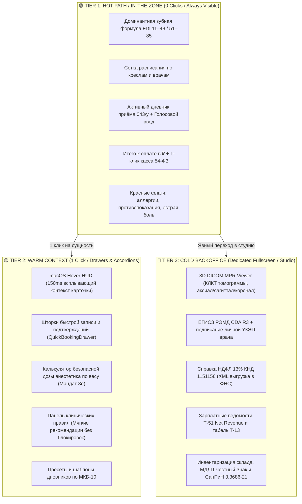

# 🖥️ Полная Карта Фронтенд-Компонентов Dental CRM (React 19 / TypeScript)

> 🧭 **Навигация:** [🗺️ Главный Индекс (.agents/INDEX.md)](file:///C:/Clinic_MVP/dental-crm/.agents/INDEX.md) | [📚 Портал Документации (docs/README.md)](file:///C:/Clinic_MVP/dental-crm/docs/README.md)  
> ⚠️ **Высшая Конституция:** [THE_HAMMER_MASTER_PROMPT.md](file:///C:/Clinic_MVP/dental-crm/.agents/THE_HAMMER_MASTER_PROMPT.md) | [Системная Конституция (.agents/AGENTS.md)](file:///C:/Clinic_MVP/dental-crm/.agents/AGENTS.md)  
> 📐 **Стандарты Эргономики и UI:** [UI_STANDARDS.md](file:///C:/Clinic_MVP/dental-crm/.agents/UI_STANDARDS.md) | [FRONTEND_VIEWS_MAP.md](file:///C:/Clinic_MVP/dental-crm/.agents/FRONTEND_VIEWS_MAP.md) | [CLINICAL_RULES.md](file:///C:/Clinic_MVP/dental-crm/.agents/CLINICAL_RULES.md)  
> **Стек клиентской части:** React `19.2.7`, TypeScript, Vite, Tailwind CSS + CSS Variables (`var(--paper)`, `var(--ink)`), Lucide Icons, Web Workers (3D DICOM MPR).

---

## 🏛️ 1. Архитектурный Каркас и 3-Уровневая Модель (3-Tier Interaction Architecture)

Интерфейс веб-клиента DENTE (`apps/web/src/`) строго спроектирован по канонам **Universal 3-Tier Interaction Doctrine** и **Studio Clinical HIG** (десктопная плотность панели пилота для 80% рабочих станций, мобильная эргономика для 10% планшетов у кресла и 10% пациентского портала):

### Принципы уровней:
1. **🟢 TIER 1 (Hot Path / В потоке):**
   - Рабочий холст доминирует на экране (сетка расписания, зубная одонтограмма $\ge 140\text{--}160\text{px}$, активная карта визита).
   - 0-клик доступ к ключевым действиям.
   - **Абсолютный запрет на всплывающие блокирующие модальные окна** и опросники на основном пути врача.
   - Тач-таргеты строго $\ge 44\times 44\text{px}$ для работы в медицинских перчатках.
2. **🟡 TIER 2 (Warm Context / Контекстные шторки и аккордеоны):**
   - Выкатные боковые панели (Side Drawers $\le 420\text{px}$) и встроенные раскрывающиеся списки.
   - Открываются строго по 1 клику пользователя на выбранную сущность (зуб, слот расписания, услугу).
   - **Закон Анти-Матрёшки:** максимальная глубина модальных слоев — строго 1. Запрещено открывать модалку поверх модалки.
3. **🔵 TIER 3 (Cold Backoffice / Кабинетный режим и специализированные студии):**
   - Тяжелые аналитические, диагностические и регуляторные операции.
   - Вынесены в изолированные полноэкранные режимы (`ImagingView`, студия CDA/УКЭП, кассовая инкассация, складские ревизии), чтобы не утяжелять hot-path рендеринга.

---

## 🧭 2. Полный Реестр 14 Главных Представлений (App Views Registry)

В соответствии с конфигурацией корневого роутера (`apps/web/src/workspaceShell.tsx`, `apps/web/src/workspacePreload.ts`, `apps/web/src/App.tsx`) в системе развернуто ровно **14 основных представлений**:

| # | Идентификатор | Хеш роута | Название раздела | Корневой компонент | Основная роль и назначение |
|---|---|---|---|---|---|
| 1 | `shift` | `#shift` | **Смена** | [`ShiftView.tsx`](file:///C:/Clinic_MVP/dental-crm/apps/web/src/ShiftView.tsx) | Кокпит врача и ассистента: текущий пациент в кресле, таймер приема, оперативные задачи смены, быстрый вызов ЭМК. |
| 2 | `schedule` | `#schedule` | **Расписание** | [`ScheduleView.tsx`](file:///C:/Clinic_MVP/dental-crm/apps/web/src/ScheduleView.tsx) | Календарная сетка приемов по креслам и специалистам, цветовое кодирование явки, 150ms macOS Hover HUD, листы ожидания. |
| 3 | `patients` | `#patients` | **Пациенты** | [`PatientsView.tsx`](file:///C:/Clinic_MVP/dental-crm/apps/web/src/PatientsView.tsx) | Реестр пациентов, расширенный поиск (ФИО, телефон, СНИЛС, полис), семейные группы, депозитные балансы, история визитов. |
| 4 | `imaging` | `#imaging` | **Снимки / КЛКТ** | [`ImagingView.tsx`](file:///C:/Clinic_MVP/dental-crm/apps/web/src/ImagingView.tsx) | 3D DICOM PACS Viewer: мультипланарная реконструкция (MPR), денситометрия Хаунсфилда (HU D1–D4), RVG радиовизиография. |
| 5 | `visit` | `#visit` | **Приём (ЭМК 043/у)** | [`VisitView.tsx`](file:///C:/Clinic_MVP/dental-crm/apps/web/src/VisitView.tsx) | Рабочее место стоматолога: интерактивная одонтограмма FDI 11–48/51–85, диктовка дневника, наряд услуг по 804н, списание материалов. |
| 6 | `documents` | `#documents` | **Документооборот** | [`DocumentsView.tsx`](file:///C:/Clinic_MVP/dental-crm/apps/web/src/DocumentsView.tsx) | Юридический контур: 31 вид бланков, договоры, ИДС, акты выполненных работ, справки НДФЛ КНД 1151156, headless PDF экспорт. |
| 7 | `finance` | `#finance` | **Финансы / Касса** | [`FinanceView.tsx`](file:///C:/Clinic_MVP/dental-crm/apps/web/src/FinanceView.tsx) | Касса по 54-ФЗ, фискализация чеков (ФФД 1.2), эквайринг, раздельная и комбинированная оплата (нал/карта/аванс), семейные кошельки. |
| 8 | `analytics` | `#analytics` | **Аналитика** | [`pages/AnalyticsDashboardView.tsx`](file:///C:/Clinic_MVP/dental-crm/apps/web/src/pages/AnalyticsDashboardView.tsx) | Управленческий дашборд руководителя: когортный анализ LTV/CAC, загрузка кресел, средний чек, конверсия первичных приемов. |
| 9 | `communications` | `#communications` | **Сообщения / Чаты** | [`CommunicationsView.tsx`](file:///C:/Clinic_MVP/dental-crm/apps/web/src/CommunicationsView.tsx) | Омниканальный коммуникатор: WhatsApp WABA, VK MAX, Telegram-бот, аудиозаписи звонков АТС (Mango, UIS, Zadarma). |
| 10 | `inventory` | `#inventory` | **Склад и СанПиН** | [`components/InventoryView.tsx`](file:///C:/Clinic_MVP/dental-crm/apps/web/src/components/InventoryView.tsx) | Складской учет: партии, сроки годности, техкарты процедур (BOM), журналы стерилизации СанПиН 3.3686-21, 1-клик списание карпул. |
| 11 | `scanner` | `#scanner` | **Сканер** | [`ScannerView.tsx`](file:///C:/Clinic_MVP/dental-crm/apps/web/src/ScannerView.tsx) | Модуль потокового сканирования и распознавания бумажных документов, паспортов, полисов ОМС/ДМС и согласий. |
| 12 | `leads` | `#leads` | **Обращения / Лиды** | [`components/leads/LeadsKanbanView.tsx`](file:///C:/Clinic_MVP/dental-crm/apps/web/src/components/leads/LeadsKanbanView.tsx) | Канбан-доска координатора первичных обращений: этапы воронки, интеграции с рекламными кабинетами, коллтрекинг. |
| 13 | `settings` | `#settings` | **Настройки** | [`SettingsView.tsx`](file:///C:/Clinic_MVP/dental-crm/apps/web/src/SettingsView.tsx) | Администрирование клиники: справочники прейскуранта 804н, роли персонала (RBAC), графики сменности, интеграции API. |
| 14 | `marketing` | `#marketing` | **Маркетинг** | [`MarketingView.tsx`](file:///C:/Clinic_MVP/dental-crm/apps/web/src/MarketingView.tsx) | Управление промо-акциями, рассылками напоминаний о профосмотрах, бонусными программами и сегментацией пациентской базы. |

### Дополнительные специализированные модули и порталы:
- **`components/portal/selfCheckin/MobileSelfCheckinModal.tsx`** — Мобильный портал саморегистрации пациента по QR-коду на ресепшене.
- **`components/patient-portal/PublicEstimatePortal.tsx`** — Интерактивная 3-уровневая смета для пациента («Эконом», «Оптимум», «Премиум»).
- **`components/telephony/IncomingCallPopup.tsx`** — Фоновый ненавязчивый индикатор входящего звонка (для врача полностью беззвучен).

---

## 🛑 3. Соблюдение Мандата 8e: Полная Автономия Врача и Персонала (Doctor Autonomy)

В соответствии с **Высшей Конституцией (Раздел VII)** и **Мандатом 8e** любые бюрократические преграды, парализующие работу врача у стоматологического кресла, категорически ликвидированы:

### 1. Ликвидация блокировок на приёме:
- **`ClinicalRulePanel.tsx` — Мягкие предупреждения вместо блокировок:**
  - *Было (устаревшее):* Блокировка сохранения визита и завершения приема при несовпадении протокола или отсутствии согласий.
  - *Стало (Мандат 8e):* Панель клинических правил формирует **исключительно информационные рекомендации и мягкие предупреждения** (warning/advisory). Врач видит предупреждение, но сохранение визита, назначение услуг и печать документов **НИКОГДА НЕ БЛОКИРУЮТСЯ**.
- **Никаких заблокированных кнопок без причины:** Кнопки «Сохранить», «Завершить приём», «Добавить услугу», «Печать» **НИКОГДА не бывают неактивными (`disabled`)** из-за незаполненных второстепенных полей (пульс, температура, соматическая анкета на 50 пунктов).
- **Физиологическая норма в 1 клик:** Кнопка «Соматически здоров / норма» моментально заполняет весь осмотр и анамнез физиологической нормой. Врач правит исключительно патологию.
- **Debounced Autosave в IndexedDB:** Любой текст дневника приёма сохраняется на лету при каждом нажатии клавиши. Смена вкладки, сбой сети или открытие снимка никогда не уничтожают набранный текст.
- **Печать в любой момент:** Форма 043/у печатается на любом этапе: если приём не закрыт — с водяным знаком «ЧЕРНОВИК», если закрыт — «ПОДПИСАНО ВРАЧОМ».
- **Свобода скидок:** Врач имеет право выставить скидку до 100% (гарантийная переделка, персонал) без вызова администратора с мастер-паролем.

### 2. Регистратура и расписание без помех:
- **Создание записи без ассистента:** Поле выбора ассистента строго опционально.
- **Печать договора до осмотра:** Регистратор может распечатать бланк договора с 0 ₽ и строками `_______` для ручного заполнения без 403-ошибок.
- **Тихий софтфон:** Для роли врача входящие звонки скрыты и беззвучны, чтобы не отвлекать от препарирования зуба.

### 3. Касса 54-ФЗ и склад:
- **Оплата без ИНН для физлиц:** Запрещено требовать ИНН с физических лиц при оплате картой или наличными (по 54-ФЗ ИНН обязателен только для юрлиц/ИП).
- **Комбинированная оплата в 1 клик:** Касса моментально принимает разделение суммы (нал + карта + аванс/семейный кошелек).
- **Списание пустых карпул анестетика медсестрой в 1 клик** без комиссии из трех человек.
- **Мягкий овердрафт склада:** Задержка оприходования накладной не блокирует операцию, формируя мягкое предупреждение с минусовым остатком партии.

---

## 🧩 4. Ключевые Подсистемы, Модальные Окна и Шторки

### 4.1. Клинический контур и ЭМК 043/у
- **`components/odontogram/ToothChart.tsx`** — Интерактивная векторная одонтограмма (32 постоянных зуба FDI 11–48 + 20 молочных 51–85, выбор поверхностей: окклюзионная, вестибулярная, оральная, медиальная, дистальная).
- **`components/odontogram/EndoCanalMatrixModal.tsx`** — Анатомическая эндодонтическая карта: рабочая длина корневых каналов, апекслокатор, размеры мастер-файлов и тип обтурации.
- **`components/visit/anesthesia/AnesthesiaAspirationJournalModal.tsx`** — Журнал местной анестезии: выбор препарата (Артикаин, Мепивакаин), автоматический расчет предельной дозы по массе тела пациента, фиксация аспирационной пробы.
- **`components/visit/VisitSoapTemplatesModal.tsx`** — Каталог клинических шаблонов жалоб, анамнеза и дневников по МКБ-10 (K02 кариес, K04 пульпит/периодонтит, K05 гингивит/пародонтит).
- **`components/SmartMicrophoneButton.tsx` & `PriceDictationBar.tsx`** — Голосовая диктовка протокола через микрофон с фоновым распознаванием терминов и автодобавлением услуг в наряд.

### 4.2. Рентгенология и КЛКТ 3D
- **`components/imaging/DicomMprCanvas.tsx`** — Высокопроизводительный WebGL/2D Canvas рендерер срезов КТ из Web Worker (`mprWorker.ts`).
- **`components/imaging/CtPlanningToolbar.tsx`** — Панель виртуального планирования имплантации: позиционирование 3D-импланта, расчет расстояния до нижнечелюстного канала и гайморовой пазухи.
- **`components/imaging/HounsfieldHistogramWidget.tsx`** — График распределения рентгеновской плотности костной ткани по шкале Хаунсфилда (HU) в зоне остеотомии.

### 4.3. Финансы, Платежи и Смета
- **`components/finance/PaymentCaptureModal.tsx`** — Модальное окно кассы 54-ФЗ: выбор способа оплаты, фискализация через ККМ-сервер, печать электронного чека ОФД.
- **`components/finance/FamilyWalletModal.tsx`** — Управление общим семейным балансом: распределение депозита между родственниками.
- **`components/treatment-plans/TreatmentPlanModal.tsx`** — Интерактивный конструктор 3-уровневой сметы (Эконом / Оптимум / Премиум) с расчетом этапов и автоподбором ИДС.

### 4.4. Документооборот и Регуляторика РФ
- **`components/documents/DocumentPreviewModal.tsx`** — Двухколоночный предпросмотр типографских форм бланков (043/у, ИДС, договоры, справки НДФЛ).
- **`components/egisz/EgiszRemdSigningModal.tsx`** — Студия формирования медицинских электронных документов CDA R3 и подписания личной УКЭП врача через Cadesplugin (КриптоПро).
- **`components/documents/NdflCalculatorModal.tsx`** — Калькулятор справки об оплате медицинских услуг для налогового вычета 13% НДФЛ по форме ФНС КНД 1151156.

---

## ⚙️ 5. Управление Состоянием и Предотвращение Деградации

- **`apps/web/src/useAppLogic.tsx`** — Центральный реактивный State-контекст веб-приложения:
  - Декомпозирован на независимые доменные хуки (`useScheduleQueries`, `usePatientQueries`, `useClinicalVisitLogic`, `useImagingQueries`, `useFinanceQueries`).
  - Покрыт жестким прекоммит-гейтом `scripts/check-applogic-stub-overrides.mjs`, предотвращающим затирание живых методов пустыми заглушками.
- **`apps/web/src/contexts/AppLogicContext.tsx`** — Поставщик данных (Context Provider) для глубоких дочерних компонентов интерфейса.
- **Хранилища Zustand (`apps/web/src/store/`)**:
  - `appStore.ts` — текущая активная смена, выбранный пациент, состояние модалок.
  - `themeStore.ts` — поддержка тем оформления (Light, Dark, Calm Teal, Night, Ocean) с токенами `var(--paper)`.
  - `telephonyStore.ts` — очереди входящих звонков и софтфон.

---

## 🔗 Перекрестные Ссылки
- 🗺️ [Главный Навигационный Индекс (.agents/INDEX.md)](file:///C:/Clinic_MVP/dental-crm/.agents/INDEX.md)
- 📚 [Портал Технической Документации (docs/README.md)](file:///C:/Clinic_MVP/dental-crm/docs/README.md)
- 📐 [Стандарты Вёрстки и Экранов (FRONTEND_VIEWS_MAP.md)](file:///C:/Clinic_MVP/dental-crm/.agents/FRONTEND_VIEWS_MAP.md)
- 🧪 [Справочник Скриптов и Гейтов (SCRIPTS_AND_CLI_DEEP_MAP.md)](file:///C:/Clinic_MVP/dental-crm/docs/competitive-audit/SCRIPTS_AND_CLI_DEEP_MAP.md)
- 🧮 [Алгоритмы и Пакет @dental/shared (ALGORITHMS_AND_SHARED_DEEP_MAP.md)](file:///C:/Clinic_MVP/dental-crm/docs/competitive-audit/ALGORITHMS_AND_SHARED_DEEP_MAP.md)

