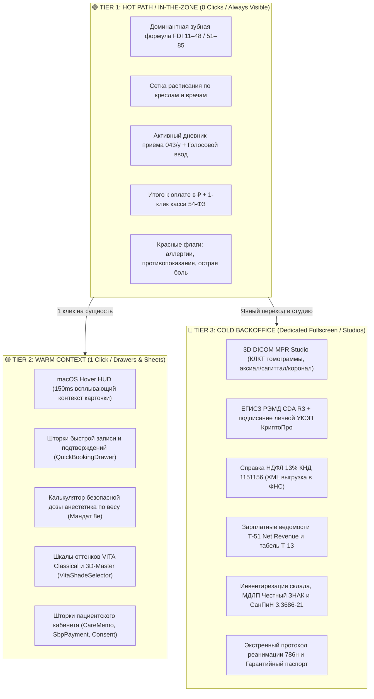

# 🖥️ Полная Карта Фронтенд-Компонентов Dental CRM (React 19 / TypeScript)

> 🧭 **Навигация:** [🗺️ Главный Индекс (.agents/INDEX.md)](file:///C:/Clinic_MVP/dental-crm/.agents/INDEX.md) | [📚 Портал Документации (docs/README.md)](file:///C:/Clinic_MVP/dental-crm/docs/README.md)  
> ⚠️ **Высшая Конституция:** [THE_HAMMER_MASTER_PROMPT.md](file:///C:/Clinic_MVP/dental-crm/.agents/THE_HAMMER_MASTER_PROMPT.md) | [Системная Конституция (.agents/AGENTS.md)](file:///C:/Clinic_MVP/dental-crm/.agents/AGENTS.md)  
> 📐 **Стандарты Эргономики и UI:** [UI_STANDARDS.md](file:///C:/Clinic_MVP/dental-crm/.agents/UI_STANDARDS.md) | [FRONTEND_VIEWS_MAP.md](file:///C:/Clinic_MVP/dental-crm/.agents/FRONTEND_VIEWS_MAP.md) | [CLINICAL_RULES.md](file:///C:/Clinic_MVP/dental-crm/.agents/CLINICAL_RULES.md)  
> **Стек клиентской части:** React `19.2.7`, TypeScript, Vite, CSS Variables (`var(--paper)`, `var(--ink)`, `var(--glass-panel)`), Lucide Icons, Web Workers (3D DICOM MPR), 800 модулей компонентов в [`apps/web/src/components/`](file:///C:/Clinic_MVP/dental-crm/apps/web/src/components/).

---

## 🏛️ 1. Архитектурный Каркас и 3-Уровневая Модель (3-Tier Interaction Architecture)

Интерфейс веб-клиента DENTE (`apps/web/src/`) строго спроектирован по канонам **Universal 3-Tier Interaction Doctrine** и **Studio Clinical HIG** (десктопная плотность панели пилота 28–36px для рабочих мест врачей, тач-таргеты $\ge 44\times 44\text{px}$ для мобильных устройств и планшетов у кресла):

```mermaid
graph TD
    subgraph TIER_1["🟢 TIER 1: HOT PATH / IN-THE-ZONE (0 Clicks / Always Visible)"]
        T1_1["Доминантная зубная формула FDI 11–48 / 51–85"]
        T1_2["Сетка расписания по креслам и врачам"]
        T1_3["Активный дневник приёма 043/у + Голосовой ввод"]
        T1_4["Итого к оплате в ₽ + 1-клик касса 54-ФЗ"]
        T1_5["Красные флаги: аллергии, противопоказания, острая боль"]
    end

    subgraph TIER_2["🟡 TIER 2: WARM CONTEXT (1 Click / Drawers & Sheets)"]
        T2_1["macOS Hover HUD (150ms всплывающий контекст карточки)"]
        T2_2["Шторки быстрой записи и подтверждений (QuickBookingDrawer)"]
        T2_3["Калькулятор безопасной дозы анестетика по весу (Мандат 8e)"]
        T2_4["Шкалы оттенков VITA Classical и 3D-Master (VitaShadeSelector)"]
        T2_5["Шторки пациентского кабинета (CareMemo, SbpPayment, Consent)"]
    end

    subgraph TIER_3["🔵 TIER 3: COLD BACKOFFICE (Dedicated Fullscreen / Studios)"]
        T3_1["3D DICOM MPR Studio (КЛКТ томограммы, аксиал/сагиттал/коронал)"]
        T3_2["ЕГИСЗ РЭМД CDA R3 + подписание личной УКЭП КриптоПро"]
        T3_3["Справка НДФЛ 13% КНД 1151156 (XML выгрузка в ФНС)"]
        T3_4["Зарплатные ведомости Т-51 Net Revenue и табель Т-13"]
        T3_5["Инвентаризация склада, МДЛП Честный ЗНАК и СанПиН 3.3686-21"]
        T3_6["Экстренный протокол реанимации 786н и Гарантийный паспорт"]
    end

    TIER_1 -->|1 клик на сущность| TIER_2
    TIER_1 -->|Явный переход в студию| TIER_3
```

---

## 🧭 2. Полный Реестр 14 Главных Представлений (App Views Registry)

В соответствии с конфигурацией корневого роутера (`apps/web/src/workspaceShell.tsx`, `apps/web/src/workspacePreload.ts`, `apps/web/src/App.tsx`) в системе развернуто ровно **14 основных представлений**:

| # | Идентификатор | Хеш роута | Название раздела | Корневой компонент | Основная роль и назначение |
|---|---|---|---|---|---|
| 1 | `shift` | `#shift` | **Смена** | [`ShiftView.tsx`](file:///C:/Clinic_MVP/dental-crm/apps/web/src/ShiftView.tsx) | Кокпит врача и ассистента: текущий пациент в кресле, таймер приема, оперативные задачи смены, быстрый вызов ЭМК. |
| 2 | `schedule` | `#schedule` | **Расписание** | [`ScheduleView.tsx`](file:///C:/Clinic_MVP/dental-crm/apps/web/src/ScheduleView.tsx) | Календарная сетка приемов по креслам и специалистам, цветовое кодирование явки, 150ms macOS Hover HUD, листы ожидания. |
| 3 | `patients` | `#patients` | **Пациенты** | [`PatientsView.tsx`](file:///C:/Clinic_MVP/dental-crm/apps/web/src/PatientsView.tsx) | Реестр пациентов, расширенный поиск (ФИО, телефон, СНИЛС, полис), семейные группы, депозитные балансы, история визитов. |
| 4 | `imaging` | `#imaging` | **Снимки / КЛКТ** | [`ImagingView.tsx`](file:///C:/Clinic_MVP/dental-crm/apps/web/src/ImagingView.tsx) | 3D DICOM PACS Viewer: мультипланарная реконструкция (MPR), денситометрия Хаунсфилда (HU D1–D4), RVG радиовизиография. |
| 5 | `visit` | `#visit` | **Приём (ЭМК 043/у)** | [`VisitView.tsx`](file:///C:/Clinic_MVP/dental-crm/apps/web/src/VisitView.tsx) | Рабочее место стоматолога: интерактивная одонтограмма FDI 11–48/51–85, диктовка дневника, наряд услуг по 804н, списание материалов. |
| 6 | `documents` | `#documents` | **Документооборот** | [`DocumentsView.tsx`](file:///C:/Clinic_MVP/dental-crm/apps/web/src/DocumentsView.tsx) | Юридический контур: 31 вид бланков, договоры, ИДС, акты выполненных работ, справки НДФЛ КНД 1151156, headless PDF экспорт. |
| 7 | `finance` | `#finance` | **Финансы / Касса** | [`FinanceView.tsx`](file:///C:/Clinic_MVP/dental-crm/apps/web/src/FinanceView.tsx) | Касса по 54-ФЗ, фискализация чеков (ФФД 1.2), эквайринг, раздельная и комбинированная оплата (нал/карта/аванс), семейные кошельки. |
| 8 | `analytics` | `#analytics` | **Аналитика** | [`pages/AnalyticsDashboardView.tsx`](file:///C:/Clinic_MVP/dental-crm/apps/web/src/pages/AnalyticsDashboardView.tsx) | Управленческий дашборд руководителя: когортный анализ LTV/CAC, загрузка кресел, средний чек, конверсия первичных приемов. |
| 9 | `communications` | `#communications` | **Сообщения / Чаты** | [`CommunicationsView.tsx`](file:///C:/Clinic_MVP/dental-crm/apps/web/src/CommunicationsView.tsx) | Омниканальный коммуникатор: WhatsApp WABA, VK MAX, Telegram-бот, аудиозаписи звонков АТС (Mango, UIS, Zadarma). |
| 10 | `inventory` | `#inventory` | **Склад и СанПиН** | [`components/InventoryView.tsx`](file:///C:/Clinic_MVP/dental-crm/apps/web/src/components/InventoryView.tsx) | Складской учет: партии, сроки годности, техкарты процедур (BOM), журналы стерилизации СанПиН 3.3686-21, 1-клик списание карпул. |
| 11 | `scanner` | `#scanner` | **Сканер** | [`ScannerView.tsx`](file:///C:/Clinic_MVP/dental-crm/apps/web/src/ScannerView.tsx) | Модуль потокового сканирования и распознавания бумажных документов, паспортов, полисов ОМС/ДМС и согласий. |
| 12 | `leads` | `#leads` | **Обращения / Лиды** | [`components/leads/LeadsKanbanView.tsx`](file:///C:/Clinic_MVP/dental-crm/apps/web/src/components/leads/LeadsKanbanView.tsx) | Канбан-доска координатора первичных обращений: этапы воронки, интеграции с рекламными кабинетами, коллтрекинг. |
| 13 | `settings` | `#settings` | **Настройки** | [`SettingsView.tsx`](file:///C:/Clinic_MVP/dental-crm/apps/web/src/SettingsView.tsx) | Администрирование клиники: справочники прейскуранта 804н, роли персонала (RBAC), графики сменности, интеграции API. |
| 14 | `marketing` | `#marketing` | **Маркетинг** | [`MarketingView.tsx`](file:///C:/Clinic_MVP/dental-crm/apps/web/src/MarketingView.tsx) | Управление промо-акциями, рассылками напоминаний о профосмотрах, бонусными программами и сегментацией пациентской базы. |

---

## 🧩 3. Полный Каталог Специализированных Подсистем и Модулей (`apps/web/src/components/`)

### 3.1. Клиническая Фотография и Каталог Оттенков VITA (`components/photography/`)
* **[`ClinicalPhotoProtocolModal.tsx`](file:///C:/Clinic_MVP/dental-crm/apps/web/src/components/photography/ClinicalPhotoProtocolModal.tsx)** — Полноэкранная студия дентального фотопротокола (12 стандартных проекций: анфас, профиль, окклюзия в/ч и н/ч, 1:1 макро).
* **[`VitaShadeSelector.tsx`](file:///C:/Clinic_MVP/dental-crm/apps/web/src/components/photography/VitaShadeSelector.tsx)** — Интерактивный селектор расцветки зубов с предпросмотром эмали.
* **[`vitaShadesCatalog.ts`](file:///C:/Clinic_MVP/dental-crm/apps/web/src/components/photography/vitaShadesCatalog.ts)** — Полный классификатор шкал VITA:
  - **VITA Classical:** A1, A2, A3, A3.5, A4, B1, B2, B3, B4, C1, C2, C3, C4, D2, D3, D4.
  - **VITA 3D-Master:** 29 градаций светлоты, насыщенности и цветового тона (L, M, R).
  - **Bleach Shades:** 0M1, 0M2, 0M3 для эстетической реставрации и виниров.
* **[`BeforeAfterComparisonView.tsx`](file:///C:/Clinic_MVP/dental-crm/apps/web/src/components/photography/BeforeAfterComparisonView.tsx)** — Двухканальный слайдер сравнения «До / После» лечения с привязкой зубов FDI.
* **[`IncisalAlignmentGuideOverlay.tsx`](file:///C:/Clinic_MVP/dental-crm/apps/web/src/components/photography/IncisalAlignmentGuideOverlay.tsx)** — Калибровочные направляющие окклюзионной и режущей плоскости, зрачковой линии и средней линии лица.
* **[`PhotoCalibrationDrawer.tsx`](file:///C:/Clinic_MVP/dental-crm/apps/web/src/components/photography/PhotoCalibrationDrawer.tsx)** — Точная подгонка баланса белого и масштабирование по эталонному маркеру.
* **[`PhotoCollageExportSheet.tsx`](file:///C:/Clinic_MVP/dental-crm/apps/web/src/components/photography/PhotoCollageExportSheet.tsx)** — Экспорт клинических коллажей для презентации пациенту и передачи в ЗТЛ.

### 3.2. Экстренная Помощь 786н и Гарантийный Паспорт (`components/emergency/`, `components/warranty/`)
* **[`EmergencyRescueModal.tsx`](file:///C:/Clinic_MVP/dental-crm/apps/web/src/components/emergency/EmergencyRescueModal.tsx)** — Экспресс-протокол оказания неотложной помощи по Приказу Минздрава России 786н:
  - Анафилактический шок (дозировка эпинефрина 0.1% по массе тела, мониторинг АД/ЧСС).
  - Коллапс и обморок (положение Тренделенбурга, ингаляция кислорода).
  - Гипертонический криз и острый коронарный синдром.
  - Токсическая реакция на местный анестетик (протокол липидной реанимации Intralipid 20%).
* **[`emergencyRescueEngine.ts`](file:///C:/Clinic_MVP/dental-crm/apps/web/src/components/emergency/emergencyRescueEngine.ts)** & **[`emergencyRescuePresets.ts`](file:///C:/Clinic_MVP/dental-crm/apps/web/src/components/emergency/emergencyRescuePresets.ts)** — Автоматические калькуляторы реанимационных дозировок, состав аптечки «АнтиШок».
* **[`WarrantyPassportModal.tsx`](file:///C:/Clinic_MVP/dental-crm/apps/web/src/components/warranty/WarrantyPassportModal.tsx)** — Электронный гарантийный паспорт пациента:
  - Паспорт дентальных имплантов (бренд, диаметр, длина, номер партии, серийный номер, ISQ торк).
  - Гарантийные обязательства на ортопедические конструкции ЗТЛ и терапевтические реставрации.
  - Динамический QR-код для верификации подлинности паспорта со смартфона пациента.

### 3.3. Пациентский Портал, Кабинет и Self-Checkin (`components/portal/`, `components/patient-portal/`)
* **[`PatientCabinetModal.tsx`](file:///C:/Clinic_MVP/dental-crm/apps/web/src/components/portal/patientCabinet/PatientCabinetModal.tsx)** — PWA кабинет пациента с бесшовной авторизацией:
  - **[`TreatmentPlanTab.tsx`](file:///C:/Clinic_MVP/dental-crm/apps/web/src/components/portal/patientCabinet/tabs/TreatmentPlanTab.tsx)** — 3-уровневый интерактивный план лечения (Эконом / Оптимум / Премиум) с переключением опций.
  - **[`CareMemoSheet.tsx`](file:///C:/Clinic_MVP/dental-crm/apps/web/src/components/portal/patientCabinet/sheets/CareMemoSheet.tsx)** — Памятки после приема (после удаления зуба, после анестезии, после установки импланта).
  - **[`ConsentSigningSheet.tsx`](file:///C:/Clinic_MVP/dental-crm/apps/web/src/components/portal/patientCabinet/sheets/ConsentSigningSheet.tsx)** — Электронное подписание ИДС пальцем/стилусом со смартфона пациента.
  - **[`SbpPaymentSheet.tsx`](file:///C:/Clinic_MVP/dental-crm/apps/web/src/components/portal/patientCabinet/sheets/SbpPaymentSheet.tsx)** — 1-клик оплата счетов через мобильный банк по СБП QR.
  - **[`RescheduleSheet.tsx`](file:///C:/Clinic_MVP/dental-crm/apps/web/src/components/portal/patientCabinet/sheets/RescheduleSheet.tsx)** — Запрос переноса визита без звонка в регистратуру.
  - **[`ReceptionQrSheet.tsx`](file:///C:/Clinic_MVP/dental-crm/apps/web/src/components/portal/patientCabinet/sheets/ReceptionQrSheet.tsx)** — Персональный QR-код для экспресс-идентификации на ресепшене.
* **[`MobileSelfCheckinModal.tsx`](file:///C:/Clinic_MVP/dental-crm/apps/web/src/components/portal/selfCheckin/MobileSelfCheckinModal.tsx)** — Мобильный терминал саморегистрации пациента на планшете клиники:
  - 0-клик подтверждение явки («Я пришёл на приём»).
  - **[`SomaticQuestionnaireEngine.ts`](file:///C:/Clinic_MVP/dental-crm/apps/web/src/components/portal/selfCheckin/SomaticQuestionnaireEngine.ts)** — Быстрая соматическая анкета с пресетом «Соматически здоров» (Мандат 8e).
* **[`PatientBudgetSignView.tsx`](file:///C:/Clinic_MVP/dental-crm/apps/web/src/components/portal/PatientBudgetSignView.tsx)** — Просмотр и утверждение финансового плана лечения.

### 3.4. 3D DICOM MPR Viewer, Радиология и Визиография (`components/radiology/`, `components/dicom/`, `components/visiograph/`)
* **[`CbctMprImplantStudioModal.tsx`](file:///C:/Clinic_MVP/dental-crm/apps/web/src/components/radiology/CbctMprImplantStudioModal.tsx)** — Полнофункциональная 3D студия КЛКТ:
  - Одновременный 3-проекционный рендеринг: Аксиальная, Сагиттальная, Корональная плоскости.
  - Панорамная кривая зубной дуги ([`dentalCurveEngine.ts`](file:///C:/Clinic_MVP/dental-crm/apps/web/src/components/radiology/dentalCurveEngine.ts)) и вычисление срезов Cross-Section.
  - Трассировка нижнечелюстного канала нерва ([`cbctCaliperNerveMath.ts`](file:///C:/Clinic_MVP/dental-crm/apps/web/src/components/radiology/cbctCaliperNerveMath.ts)) с предупреждением об опасной зоне < 2 мм.
  - Денситометрия кости Хаунсфилда по шкале Миша ([`boneDensityMischMath.ts`](file:///C:/Clinic_MVP/dental-crm/apps/web/src/components/radiology/boneDensityMischMath.ts)): D1 (>1250 HU), D2 (850–1250 HU), D3 (350–850 HU), D4 (150–350 HU).
* **[`CbctViewportHud.tsx`](file:///C:/Clinic_MVP/dental-crm/apps/web/src/components/radiology/CbctViewportHud.tsx)** & **[`CbctLeftToolDock.tsx`](file:///C:/Clinic_MVP/dental-crm/apps/web/src/components/radiology/CbctLeftToolDock.tsx)** — Инструменты калибровки, линейка, транспортир, плотность HU, пресеты окон (Bone, Tooth, Soft Tissue).
* **[`DirectRvgCaptureModal.tsx`](file:///C:/Clinic_MVP/dental-crm/apps/web/src/components/radiology/DirectRvgCaptureModal.tsx)** & **[`VisiographStudioCanvas.tsx`](file:///C:/Clinic_MVP/dental-crm/apps/web/src/components/visiograph/VisiographStudioCanvas.tsx)** — Прямой захват 16-битных прицельных снимков с датчиков радиовизиографа с инверсией, фильтрами резкости и юридическим водяным знаком клиники.

### 3.5. Голосовой Ввод и Звуковой Шлюз (`components/audio/`, `components/voice/`)
* **[`AudioStreamManager.ts`](file:///C:/Clinic_MVP/dental-crm/apps/web/src/components/audio/AudioStreamManager.ts)** — Потоковый захват микрофона через AudioWorklet без блокировки UI-потока.
* **[`CanvasWaveform.tsx`](file:///C:/Clinic_MVP/dental-crm/apps/web/src/components/audio/CanvasWaveform.tsx)** — 60 FPS аппаратная визуализация звуковой волны речи врача.
* **[`VoiceDictationAssistantModal.tsx`](file:///C:/Clinic_MVP/dental-crm/apps/web/src/components/voice/VoiceDictationAssistantModal.tsx)** — Голосовой ассистент с распознаванием терминов («кариес 36 пломба 45 удаление 18») и мгновенным автозаполнением дневника 043/у.

### 3.6. СанПиН 3.3686-21, Стерилизация и Медотходы (`components/sanpin/`)
* **[`SanpinRegisters.tsx`](file:///C:/Clinic_MVP/dental-crm/apps/web/src/components/sanpin/SanpinRegisters.tsx)** — Единый пульт контроля санитарно-эпидемиологических журналов:
  - **`AutoclaveRegisterTab.tsx`** — Журнал стерилизации автоклавов класса B (контроль режима 134°C / 5 мин и 121°C / 20 мин, хим. индикаторы).
  - **`PsoRegisterTab.tsx`** — Журнал предстерилизационной очистки (ПСО, азопирамовая и фенолфталеиновая проба — пресет «Норма» в 1 клик).
  - **`BactericidalRegisterTab.tsx`** — Журнал наработки часов бактерицидных облучателей и рециркуляторов воздуха.
  - **`GeneralCleaningRegisterTab.tsx`** — График и фиксация генеральных уборок помещений.
  - **`MedicalWasteRegisterTab.tsx`** — Журнал образования и передачи на утилизацию медицинских отходов класса Б (пакеты, бирки, вес в кг).
  - **`RetroactiveSanpinBatchModal.tsx`** — Массовое закрытие рутинных записей журналов задним числом в 1 клик без бюрократии.

### 3.7. Касса 54-ФЗ, СБП, Эквайринг и Зарплата Т-13/Т-51 (`components/payments/`, `components/payroll/`)
* **[`SberPosTerminalModal.tsx`](file:///C:/Clinic_MVP/dental-crm/apps/web/src/components/payments/sberPos/SberPosTerminalModal.tsx)** — Интеграция со смарт-терминалами Сбербанк POS: отправка команды оплаты, чтение карт МИР/Mastercard/Visa.
* **[`BankInstallmentQrModal.tsx`](file:///C:/Clinic_MVP/dental-crm/apps/web/src/components/payments/BankInstallmentQrModal.tsx)** — Оформление банковской рассрочки по QR-коду за 2 минуты у кресла.
* **[`checkout/fastCheckoutEngine.ts`](file:///C:/Clinic_MVP/dental-crm/apps/web/src/components/payments/checkout/fastCheckoutEngine.ts)** — Быстрый кассовый расчет: комбинированная оплата (нал + карта + аванс) без требования ИНН у физлиц (Мандат 8e).
* **[`TimesheetT13Modal.tsx`](file:///C:/Clinic_MVP/dental-crm/apps/web/src/components/payroll/TimesheetT13Modal.tsx)** — Табель учета рабочего времени формы Т-13: отработанные смены, ночные часы, больничные и праздничные.
* **[`staffPayrollEngine.ts`](file:///C:/Clinic_MVP/dental-crm/apps/web/src/components/payroll/staffPayrollEngine.ts)** — Расчет сдельной зарплаты врачей Т-51 Net Revenue за вычетом расходников BOM и лаборатории.

### 3.8. Комплексные 3-Уровневые Планы Лечения (`components/treatment-plans/`)
* **[`TreatmentPlan3TierComparison.tsx`](file:///C:/Clinic_MVP/dental-crm/apps/web/src/components/treatment-plans/TreatmentPlan3TierComparison.tsx)** — 3-колоночный интерактивный виджет («Эконом», «★ Оптимум», «Премиум»).
* **[`TreatmentPlanPresenterModal.tsx`](file:///C:/Clinic_MVP/dental-crm/apps/web/src/components/treatment-plans/TreatmentPlanPresenterModal.tsx)** — Презентационный режим для демонстрации плана на большом настенном мониторе в кабинете врача.
* **[`TreatmentPlanPhased4StageView.tsx`](file:///C:/Clinic_MVP/dental-crm/apps/web/src/components/treatment-plans/TreatmentPlanPhased4StageView.tsx)** — Поэтапная дорожная карта лечения (1. Неотложная санация -> 2. Терапия -> 3. Хирургия/Имплантация -> 4. Ортопедия).
* **[`TreatmentPlanSignatureModal.tsx`](file:///C:/Clinic_MVP/dental-crm/apps/web/src/components/treatment-plans/TreatmentPlanSignatureModal.tsx)** — Подписание согласованной сметы пациентом с формированием юридического акта.

---

## ⚙️ 4. Управление Состоянием и Предотвращение Деградации

- **[`apps/web/src/useAppLogic.tsx`](file:///C:/Clinic_MVP/dental-crm/apps/web/src/useAppLogic.tsx)** — Центральный реактивный State-контекст веб-приложения:
  - Декомпозирован на независимые доменные хуки (`useScheduleQueries`, `usePatientQueries`, `useClinicalVisitLogic`, `useImagingQueries`, `useFinanceQueries`).
  - Защищен жестким прекоммит-гейтом `scripts/check-applogic-stub-overrides.mjs`, предотвращающим случайное перекрытие живых методов пустыми заглушками.
- **[`apps/web/src/contexts/AppLogicContext.tsx`](file:///C:/Clinic_MVP/dental-crm/apps/web/src/contexts/AppLogicContext.tsx)** — Контекстный провайдер React для глубоких дочерних компонентов.
- **Хранилища Zustand (`apps/web/src/store/`)**:
  - `appStore.ts` — текущая активная смена, выбранный пациент, состояние модалок.
  - `themeStore.ts` — поддержка тем оформления (Light, Dark, Calm Teal, Night, Ocean) с токенами `var(--paper)`.
  - `telephonyStore.ts` — очереди входящих звонков и софтфон.

---

## 🔗 Перекрестные Ссылки
- 🗺️ [Главный Навигационный Индекс (.agents/INDEX.md)](file:///C:/Clinic_MVP/dental-crm/.agents/INDEX.md)
- 📚 [Портал Технической Документации (docs/README.md)](file:///C:/Clinic_MVP/dental-crm/docs/README.md)
- 🛣️ [Карта Маршрутов API (API_ROUTES_DEEP_MAP.md)](file:///C:/Clinic_MVP/dental-crm/docs/competitive-audit/API_ROUTES_DEEP_MAP.md)
- 🗄️ [Карта Базы Данных (DATABASE_DEEP_MAP.md)](file:///C:/Clinic_MVP/dental-crm/docs/competitive-audit/DATABASE_DEEP_MAP.md)
- 🧮 [Алгоритмы и Пакет @dental/shared (ALGORITHMS_AND_SHARED_DEEP_MAP.md)](file:///C:/Clinic_MVP/dental-crm/docs/competitive-audit/ALGORITHMS_AND_SHARED_DEEP_MAP.md)
- 🧪 [Справочник Скриптов и Гейтов (SCRIPTS_AND_CLI_DEEP_MAP.md)](file:///C:/Clinic_MVP/dental-crm/docs/competitive-audit/SCRIPTS_AND_CLI_DEEP_MAP.md)
