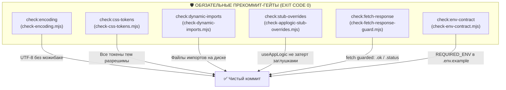

# 🧪 Справочник Автоматизации, Pre-Commit Гейтов и Тестов Dental CRM (`scripts/`)

> 🧭 **Навигация:** [🗺️ Главный Индекс (.agents/INDEX.md)](file:///C:/Clinic_MVP/dental-crm/.agents/INDEX.md) | [📚 Портал Документации (docs/README.md)](file:///C:/Clinic_MVP/dental-crm/docs/README.md)  
> ⚠️ **Высшая Конституция:** [THE_HAMMER_MASTER_PROMPT.md](file:///C:/Clinic_MVP/dental-crm/.agents/THE_HAMMER_MASTER_PROMPT.md) | [Системная Конституция (.agents/AGENTS.md)](file:///C:/Clinic_MVP/dental-crm/.agents/AGENTS.md)  
> 🛠️ **Команды и Сборка:** [COMMANDS_AND_TESTS.md](file:///C:/Clinic_MVP/dental-crm/.agents/COMMANDS_AND_TESTS.md) | [UI_STANDARDS.md](file:///C:/Clinic_MVP/dental-crm/.agents/UI_STANDARDS.md)  

---

## 🛡️ 1. Обязательные Pre-Commit Quality Gates (Железные Шлюзы Качества)

Перед выполнением любого коммита в репозитории действует обязательный заслон автоматических валидаторов («The Iron Gate»). Эти скрипты написаны для предотвращения скрытых дефектов, которые не отлавливаются стандартным компилятором `tsc` или линтерами:

### Детальное описание обязательных гейтов:

### 1. `scripts/check-encoding.mjs` (`npm run check:encoding`)
- **Назначение:** Тотальная проверка кодировки всех текстовых файлов репозитория на строгое соответствие **UTF-8 без BOM**.
- **Ловит 4 класса критических дефектов:**
  1. *Не-UTF-8 байты:* файлы в кодировке Windows-1251 (CP1251) или иных ANSI кодировках.
  2. *Символ замены `U+FFFD` (``):* следы уже произошедшей необратимой порчи кириллицы при некорректном чтении/записи скриптами.
  3. *Можибака CP1252:* UTF-8, ошибочно прочитанный как Windows-1252 (характерные пары «D с чертой» `Ð` и «N с тильдой» `Ñ` перед знаками верхней половины ASCII).
  4. *Можибака CP1251:* UTF-8, прочитанный как Windows-1251 (байты `0xD0`/`0xD1` превращаются в кириллические «Р» и «С» подряд, маскируясь под валидный русский текст).
- **Особое правило:** В самом скрипте искомые маркеры записаны только Unicode escape-последовательностями (`\uFFFD`, `\u00D0` и т.д.), исключая ложное самосрабатывание.

### 2. `scripts/check-css-tokens.mjs` (`npm run check:css-tokens`)
- **Назначение:** Поиск обращений к CSS-переменным `var(--x)`, которые не могут быть разрешены ни в одной из тем оформления приложения (`data-theme`).
- **Почему это критично:** Несуществующая переменная в CSS не валит сборку и не дает предупреждений в консоли; свойство становится `invalid at computed-value time`. Для `color` это означает «текст исчез/пропал», для `background` — прозрачная плашка, ломающая верстку. Компилятор TypeScript этого не видит.
- **Особенности алгоритма:**
  - Проверяет наличие fallback-значения по месту вызова.
  - Очищает комментарии CSS перед анализом, чтобы примеры дефектов в документации не считались объявлениями.
  - Учитывает переменные, объявляемые через `@property` или динамически выставляемые из TypeScript/JS через `style.setProperty`.

### 3. `scripts/check-dynamic-imports.mjs` (`npm run check:dynamic-imports`)
- **Назначение:** Валидация всех динамических импортов вида `await import("./path/module.js")` и `import("...")` с относительными путями в `apps/api/src`, `apps/web/src`, `packages/shared/src`.
- **Почему это критично:** Компилятор TypeScript не проверяет физическое существование файлов при строковых динамических импортах. Если модуль удален или переименован, `tsc` дает Exit Code 0, а сервер или клиент падает во время выполнения (Runtime Crash) при первом обращении к роуту.
- **Особенности:** Разрешает относительные пути на диске, учитывая расширения `.ts`, `.tsx`, `.js`, `.mjs`, и возвращает ненулевой код при обнаружении «висячих» ссылок.

### 4. `scripts/check-applogic-stub-overrides.mjs` (`npm run check:stub-overrides`)
- **Назначение:** TypeScript AST-гейт для центрального стейт-менеджера `apps/web/src/useAppLogic.tsx`.
- **Почему это критично:** `useAppLogic` собирает финальный возвращаемый объект, сначала раскрывая доменные хуки (`...useImagingQueries()`, `...useClinicalVisitLogic()`), а затем перечисляя вспомогательные свойства. В литерале объекта JS побеждает последний объявленный ключ. Случайная заглушка `pickBrowserImagingFiles: () => {}` или `: null`, объявленная ниже spread-оператора, **молча перекрывает живую реализацию из модуля**. Поскольку типы совпадают (`() => void`), `typecheck` остается чистым, но кнопка в UI перестает работать.
- **Особенности:** Полный обход AST-дерева через TypeScript Compiler API, сверка экспортов каждого раскрытого модуля с ключами литерала.

### 5. `scripts/check-fetch-response-guard.mjs` (`npm run check:fetch-response`)
- **Назначение:** Обязательная проверка проверки HTTP-статуса ответа `fetch` (`response.ok` или `response.status`) до вызова метода десериализации тела `response.json()`.
- **Почему это критично:** Нативный промис `fetch` в JavaScript отклоняется (`reject`) **исключительно при аппаратном сбое сети**. Ответы с кодами 403 Forbidden, 404 Not Found, 500 Internal Server Error возвращаются как успешно разрешенный промис. Без проверки `if (!res.ok)` тело ошибки `{ error: "Access Denied" }` попадает в стейт вместо массива данных, провоцируя `TypeError: data.map is not a function` или пустые экраны.
- **Особенности:** Парсинг AST, отслеживание имени переменной ответа и обязательный поиск обращений к полям `.ok` или `.status` в области видимости функции до разбора данных.

### 6. `scripts/check-env-contract.mjs` (`npm run check:env-contract`)
- **Назначение:** Проверка синхронизации файла-шаблона `.env.example` с программным контрактом обязательных переменных окружения `REQUIRED_ENV` (`apps/api/src/env/requiredEnv.ts`).
- **Почему это критично:** Если разработчик добавляет новый секрет или эндпоинт в схему приложения, но забывает добавить строку объявления в `.env.example`, развертывание нового стенда или контейнера завершается аварийным падением при старте сервера.
- **Особенности:** Запуск через `node --import tsx`, прямой импорт схемы `REQUIRED_ENV`, проверка наличия физической строки объявления `KEY=` или `# KEY=` с пояснением над ней (простое упоминание в тексте комментария запрещено).

---

## 🔍 2. Дополнительные Гейты Целостности и Архитектуры

- **`scripts/check-tracked-ignored.mjs` (`npm run check:tracked-ignored`)** — Поиск файлов, попавших в индекс Git вопреки правилам `.gitignore` (случайно закоммиченные `.env`, артефакты сборки `dist/`, дампы БД).
- **`scripts/check-guarded-route-headers.mjs` (`npm run check:guarded-headers`)** — Валидация передачи обязательных заголовков авторизации и тенант-контекста во всех клиентах API.
- **`scripts/check-route-callers.mjs` (`npm run check:route-callers`)** — Поиск сиротских серверных маршрутов, к которым нет ни одного обращения с фронтенда.
- **`scripts/check-schema-type-drift.mjs`** — Проверка дрейфа типов между Drizzle ORM схемой PostgreSQL и TypeScript DTO.

---

## 📸 3. Скрипты Визуального Аудита и 4-State Proof

В соответствии с правилами визуальной верификации (Mandatory 4-State Visual Proof: PC Light, PC Dark, Mobile Light, Mobile Dark) применяются следующие инструменты:

- **`scripts/comprehensive-visual-audit.mjs`** — Комплексный визуальный аудит всех 14 экранов CRM с поиском выпадений текста и ошибок адаптивности.
- **`scripts/screenshot-all-views.mjs`** — Автоматический захват скриншотов главных представлений (`Shift`, `Schedule`, `Patients`, `Imaging`, `Visit`, `Documents`, `Finance`, `Settings`, `Analytics`).
- **`scripts/capture-honest-screenshot.cjs`** — Захват физического состояния интерфейса строго с работающего dev-сервера с валидацией HTTP 200 OK.
- **`scripts/capture-real-lifecycle-proofs.mjs`** — Снятие визуальных доказательств сквозного жизненного цикла пациента (от онлайн-записи до чека 54-ФЗ).
- **`scripts/detect-overflows.mjs`** — Автоматический сканер горизонтального паразитного скролла (`overflow-x`) и наездов элементов на мобильных вьюпортах (390px iPhone 14).

---

## 🧪 4. Набор Smoke-Тестов Проверки Качества (Quality Gates Suite)

- **`scripts/run-smoke-suite.mjs` (`npm run smoke:all`)** — Главный консольный раннер автономных smoke-тестов проекта.
- **`scripts/smoke-tax-knd-xml.mjs`** — Проверка корректности формирования XML справок 13% НДФЛ по стандарту ФНС РФ (КНД 1151156).
- **`scripts/smoke-dicom-folder-workup.mjs`** — Проверка парсинга бинарных 16-bit DICOM файлов, вычисления срезов MPR и денситометрии Хаунсфилда.
- **`scripts/smoke-speech-groq-chunk-floor.mjs`** — Валидация устойчивости голосового шлюза диктовки при неравномерном аудиопотоке.
- **`scripts/smoke-payment-idempotency.mjs`** — Тестирование защиты от повторных списаний средств по UUIDv7 ключам идемпотентности.
- **`scripts/smoke-telegram-bot.mjs`** — Валидация командного интерфейса и вебхуков Telegram-бота.
- **`scripts/smoke-clinical-mutation-guard.mjs`** — Проверка невозможности несанкционированной мутации закрытых медицинских протоколов.
- **`scripts/smoke-import-contracts.mjs`** — Проверка парсеров миграции баз данных из сторонних CRM (IDENT, DentalPRO, Инфодент).
- **`scripts/run-chain-proofs.mjs` (`npm run chains`)** — Прогон сквозных цепочек доказательств бизнес-логики.
- **Волновые сценарии граничных условий:** `smoke:wave6` .. `smoke:wave15` (тестирование редких клинических коллизий, многопоточных кассовых смен, нестандартных кодировок).

---

## 📋 5. Сводная Таблица Команд Валидации в `package.json`

| Команда CLI | Исполняемый скрипт / команда | Область проверки |
|---|---|---|
| `npm run check:encoding` | `node scripts/check-encoding.mjs` | Кодировка UTF-8, поиск U+FFFD и можибаки |
| `npm run check:css-tokens` | `node scripts/check-css-tokens.mjs` | Валидность CSS-переменных во всех темах |
| `npm run check:dynamic-imports` | `node scripts/check-dynamic-imports.mjs` | Физическое наличие файлов динамических импортов |
| `npm run check:stub-overrides` | `node scripts/check-applogic-stub-overrides.mjs` | Защита от перекрытия хуков заглушками в useAppLogic |
| `npm run check:fetch-response` | `node scripts/check-fetch-response-guard.mjs` | Наличие проверок .ok/.status перед response.json() |
| `npm run check:env-contract` | `node --import tsx scripts/check-env-contract.mjs` | Соответствие .env.example схеме REQUIRED_ENV |
| `npm run check:tracked-ignored` | `node scripts/check-tracked-ignored.mjs` | Отсутствие заигноренных файлов в индексе Git |
| `npm run typecheck` | `tsc` во всех воркспейсах монорепо | Статическая проверка типов TypeScript (Exit Code 0) |
| `npm run lint` | Комплекс прекоммит-проверок + `typecheck` | Сводный гейт перед коммитом в репозиторий |
| `npm run smoke:all` | `node scripts/run-smoke-suite.mjs` | Полный прогон всех функциональных смоук-тестов |

---

## 🔗 Перекрестные Ссылки
- 🗺️ [Главный Навигационный Индекс (.agents/INDEX.md)](file:///C:/Clinic_MVP/dental-crm/.agents/INDEX.md)
- 📚 [Портал Технической Документации (docs/README.md)](file:///C:/Clinic_MVP/dental-crm/docs/README.md)
- 🖥️ [Карта Компонентов Фронтенда (FRONTEND_COMPONENTS_DEEP_MAP.md)](file:///C:/Clinic_MVP/dental-crm/docs/competitive-audit/FRONTEND_COMPONENTS_DEEP_MAP.md)
- 🧮 [Алгоритмы и Пакет @dental/shared (ALGORITHMS_AND_SHARED_DEEP_MAP.md)](file:///C:/Clinic_MVP/dental-crm/docs/competitive-audit/ALGORITHMS_AND_SHARED_DEEP_MAP.md)
- 🏛️ [Акт Передачи Архитектурного Контроля (ARCHITECT_HANDOVER.md)](file:///C:/Clinic_MVP/dental-crm/docs/competitive-audit/ARCHITECT_HANDOVER.md)

