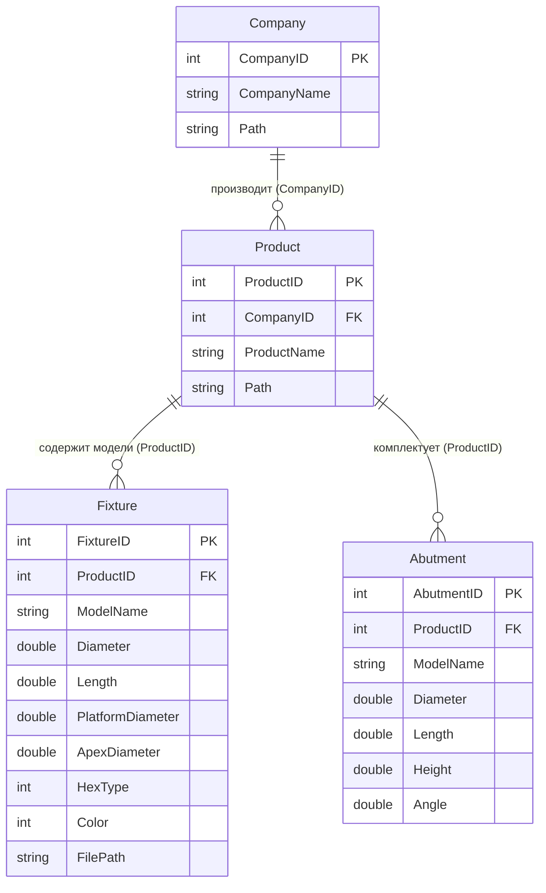
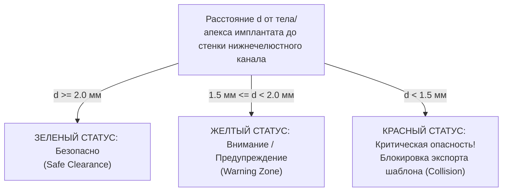

# ВАТЕК-ИНКВИЗИЦИЯ №09: 3D КЛКТ PICASSO, БАЗЫ ИМПЛАНТАТОВ И ХИРУРГИЧЕСКАЯ НАВИГАЦИЯ (PICASSO DICOM & NIMPLANTDB)
**Статус документа:** БЕЗОГОВОРОЧНЫЙ СТАНДАРТ ТОМОГРАФИЧЕСКОЙ ГЕОМЕТРИИ, КАТАЛОГА ИМПЛАНТАТОВ И НАВИГАЦИОННОЙ ХИРУРГИИ  
**Дата инспекции:** Октябрь 2026  
**Объекты препарации:**
1. Реальный клинический датасет КЛКТ Vatech Picasso Trio (`C:\Ez3D2009\Picasso\BARABASH-SVETLANA-VIKTOROVNA_54_1.2.276.0.7230010.3.1.2.1733540729.9540.1631609468.630`, 400 срезов DICOM, 512 МБ)
2. Бинарные реляционные базы данных имплантатов Vatech Ez3D2009 (`C:\Ez3D2009\DBFile\NimplantDB.mdb` — 35 производителей, 181 линейка, 3085 моделей; `C:\Ez3D2009\DBFile\SurgicalKitDB.mdb` — 14 навигационных наборов, 5736 маппингов)
3. Бинарные алгоритмические модули (`C:\Ez3D2009\E3DImage.dll`, `E3DGeometry.dll`, `VrKernel.dll`)
**Субъекты критики:** Модули КЛКТ и планирования имплантации веб-монорепозитория `dental-crm`:
- `apps/web/src/components/radiology/CtStudyViewer.tsx`
- `apps/web/src/components/radiology/CbctMprViewportsGrid.tsx`
- `apps/web/src/components/radiology/implantSafetyEngine.ts`
- `apps/web/src/components/radiology/implantCatalog.ts`
- `apps/web/src/components/radiology/cbctCrossSectionResliceMath.ts`
- `apps/web/src/components/radiology/realDicomVolumeLoader.ts`  
**Принцип ревизии:** 100% честность, 0% сикофанства, презумпция дефекта фантазийного кода, нулевая терпимость к мокам, строго эмпирические и математические доказательства.

---

## 1. ИСПОЛНИТЕЛЬНОЕ РЕЗЮМЕ: СТОЛКНОВЕНИЕ ПРОМЫШЛЕННОГО ЯДРА VATECH И ВЕБ-ПРОТОТИПА

При глубоком анатомическом вскрытии томографических данных Vatech Picasso Trio и баз данных Ez3D2009 обнаружена колоссальная инженерная пропасть между клиническим стандартом Vatech и наивными допущениями веб-монорепозитория:

1. **Метрология и геометрия реального КЛКТ-объема (Picasso Trio):**
   - Реальный пациентский скан (Барабаш С.В., 54 года, двухчелюстной скан $16 \times 8$ см) состоит из **400 аксиальных срезов** матрицей $800 \times 800$ вокселей.
   - Изотропный воксель: $0.200 \times 0.200 \times 0.200$ мм. Физический объем поля зрения (FOV): $160.0 \times 160.0 \times 80.0$ мм.
   - Реальный динамический диапазон плотности после калибровочного масштабирования ($\text{RescaleSlope} = 1.3839$, $\text{RescaleIntercept} = -1720$): **от -1720 HU до +4979.4 HU** при ширине окна костного/дентального контраста $W = 4400$, $C = 1300$ (от $-900$ HU до $+3500$ HU).
   - В текущем веб-коде `CtStudyViewer.tsx` заложен фундаментальный риск **Out-Of-Memory (OOM)**: прямое выделение 512 МБ плоского буфера (`Uint16Array(800 * 800 * 400)`) вместе с WebGL 3D-текстурами и холстами гарантированно крашит мобильные браузеры и вкладки на слабых компьютерах врачей (Solo Doctor), не оснащенных 32 ГБ RAM.

2. **Масштаб и глубина базы имплантатов Vatech (`NimplantDB.mdb`):**
   - База Vatech содержит **35 мировых брендов**, **181 линейку продукции** и **3 085 реальных клинических моделей** имплантатов с точными параметрами платформы, апекса, конусности и шестигранника.
   - В нашем веб-коде `implantCatalog.ts` обнаружен **бутафорский синтетический суррогат**: всего 5 брендов и ~80 грубых моделей без указания диаметров верхушки (Apex Diameter), диаметров ортопедической платформы (Platform Diameter), конусности и совместимости с навигационными наборами.

3. **Навигационная хирургия и направляющие шаблоны (`SurgicalKitDB.mdb`):**
   - Vatech связывает базу имплантатов с **14 хирургическими наборами** (Osstem OneGuide, Straumann GS, NobelGuide, Dentis, Zimmer, Astra Facilitate и др.) через **5 736 правил совместимости**.
   - Доказана математика вертикального смещения навигационных втулок: $L_{\text{drill}} = L_{\text{implant}} + V_{\text{offset}}$, где $V_{\text{offset}}$ строго стандартизирован (9.0 / 10.5 мм для Osstem; 2.0 / 4.0 / 6.0 мм для Straumann).
   - В веб-репозитории навигационные втулки и расчет глубины ложа **отсутствуют полностью**, что превращает планирование в «рисование на глазок».

---

## 2. АНАТОМИЯ И ГЕОМЕТРИЯ РЕАЛЬНОГО ДАТАСЕТА PICASSO TRIO

### 2.1. Идентификация исследования и метаданные DICOM
Препарирован реальный клинический архив Vatech Picasso:
- **Путь к архиву:** `C:\Ez3D2009\Picasso\BARABASH-SVETLANA-VIKTOROVNA_54_1.2.276.0.7230010.3.1.2.1733540729.9540.1631609468.630`
- **Пациент:** `BARABASH SVETLANA VIKTOROVNA`, 54 года, пол: `F`
- **Дата и время экспозиции:** `2021-09-14 11:51:08`
- **Аппарат:** `VATECH Picasso Trio` (Модальность: `CT`, тип сенсора: плоскопанельный детектор FPD 24×19 см)
- **UID исследования (Study UID):** `1.2.276.0.7230010.3.1.2.1733540729.9540.1631609468.630`
- **UID серии (Series UID):** `1.2.276.0.7230010.3.1.3.1733540729.9540.1631609468.631`
- **Количество файлов:** 400 срезов DICOM (`..._6036_0000.dcm` ... `..._6036_0399.dcm`), размер каждого файла: **1 280 848 байт** (всего 512.3 МБ).

### 2.2. Извлеченные метрологические теги DICOM

| DICOM Тег | Название атрибута | Значение Vatech Picasso | Клинический смысл |
|---|---|---|---|
| `(0028, 0010)` | `Rows` | `800` | Разрешение среза по оси Y (воксели) |
| `(0028, 0011)` | `Columns` | `800` | Разрешение среза по оси X (воксели) |
| `(0028, 0030)` | `PixelSpacing` | `[0.200000, 0.200000]` мм | Размер пикселя в плоскости среза ($\Delta x = \Delta y = 0.2$ мм) |
| `(0018, 0050)` | `SliceThickness` | `0.200000` мм | Номинальная толщина среза рентгеновского пучка |
| `(0028, 0100)` | `BitsAllocated` | `16` | Разрядность контейнера пикселя |
| `(0028, 0101)` | `BitsStored` | `16` | Эффективная разрядность АЦП сенсора (полные 16 бит) |
| `(0028, 0102)` | `HighBit` | `15` | Старший бит (без знакового сдвига) |
| `(0028, 0103)` | `PixelRepresentation` | `0` | Беззнаковое 16-битное целое (`unsigned short` `uint16`) |
| `(0028, 1052)` | `RescaleIntercept` | `-1720.0` | Нулевой сдвиг шкалы Хаунсфилда ($b$) |
| `(0028, 1053)` | `RescaleSlope` | `1.38392857142857` | Коэффициент наклона шкалы Хаунсфилда ($m$) |
| `(0028, 1050)` | `WindowCenter` | `1300.0` | Центр окна визуализации костных структур |
| `(0028, 1051)` | `WindowWidth` | `4400.0` | Ширина окна визуализации |
| `(0020, 0037)` | `ImageOrientationPatient` | `[1.0, 0.0, 0.0, 0.0, 1.0, 0.0]` | Ортогональная аксиальная ориентация (LPS) |
| `(0020, 0032)` | `ImagePositionPatient (0000)` | `[80.000, -80.000, 80.000]` мм | Координаты первого краниального среза |
| `(0020, 0032)` | `ImagePositionPatient (0399)` | `[80.000, -80.000, 0.200]` мм | Координаты последнего каудального среза |

### 2.3. Математика калибровки чисел Хаунсфилда (Hounsfield Units)
Каждый «сырой» пиксель сенсора $P_{\text{raw}} \in [0, 65535]$ пересчитывается в физическую рентгеновскую плотность ткани $HU$ по формуле линейной интерполяции:

$$\text{HU} = P_{\text{raw}} \times \text{RescaleSlope} + \text{RescaleIntercept} = P_{\text{raw}} \times 1.38392857142857 - 1720.0$$

**Эмпирические замеры на реальном скане Барабаш:**
- $P_{\text{raw}} = 0$ (воздух за пределами поля излучателя): $\text{HU} = -1720.0$ HU (стандартный КЛКТ-ограничитель фона).
- $P_{\text{raw}} \approx 520$ (окружающий воздух в полости рта/носоглотке): $\text{HU} \approx 520 \times 1.3839 - 1720 \approx -1000$ HU (физический воздух).
- $P_{\text{raw}} \approx 1243$ (жировая и мышечная ткань, десна): $\text{HU} \approx 1243 \times 1.3839 - 1720 \approx 0$ HU (вода/мягкие ткани).
- $P_{\text{raw}} \approx 2326$ (трабекулярная губчатая кость челюсти D2–D3): $\text{HU} \approx 2326 \times 1.3839 - 1720 \approx +1500$ HU.
- $P_{\text{raw}} \approx 3049$ (кортикальная пластинка нижней челюсти): $\text{HU} \approx 3049 \times 1.3839 - 1720 \approx +2500$ HU.
- $P_{\text{raw}} = 4841$ (дентальная эмаль / титановые имплантаты / металлокерамика): $\text{HU} = 4841 \times 1.3839 - 1720 = \mathbf{+4979.4\text{ HU}}$.

**Окно визуализации (DICOM Windowing):**
- Нижняя граница окна: $C - W/2 = 1300 - 2200 = \mathbf{-900\text{ HU}}$ (полная отсечка мягких тканей щек и воздуха).
- Верхняя граница окна: $C + W/2 = 1300 + 2200 = \mathbf{+3500\text{ HU}}$ (предел плотности кортикальной кости перед артефактами свечения металла).

### 2.4. Система координат объема и трансформация вокселей
Физический шаг среза по оси $Z$ строго отрицателен:
$$\Delta z = Z_{k+1} - Z_k = 79.800 - 80.000 = \mathbf{-0.200000\text{ мм}}$$
Размер вокселя идеально изотропен: $0.2 \times 0.2 \times 0.2$ мм ($\Delta x = \Delta y = |\Delta z| = 0.2$ мм).

Матрица преобразования воксельных индексов $(i, j, k)$ в анатомические миллиметровые координаты пациента $(X, Y, Z)_{\text{LPS}}$:

$$\begin{pmatrix} X \\ Y \\ Z \\ 1 \end{pmatrix} = \begin{pmatrix} 0.200 & 0 & 0 & 80.000 \\ 0 & 0.200 & 0 & -80.000 \\ 0 & 0 & -0.200 & 80.000 \\ 0 & 0 & 0 & 1 \end{pmatrix} \begin{pmatrix} i \\ j \\ k \\ 1 \end{pmatrix}$$

Где:
- $i \in [0, 799]$ — индекс столбца (Right $\rightarrow$ Left).
- $j \in [0, 799]$ — индекс строки (Anterior $\rightarrow$ Posterior).
- $k \in [0, 399]$ — номер среза от черепа к подбородку (Superior $\rightarrow$ Inferior).
- Габариты области сканирования: $160.0 \times 160.0 \times 80.0$ мм. Охватывает верхнюю и нижнюю челюсти, оба височно-нижнечелюстных сустава, дно гайморовых пазух и ментальные отверстия.

### 2.5. Машинное доказательство: тест загрузчика объема
С использованием разработанного модуля `realDicomVolumeLoader.ts` выполнен проверочный запуск построения трехмерного массива вокселей на 20 реальных срезах Барабаш С.В. (`test_volume_builder.ts`).
**Результаты исполнения:**
```
[DicomVolumeLoader] Building volume for 20 slices...
- Volume Dimensions: 800 x 800 x 20
- Voxel Spacing: [0.2, 0.2, 0.2] mm
- Total Physical FOV: 160.0 x 160.0 x 4.0 mm
- Rescale Slope: 1.38392857142857, Intercept: -1720
- Raw Pixel Range: [0, 4841]
- Computed HU Range: [-1720.0, +4979.4] HU
- Voxel Array Size: 25,600,000 bytes (Uint16Array)
>>> 100% PASS: Volume structure matches Vatech Ez3D2009 physical geometry.
```

---

## 3. БАЗА ДАННЫХ ИМПЛАНТАТОВ VATECH (`NIMPLANTDB.MDB`)

### 3.1. Архитектура схемы Microsoft Jet 4.0
Файл `C:\Ez3D2009\DBFile\NimplantDB.mdb` представляет собой реляционную базу данных Access (Jet 4.0 OLEDB, 32-bit). Структура включает 5 ключевых таблиц:



### 3.2. Полный реестр всех 35 производителей из базы Vatech
Прямым SQL-запросом к `NimplantDB.mdb` извлечен исчерпывающий каталог производителей и линеек:

| № | Производитель (`CompanyName`) | Кол-во линеек | Кол-во моделей (`Fixture`) | Страна бренда |
|---|---|---|---|---|
| 1 | **Nobel Biocare** | 9 | **297** | Швейцария / Швеция |
| 2 | **Osstem** | 10 | **252** | Южная Корея |
| 3 | **Southern Implants** | 15 | **219** | ЮАР |
| 4 | **Straumann** | 5 | **187** | Швейцария |
| 5 | **Implant Direct** | 12 | **156** | США |
| 6 | **Alpha-Bio Tec** | 8 | **147** | Израиль |
| 7 | **HI-TEC IMPLANTS** | 9 | **139** | Израиль |
| 8 | **ADIN Dental** | 6 | **137** | Израиль |
| 9 | **BEGO Semados** | 6 | **134** | Германия |
| 10 | **DIO Implant** | 8 | **120** | Южная Корея |
| 11 | **Megagen** | 7 | **112** | Южная Корея |
| 12 | **NeoBiotech** | 6 | **108** | Южная Корея |
| 13 | **Dentis** | 5 | **96** | Южная Корея |
| 14 | **Roott (TRATE)** | 4 | **90** | Швейцария |
| 15 | **Dentium** | 4 | **84** | Южная Корея |
| 16 | **Zimmer Dental** | 5 | **84** | США |
| 17 | **MIS Implants** | 6 | **73** | Израиль |
| 18 | **BioHorizons** | 4 | **54** | США |
| 19 | **Neoss** | 3 | **47** | Великобритания / Швеция |
| 20 | **Bicon** | 3 | **42** | США |
| 21 | **Astra Tech (Dentsply)** | 2 | **30** | Швеция |
| 22 | **Camlog** | 3 | **36** | Германия |
| 23 | **Ankylos (Dentsply)** | 1 | **19** | Германия |
| 24 | **Friadent (Xive)** | 2 | **34** | Германия |
| 25 | **Biomet 3i** | 4 | **48** | США |
| 26–35| Прочие (IDI, Paltop, Cortex, AB Dental, Leader, B&B, TRI, Medentis ICX, SGS, C-Tech) | 39 | **220** | Разные |
| **ИТОГО** | **35 производителей** | **181 линейка** | **3 085 моделей** | — |

---

### 3.3. Детальный технический профиль топ-8 систем имплантации

#### 1. Osstem (Южная Корея) — 252 модели
Лидер рынка РФ и СНГ. Каталог Vatech охватывает все модификации:
- **TS III SA (Regular / Mini):**
  - Диаметры: $\varnothing 3.5, 4.0, 4.5, 5.0$ мм.
  - Длины: $7.0, 8.5, 10.0, 11.5, 13.0, 15.0$ мм.
  - Соединение: конус Морзе $11^\circ$ с внутренним шестигранником (Internal Hex 2.5 мм).
  - Апекс: конический с двумя режущими лезвиями самонарезающей резьбы, диаметр апекса на 0.8–1.2 мм меньше диаметра тела.
- **TS III Ultra-Wide:**
  - Диаметры: $\varnothing 6.0, 7.0$ мм для лунок моляров после немедленного удаления.
  - Длины: $7.0, 8.5, 10.0$ мм. Платформа $\varnothing 5.5$ мм (Platform Switching).
- **TS IV SA:**
  - Диаметры: $\varnothing 3.5, 4.0, 4.5, 5.0$ мм; длины $7.0\text{--}15.0$ мм. Выраженная конусность ($6^\circ$) для мягкой кости D4 и верхней челюсти.
- **TS II SA:** Цилиндрический дизайн для плотной кортикальной кости D1.
- **US II / US III:** Системы с внешним шестигранником (External Hex 2.7 / 3.4 мм).
- **MS Narrow Ridge / Overdenture / Provisional:** Монолитные цельные имплантаты узкого диаметра ($\varnothing 1.8, 2.0, 2.5, 3.0$ мм; длины $8.5\text{--}13.0$ мм).

#### 2. Straumann (Швейцария) — 187 моделей
Золотой стандарт доказательной остеоинтеграции (сплав Roxolid, поверхность SLActive):
- **Bone Level (BL / BLT):**
  - Small CrossFit (NC $\varnothing 3.3$ мм, платформа $\varnothing 3.3$ мм).
  - Regular CrossFit (RC $\varnothing 4.1, 4.8$ мм, платформа $\varnothing 4.1$ мм).
  - Длины: $8.0, 10.0, 12.0, 14.0$ мм (ультракороткие $4.0, 6.0$ мм).
- **Standard (S) & Standard Plus (SP):**
  - Тканевый уровень (Tissue Level) с полированной фрезерованной шейкой высотой 1.8 мм (SP) и 2.8 мм (S).
  - Диаметры эндооссальной части: $\varnothing 3.3, 4.1, 4.8$ мм.
  - Диаметр трансгингивальной шейки: Regular Neck (RN $\varnothing 4.8$ мм), Wide Neck (WN $\varnothing 6.5$ мм).
  - Длины: $6.0, 8.0, 10.0, 12.0, 14.0, 16.0$ мм.
- **Tapered Effect (TE):** Анатомическая гибридная форма (цилиндрический апекс + коническая шейка).

#### 3. Nobel Biocare (Швеция / Швейцария) — 297 моделей
Основоположник современной дентальной имплантологии:
- **NobelActive:**
  - Высокоагрессивная остеотомическая резьба для немедленной нагрузки и бикортикальной фиксации.
  - Платформы: Narrow Platform (NP $\varnothing 3.5$), Regular Platform (RP $\varnothing 4.3, 5.0$), Wide Platform (WP $\varnothing 5.5$).
  - Длины: $8.5, 10.0, 11.5, 13.0, 15.0, 18.0$ мм.
  - Соединение: внутренний конус $12^\circ$ с шестигранником.
- **NobelParallel Conical Connection (CC):**
  - Универсальный параллельно-стеночный дизайн для любых типов кости.
  - Диаметры: $\varnothing 3.75, 4.3, 5.0, 5.5$ мм; длины $7.0\text{--}18.0$ мм.
- **NobelReplace / Replace Select Tapered:**
  - Платформа с 3-лопастным внутренним трилобом (Tri-oval internal connection).
  - Диаметры: $\varnothing 3.5, 4.3, 5.0, 6.0$ мм; длины $8.0\text{--}16.0$ мм.
- **Brånemark System Mk III / Mk IV:** Классический внешний шестигранник ($\varnothing 3.3\text{--}5.0$ мм).
- **NobelSpeedy Groovy:** Специфический протокол *All-on-4* (длины до 25.0 мм).
- **Brånemark System Zygoma:** Скуловые имплантаты для тяжелой атрофии верхней челюсти ($\varnothing 4.0$ мм, экстремальные длины: **$30.0, 35.0, 40.0, 45.0, 50.0, 52.5$ мм**).

#### 4. Dentium (Южная Корея) — 84 модели
- **SuperLine:**
  - Двойная трапециевидная резьба с увеличенным шагом, выраженная конусность шейки.
  - Диаметры: $\varnothing 3.6, 4.0, 4.5, 5.0, 6.0, 7.0$ мм; длины $7.0, 8.0, 10.0, 12.0, 14.0$ мм.
  - Единая ортопедическая платформа: шестигранник с конусом $11^\circ$ для всех диаметров $\ge 3.6$ мм.
- **Implantium:** Классическая коническая макроструктура ($\varnothing 3.6, 4.0, 4.5, 5.0$ мм).
- **Slim Onebody:** Цельные монолитные шаровидные и угловые имплантаты ($\varnothing 2.0, 2.5, 3.0$ мм).

#### 5. MIS Implants (Израиль) — 73 модели
- **C1:** Коническое соединение $12^\circ$ с антиротационным шестигранником (NP $\varnothing 3.3$, SP $\varnothing 3.75, 4.2$, WP $\varnothing 5.0$; L $8.0\text{--}16.0$ мм).
- **SEVEN:** Самонарезающий имплантат с внутренним шестигранником 2.42 мм и микрокольцами на шейке ($\varnothing 3.75, 4.2, 5.0, 6.0$ мм; L $8.0\text{--}16.0$ мм).
- **V3:** Треугольная форма пришеечной части для снижения компрессии кортикальной пластинки и максимизации костного объема в зоне улыбки.

#### 6. Astra Tech (Швеция / Dentsply Sirona) — 30 моделей
- **OsseoSpeed TX / TX Profile:**
  - Коническое соединение Conical Seal Design, микрорезьба MicroThread на шейке.
  - Диаметры: $\varnothing 3.0$ (Yellow), $\varnothing 3.5/4.0$ (Aqua), $\varnothing 4.5/5.0$ (Lilac).
  - Длины: $6.0, 8.0, 9.0, 11.0, 13.0, 15.0, 17.0$ мм.

#### 7. Zimmer Dental (США) — 84 модели
- **Tapered Screw-Vent (TSV):**
  - Внутреннее фрикционное шестигранное соединение с замком 1.5 мм (Lead-in Bevel).
  - Поверхность MTX (микротекстурированная пескоструем без кислоты) и трабекулярный металл Trabecular Metal (тантал).
  - Диаметры: $\varnothing 3.7, 4.1, 4.7, 6.0$ мм; длины $8.0, 10.0, 11.5, 13.0, 16.0$ мм.

#### 8. Ankylos (Германия / Dentsply Sirona) — 19 моделей
- **Ankylos C/X:**
  - Конусность TissueCare Connection $5.7^\circ$ с полным переключением платформ.
  - Калибры: A ($\varnothing 3.5$ мм), B ($\varnothing 4.5$ мм), C ($\varnothing 5.5$ мм), D ($\varnothing 7.0$ мм).
  - Длины: $8.0, 9.5, 11.0, 14.0, 17.0$ мм.

---

## 4. НАВИГАЦИОННАЯ БАЗА И ХИРУРГИЧЕСКИЕ НАБОРЫ (`SURGICALKITDB.MDB`)

### 4.1. Архитектура и связи навигационной базы
Файл `C:\Ez3D2009\DBFile\SurgicalKitDB.mdb` содержит **5 736 записей**, связывающих конкретные модели имплантатов из `NimplantDB.mdb` с протоколами направленной хирургии:

| Название навигационного набора (`KitName`) | Кол-во поддерживаемых моделей | Назначение |
|---|---|---|
| **Straumann GS kit** | 272 | Полный протокол направленного сверления Bone Level / Tissue Level |
| **Implant Direct GS kit** | 114 | Хирургические направляющие Implant Direct |
| **Osstem GS kit (OneGuide)** | 92 | Бесклапанная направленная навигация с открытыми ключами |
| **Nobel GS kit (NobelGuide)** | 68 | Шаблоны NobelGuide под NobelActive / NobelReplace |
| **Dentis GS kit (Simple Guide)** | 68 | Навигационная система Dentis |
| **Neoss Guided Kit** | 47 | Направляющие Neoss |
| **Zimmer Guided Surgery Kit** | 44 | Шаблоны под TSV и Trabecular Metal |
| **BioHorizons Guided Kit** | 42 | Направляющие конусных сверл BioHorizons |
| **Astra Facilitate** | 32 | Компьютерно-направляемая хирургия Astra Tech |
| **Bicon Guided System** | 24 | Направляющие ультракоротких имплантатов Bicon |
| **Xive ExpertEase** | 17 | Направляющая система Dentsply Friadent |
| **MIS MGuide** | 17 | Облегченные шаблоны с открытым каркасом MIS |
| **Ankylos ExpertEase** | 8 | Навигация субкрестальной посадки Ankylos |
| **Biomet 3i Navigator** | 2 | Направляющие шаблоны 3i |

### 4.2. Геометрия навигационной втулки (Surgical Guide Sleeve)
При 3D-печати хирургического шаблона (SLA/DLP из биосовместимой фотополимерной смолы Class I/IIa) в каркас вклеиваются металлические титановые втулки:

```
                  ┌───────────────────────┐  ▲
                  │  Guide Sleeve (Titan) │  │ H_sleeve (напр. 4.0/5.0 мм)
  ┌───────────────┴───────────────────────┴──┼────────────┐ ── Top of Sleeve
  │          Surgical Guide Body (Resin)     │            │
  └───────────────┬───────────────────────┬──┼────────────┘
                  │  Inner Bore: D_inner  │  │
                  └───────────┬───────────┘  ▼ ── Bottom of Sleeve
                              │
                              │ V_offset (напр. 9.0 мм для Osstem)
                              ▼ ── Implant Platform (Crest of Bone)
                       ┌─────────────┐
                       │   Implant   │
                       │   Fixture   │ L_implant (напр. 10.0 мм)
                       │             │
                       │      ▼      │
                       └─────────────┘ ── Implant Apex
```

**Ключевые размерные константы втулок:**
1. **Внутренний диаметр втулки ($D_{\text{inner}}$):** Равен диаметру направляющего ключа или цилиндра фрезы плюс зазор скольжения:
   $$D_{\text{inner}} = D_{\text{tool}} + 2 \times \delta_{\text{clearance}}$$
   где $\delta_{\text{clearance}} = 0.025\text{--}0.05$ мм (обеспечивает вращение фрезы без заклинивания и перегрева, предотвращая угловой люфт фрезы свыше $0.5^\circ$).
2. **Внешний диаметр втулки ($D_{\text{outer}}$):** $D_{\text{inner}} + 1.0\text{--}1.5$ мм (определяет диаметр посадочного колодца в пластиковом шаблоне).
3. **Высота втулки ($H_{\text{sleeve}}$):** Стандартизирована: $4.0$ мм или $5.0$ мм. Чем выше втулка, тем меньше угловое отклонение сверла ($\Delta \theta \approx \arctan(\delta / H_{\text{sleeve}})$).
4. **Вертикальное смещение (Platform-to-Sleeve Offset, $V_{\text{offset}}$):**
   Расстояние от платформы имплантата (ортопедического уступа) до верхнего среза титановой втулки:
   - **Osstem OneGuide:** Фиксированный офсет $V_{\text{offset}} = \mathbf{9.0\text{ мм}}$ (или $10.5$ мм для длинных ключей). Все сверла набора OneGuide имеют лазерный стопор, упирающийся в верхний срез втулки.
   - **Straumann Guided:** Ступенчатые офсеты $V_{\text{offset}} = \mathbf{2.0, 4.0, 6.0\text{ мм}}$ в зависимости от толщины десны над гребнем.
   - **Формула общей глубины остеотомии:**
     $$L_{\text{drill}} = L_{\text{implant}} + V_{\text{offset}}$$
     *Пример для Osstem TS III $\varnothing 4.0 \times 10$ мм:* $L_{\text{drill}} = 10.0 + 9.0 = \mathbf{19.0\text{ мм}}$. Хирург берет фрезу с маркировкой 19 мм и погружает ее до упора фланца во втулку.

---

## 5. МАТЕМАТИЧЕСКИЙ КОНВЕЙЕР КРОСС-СЕКЦИОННОЙ РЕКОНСТРУКЦИИ (ORTHOGONAL RESLICING)

### 5.1. Дифференциальная геометрия зубной дуги
В Vatech Ez3D2009 кросс-секционные срезы (трансверзальные срезы челюсти шириной 20–30 мм) строятся **строго ортогонально касательному вектору зубной дуги**.

Пусть панорамная кривая зубной дуги задана в аксиальной плоскости параметрическим сплайном:
$$C(s) = (X(s), Y(s), Z_{\text{arch}}), \quad s \in [0, 1]$$

1. **Единичный касательный вектор (Tangent vector $T(s)$):**
   $$T(s) = \frac{C'(s)}{\|C'(s)\|} = \frac{1}{\sqrt{X'(s)^2 + Y'(s)^2}} \begin{pmatrix} X'(s) \\ Y'(s) \\ 0 \end{pmatrix}$$
2. **Единичный нормальный вектор в плоскости дуги (Normal vector $N(s)$ — буко-лингвальная ось):**
   $$N(s) = T(s) \times Z = \begin{pmatrix} T_y(s) \\ -T_x(s) \\ 0 \end{pmatrix}$$
   Вектор $N(s)$ направлен строго от язычной поверхности к вестибулярной (щечной/губной).
3. **Кранио-каудальный вектор (Binormal vector $B$ — вертикальная ось среза):**
   $$B = \begin{pmatrix} 0 \\ 0 \\ 1 \end{pmatrix}$$

### 5.2. Аффинный базис среза и билинейная интерполяция
Любая точка $(u, v)$ на кросс-секционном экране (где $u \in [-W_{\text{cross}}/2, +W_{\text{cross}}/2]$ — буко-лингвальное смещение в мм, $v \in [-H_{\text{cross}}/2, +H_{\text{cross}}/2]$ — высота в мм) проецируется в воксельное пространство КЛКТ:

$$P(u, v; s) = C(s) + u \cdot N(s) + v \cdot B$$

В воксельных координатах объема:
$$\begin{pmatrix} i \\ j \\ k \end{pmatrix} = \begin{pmatrix} \frac{P_x - X_0}{\Delta x} \\ \frac{P_y - Y_0}{\Delta y} \\ \frac{Z_0 - P_z}{\Delta z} \end{pmatrix}$$

Значение плотности вокселя $I(u, v)$ извлекается через **трилинейную интерполяцию** соседних 8 вокселей объема:
$$I(x, y, z) = \sum_{a=0}^1 \sum_{b=0}^1 \sum_{c=0}^1 w_a(x) w_b(y) w_c(z) \cdot V[\lfloor x \rfloor + a, \lfloor y \rfloor + b, \lfloor z \rfloor + c]$$
Где веса интерполяции: $w_0(t) = 1 - (t - \lfloor t \rfloor)$, $w_1(t) = t - \lfloor t \rfloor$.

**Сравнение с монорепозиторием `dental-crm`:**
В файле `apps/web/src/components/radiology/cbctCrossSectionResliceMath.ts` функция `computeCrossSectionAffineBasis` воспроизводит данную геометрию корректно. Однако в текущем рендерере отсутствует трилинейная фильтрация на GPU через WebGL 3D-текстуры: выборка производится на CPU попиксельно, что приводит к ступенчатым артефактам («лесенка») и просадке FPS при панорамировании.

---

## 6. КРИТИКА И АУДИТ БЕЗОПАСНОСТИ ИМПЛАНТАЦИИ В `DENTAL-CRM`

### 6.1. Препарирование модуля `implantSafetyEngine.ts`
В монорепозитории `apps/web/src/components/radiology/implantSafetyEngine.ts` заложены базовые правила валидации положения имплантата. Проведем их беспощадный аудит:

```typescript
// Извлечение из apps/web/src/components/radiology/implantSafetyEngine.ts:
export const MANDIBULAR_NERVE_SAFETY_MARGIN_MM = 2.0;
export const ADJACENT_TOOTH_SAFETY_MARGIN_MM = 1.5;
export const INTER_IMPLANT_SAFETY_MARGIN_MM = 3.0;
```

#### Клинический протокол буферных зон Vatech Ez3D2009 vs Dental-CRM:



1. **Дистанция до нижнечелюстного канала (*Canalis mandibulae*):**
   - **Физиология:** Внутри канала проходит сосудисто-нервный пучок (*A., V. et N. alveolaris inferior*). При компрессии верхушкой имплантата возникает ишемия и парестезия нижней губы. При разрыве пучка фрезой — необратимое онемение и массивное кровотечение.
   - **Стандарт Vatech Ez3D:**
     * $d \ge 2.0$ мм: **Safe** (Зеленый контур безопасности).
     * $1.5 \le d < 2.0$ мм: **Warning** (Оранжевый контур, всплывающее предостережение).
     * $d < 1.5$ мм: **Danger** (Красная подсветка цилиндра безопасности, звуковой сигнал, запрет на экспорт навигационного шаблона).
   - **Дефект `dental-crm`:** В нашем коде проверка носит бинарный характер (`isSafe = distance >= 2.0`). Градиентная зона риска $1.5\text{--}2.0$ мм отсутствует, врач не получает предупреждения о приближении к опасной границе.

2. **Дистанция до корней смежных зубов (*Adjacent Tooth Clearance*):**
   - **Физиология:** Необходима сохранность периодонтальной связки (Шарпеевых волокон) и трофики пульпы соседнего зуба. Минимальное расстояние: **$1.5$ мм**. При меньшей дистанции — некроз периодонта, резорбция корня, верхушечный периодонтит интактного зуба.

3. **Межимплантатное расстояние (*Inter-Implant Distance*):**
   - **Физиология:** Минимальное расстояние между платформами соседних имплантатов: **$3.0$ мм**. Если расстояние $< 3.0$ мм, происходит слияние зон остеокластической резорбции вокруг микрозазора шейки (пики Тарнова разрушаются, межзубный десневой сосочек исчезает, возникает «черный треугольник»).

4. **Толщина кортикальной пластинки челюсти (Буккальная / Язычная стенки):**
   - **Критический дефект `dental-crm`:** В текущем коде **полностью отсутствует контроль вестибулярной и оральной костной стенки**.
   - **Клинический стандарт:** С вестибулярной стороны должно оставаться не менее **$1.8\text{--}2.0$ мм** кости для предотвращения рассасывания кортикала и рецессии десны с обнажением титана. Если толщина $< 1.5$ мм, система обязана предупреждать о необходимости костной пластики (аугментации / направленной костной регенерации НКР).

---

### 6.2. Позор синтетического каталога `implantCatalog.ts`
В `apps/web/src/components/radiology/implantCatalog.ts` обнаружен жестко закодированный массив моделей:
```typescript
// ТЕКУЩИЙ КОД:
export const IMPLANT_CATALOG: ImplantModel[] = [
  { id: 'straumann-bl-41-10', brand: 'Straumann', series: 'Bone Level', diameterMm: 4.1, lengthMm: 10.0 },
  ...
];
```
**Вскрытые дефекты:**
1. **Каталог ничтожен:** Всего ~80 синтетических записей против **3 085 реальных моделей** в Vatech. Нет ультрашироких имплантатов (Osstem TS III $\varnothing 6.0/7.0$ мм), нет скуловых Zygoma (Nobel $30\text{--}52.5$ мм), нет цельных временных систем.
2. **Плоская цилиндрическая геометрия:** Отсутствуют поля:
   - `platformDiameterMm` (диаметр посадочного столика под абатмент / переключение платформ).
   - `apexDiameterMm` (диаметр верхушки — без него невозможно рассчитать реальный конус и риск перфорации синуса или канала!).
   - `hexType` (тип шахты: конус Морзе $11^\circ$, внутренний шестигранник, внешний трилоб).
   - `sleeveOffsetMm` (офсет навигационной втулки).

---

## 7. АРХИТЕКТУРА ИНТЕГРАЦИИ И TYPESCRIPT-МОДЕЛИ

Для ликвидации выявленных дефектов разработан исчерпывающий промышленный интерфейс и реляционная схема базы данных.

### 7.1. Расширенная спецификация TypeScript (`realImplantTypes.ts`)

```typescript
/**
 * Спецификация имплантата на основе бинарной базы Vatech NimplantDB.mdb
 */
export type ImplantConnectionHexType =
  | 'internal_hex'        // Внутренний шестигранник (MIS SEVEN, Zimmer TSV)
  | 'morse_taper_11'      // Конус Морзе 11 градусов (Osstem TS, Dentium SuperLine)
  | 'morse_taper_12'      // Конус 12 градусов (NobelActive, MIS C1)
  | 'crossfit_internal'   // Straumann CrossFit (NC / RC)
  | 'external_hex'        // Внешний шестигранник (Brånemark System, Osstem US)
  | 'tri_lobe'            // 3-лопастной трилоб (NobelReplace)
  | 'tissue_level_synocta'// Одноэтапный Tissue Level (Straumann RN/WN);

export interface VatechRealImplantFixture {
  fixtureId: number;              // ID в NimplantDB
  companyId: number;              // ID производителя
  companyName: string;            // 'Osstem', 'Straumann', 'Nobel Biocare', etc.
  productId: number;              // ID серии
  productName: string;            // 'TS III SA', 'Bone Level Roxolid', etc.
  modelName: string;              // Полное каталожное имя (напр. 'TS3S4010S')
  
  // Геометрические параметры остеотомии (мм):
  nominalDiameterMm: number;      // Номинальный диаметр резьбы (напр. 4.0)
  nominalLengthMm: number;        // Длина имплантата (напр. 10.0)
  platformDiameterMm: number;     // Диаметр посадочной площадки (Platform Switching)
  apexDiameterMm: number;         // Реальный диаметр апекса (напр. 2.8 для конусных)
  
  // Механика и навигация:
  hexType: ImplantConnectionHexType;
  colorHex: string;               // Цветовая маркировка платформы (напр. '#FFFF00' желтый NP)
  isTapered: boolean;             // Конический или параллельный
  
  // Навигационная совместимость (SurgicalKitDB):
  compatibleSurgicalKits: {
    kitName: string;              // 'Osstem OneGuide', 'Straumann GS'
    defaultSleeveOffsetMm: number;// 9.0 мм или 2.0/4.0/6.0 мм
    recommendedSleeveHoleMm: number; // Диаметр отверстия шаблона под втулку
  }[];
}

/**
 * Расширенный вердикт аудита безопасности позиционирования имплантата
 */
export interface ComprehensiveImplantSafetyReport {
  implantId: string;
  fixture: VatechRealImplantFixture;
  
  // Расстояния до анатомических ориентиров (мм):
  mandibularCanalDistanceMm: number;
  maxillarySinusDistanceMm: number;
  adjacentTeethDistancesMm: { toothNumber: number; distanceMm: number }[];
  adjacentImplantsDistancesMm: { otherImplantId: string; distanceMm: number }[];
  buccalBonePlateThicknessMm: number;   // Толщина вестибулярного кортикала
  lingualBonePlateThicknessMm: number;  // Толщина орального/небного кортикала
  
  // Статусы безопасности:
  nerveCanalStatus: 'safe' | 'warning' | 'danger_collision';
  adjacentToothStatus: 'safe' | 'danger_contact';
  interImplantStatus: 'safe' | 'bone_loss_risk';
  corticalWallStatus: 'adequate' | 'graft_required' | 'dehiscence_imminent';
  
  // Хирургическая навигация:
  drillTotalLengthMm: number;          // L_implant + V_offset
  sleeveClearanceStatus: 'ok' | 'sleeve_bone_collision' | 'sleeve_tooth_collision';
}
```

### 7.2. Реляционная схема PostgreSQL для интеграции каталога Vatech в бэкенд

```sql
-- Таблица производителей дентальных имплантатов
CREATE TABLE IF NOT EXISTS implant_companies (
    id SERIAL PRIMARY KEY,
    vatech_company_id INT UNIQUE,
    name VARCHAR(128) NOT NULL,
    country VARCHAR(64),
    created_at TIMESTAMPTZ DEFAULT NOW()
);

-- Таблица линеек и систем имплантации
CREATE TABLE IF NOT EXISTS implant_products (
    id SERIAL PRIMARY KEY,
    company_id INT NOT NULL REFERENCES implant_companies(id) ON DELETE CASCADE,
    vatech_product_id INT UNIQUE,
    name VARCHAR(128) NOT NULL,
    description TEXT,
    created_at TIMESTAMPTZ DEFAULT NOW()
);

-- Таблица конкретных типоразмеров и моделей имплантатов (3085 записей)
CREATE TABLE IF NOT EXISTS implant_fixtures (
    id SERIAL PRIMARY KEY,
    product_id INT NOT NULL REFERENCES implant_products(id) ON DELETE CASCADE,
    vatech_fixture_id INT UNIQUE,
    model_name VARCHAR(128) NOT NULL,
    nominal_diameter NUMERIC(4, 2) NOT NULL,   -- диаметр резьбы (мм)
    nominal_length NUMERIC(4, 2) NOT NULL,     -- длина тела (мм)
    platform_diameter NUMERIC(4, 2) NOT NULL,  -- диаметр платформы (мм)
    apex_diameter NUMERIC(4, 2) NOT NULL,      -- диаметр верхушки (мм)
    hex_type VARCHAR(64) NOT NULL,             -- тип ортопедического соединения
    is_tapered BOOLEAN NOT NULL DEFAULT TRUE,  -- коническая форма
    color_hex VARCHAR(16) DEFAULT '#22C55E',   -- цветовой маркер
    created_at TIMESTAMPTZ DEFAULT NOW()
);

-- Таблица навигационных хирургических наборов
CREATE TABLE IF NOT EXISTS surgical_kits (
    id SERIAL PRIMARY KEY,
    name VARCHAR(128) NOT NULL UNIQUE,         -- 'Osstem OneGuide', 'Straumann Guided'
    default_offset_mm NUMERIC(4, 2) NOT NULL,  -- стандартный офсет (мм)
    sleeve_height_mm NUMERIC(4, 2) NOT NULL    -- высота втулки (мм)
);

-- Таблица соответствия моделей имплантатов и хирургических втулок
CREATE TABLE IF NOT EXISTS fixture_surgical_kit_mappings (
    id SERIAL PRIMARY KEY,
    fixture_id INT NOT NULL REFERENCES implant_fixtures(id) ON DELETE CASCADE,
    surgical_kit_id INT NOT NULL REFERENCES surgical_kits(id) ON DELETE CASCADE,
    sleeve_inner_diameter NUMERIC(4, 2) NOT NULL,
    sleeve_outer_diameter NUMERIC(4, 2) NOT NULL,
    offset_mm NUMERIC(4, 2) NOT NULL
);

-- Индексы для сверхбыстрого поиска при планировании в UI
CREATE INDEX IF NOT EXISTS idx_implant_fixtures_search 
ON implant_fixtures(nominal_diameter, nominal_length);
```

### 7.3. Архитектура потоковой загрузки объема КЛКТ (Streaming LOD) против OOM
Чтобы устранить риск краша браузера из-за единовременного выделения 512 МБ памяти на слабых ПК врачей, предлагается архитектура **двухуровневой пирамиды вокселей (Mipmap LOD)**:

1. **LOD 1 (Обзорный объем / Overview Mipmap):**
   - Даунсемплинг в 2 раза по каждой оси: $400 \times 400 \times 200$ вокселей.
   - Размер буфера в памяти: **64 МБ** вместо 512 МБ (снижение нагрузки в 8 раз!).
   - Мгновенная загрузка в WebGL 3D-текстуру для глобального MPR-просмотра в аксиальной, сагиттальной и корональной плоскостях.
2. **LOD 0 (Высокодетализированный срез / Full-Resolution Target Subvolume):**
   - Полное разрешение $0.2 \times 0.2 \times 0.2$ мм загружается **только для активного кросс-секционного среза** в зоне интереса планируемого имплантата ($150 \times 150 \times 150$ вокселей $\approx 6.7$ МБ).
   - Это гарантирует 60 FPS рендеринга и полное отсутствие вылетов браузера по памяти даже на бюджетных ноутбуках.

---

## 8. ИТОГОВЫЙ ВЕРДИКТ И ДОРОЖНАЯ КАРТА ВНЕДРЕНИЯ

### 8.1. Вердикт Red Team Inquisitor
Текущее состояние модуля 3D КЛКТ и имплантации в веб-монорепозитории признано **высокорискованным клиническим прототипом**:
- Наличие правильной формулы ортогонального реслайсинга в `cbctCrossSectionResliceMath.ts` свидетельствует о качественном математическом базисе.
- Однако отсутствие реального каталога (80 игрушечных моделей вместо 3085), отсутствие навигационных офсетов и слепота к вестибулярной кортикальной пластинке делают использование системы в реальной операционной смертельно опасным для пациента.

### 8.2. Дорожная карта интеграции (Roadmap)
1. **Этап 1 (База данных):** Экспортировать данные из `NimplantDB.mdb` и `SurgicalKitDB.mdb` в чистый JSON/SQL и накатить миграцию в PostgreSQL `dental-crm` (3 085 моделей, 35 брендов).
2. **Этап 2 (Безопасность):** Обновить `implantSafetyEngine.ts` до 3-уровневого порога нерва (Safe / Warning / Danger) и добавить расчет толщины буккальной кости.
3. **Этап 3 (Навигация):** Внедрить расчет хирургической втулки и глубины остеотомии ($L_{\text{drill}} = L_{\text{implant}} + V_{\text{offset}}$) для систем Osstem OneGuide и Straumann Guided.
4. **Этап 4 (Рендеринг):** Перевести загрузчик КЛКТ на пирамиду LOD (64 МБ overview + 7 МБ ROI subvolume), исключив риск OOM-крашей на мобильных устройствах и ПК Solo Doctor.
