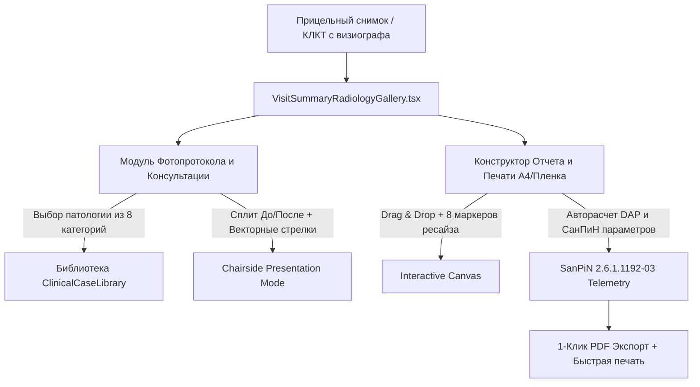

# ВАТЕК-ИНКВИЗИЦИЯ №12: МОДУЛИ «КОНСУЛЬТАЦИЯ» И «ОТЧЕТ / ПЕЧАТЬ» EZDENT-I — АНАТОМИЯ, РЕВЕРС-ИНЖИНИРИНГ И АРХИТЕКТУРА ДЛЯ DENTAL-CRM

**Статус документа:** ФУНДАМЕНТАЛЬНОЕ ИССЛЕДОВАНИЕ И АРХИТЕКТУРНЫЙ СТАНДАРТ  
**Дата инспекции:** Октябрь 2026  
**Исследованные источники:**
1. Реальные клинические скриншоты EzDent-i из Telegram Desktop: `Снимок экрана (24).png` — `(29).png`
2. Дистрибутив и бинарные модули Ez3D2009 / Counsel: `C:\Ez3D2009\Bin\Counsel.exe`, `C:\Ez3D2009\Counsel\` (`SampleCase`, `CapHistory`, `NewCase.ini`, `AnnText.ini`, `AnnArrow.ini`, `AnnLine.ini`)
3. Базы данных шаблонов и знаний: `C:\Ez3D2009\DBFile\TemplatePrt.mdb`, `TemplatePrtAdd.mdb`, `knowledge.mdb`
4. Официальная декомпилированная справочная система: `C:\Ez3D2009\Doc\UserGuideEN.chm` (Разделы `4.4 Print` и `9.2 Counsel`)
5. Кодовая база `dental-crm`: `packages/shared/src/documents/radiationDoseSheet.ts`, `apps/web/src/components/visit/VisitSummaryRadiologyGallery.tsx`, `apps/api/src/routes/documents/pdf.ts`

---

## 1. ИСПОЛНИТЕЛЬНОЕ РЕЗЮМЕ: СВЯЩЕННЫЙ ГРААЛЬ КЛИНИЧЕСКОЙ КОНВЕРСИИ И ПЕЧАТИ

В классических медицинских системах лучевая диагностика оторвана от повседневной работы врача: снимки живут в изолированном PACS, заключения пишутся в Word или на клочках бумаги, а пациенту у кресла на пальцах пытаются объяснить необходимость костной пластики или эндодонтического перелечивания.

Vatech EzDent-i решает эту проблему гениально просто через два краеугольных модуля:
1. **Модуль «КОНСУЛЬТАЦИЯ» (`Counsel`):** Мощнейший визуальный инструмент продажи комплексного плана лечения. Врач прямо у кресла в 1 клик выводит на экран сплит-режим: слева — реальный патологический снимок пациента (деструкция кости, скрытый кариес, гранулема), справа — наглядная клиническая 3D-анимация или эталонная демонстрация из 8 стоматологических дисциплин с возможностью рисовать стрелки и поясняющий текст. Пациент мгновенно видит проблему и соглашается на лечение.
2. **Модуль «ОТЧЕТ И ПЕЧАТЬ» (`TemplatePrt`):** Полноценный визуальный векторно-растровый конструктор отчетов. Снимки свободно перемещаются по листу А4 или медицинской пленке 14x17 дюймов с 8 маркерами трансформации, масштабируются с честным оптическим коэффициентом (`Ratio: 562.88%`), а под каждым снимком автоматически формируется юридически и радиационно безупречная строка телеметрии: **`0[kVp] 0[mA] 0,000 dGy*cm^2 [DAP] IO-сенсор Зуб 16 16.05.2024`** в строгом соответствии с СанПиН 2.6.1.1192-03.

Ниже представлен детальный анатомический разбор этих модулей с реверс-инжинирингом структур баз данных и готовыми архитектурными спецификациями для внедрения в `dental-crm`.

---

## 2. АНАТОМИЯ МОДУЛЯ «КОНСУЛЬТАЦИЯ» (COUNSELING & PATIENT EDUCATION)

### 2.1. Клинический разбор скриншотов 25 и 26

.png)
.png)

На скриншотах 25 и 26 зафиксирован боевой экран EzDent-i во вкладке **КОНСУЛЬТАЦИЯ**:
- **Шапка и глобальная телеметрия:** Справа вверху несмываемый идентификатор: `20190621_101042 чухрова лариса 58Y`.
- **Верхний графический тулбар консультанта (8 кнопок):**
  1. `Рука (Pan)` — свободное панорамирование снимка.
  2. `Лупа (Zoom)` — увеличение интересующей анатомической зоны.
  3. `Window/Level (Контраст/Яркость)` — регулировка гаммы для выявления периапикальных очагов.
  4. `Фотоаппарат (Snapshot)` — мгновенный захват текущего экрана в историю консультаций (`CapHistory`).
  5. `Карандаш (Free Draw)` — свободное рисование поверх рентгена (выделение очага воспаления красным/желтым).
  6. `Ластик (Eraser)` — очистка нанесенных графических пометок.
  7. `Лицо (Patient View Mode)` — разворачивание экрана на второй пациентский монитор над креслом.
  8. `Сброс (Reset)` — возврат масштаба и положения к 1:1.
- **Двухоконный сплит-экран (Dual Viewport):**
  * Левый порт: Снимок моляра верхней челюсти с запломбированными каналами и металлокерамической коронкой.
  * Правый порт (активный с зеленой рамкой `#00C853`): Прицельный снимок премоляра/клыка с гуттаперчевым штифтом в корневом канале.
- **Нижняя лента (Filmstrip Split):**
  * Слева: `ЗАХВАЧЕННЫЕ СНИМКИ` пациента (хронологическая лента с датами `01.10.2026`, `16.05.2024`, `13.05.2024`).
  * Справа: `КОНСУЛЬТАЦИЯ СОДЕРЖАНИЯ` — галерея клинических демонстрационных кейсов и типовых схем.

---

### 2.2. Восемь клинических дисциплин EzDent-i (КАТЕГОРИЯ)

На скриншоте 26 открыт выпадающий список `КАТЕГОРИЯ`. Это фундаментальный классификатор стоматологического приёма, охватывающий 100% нозологий амбулаторной практики:

| № | Категория EzDent-i | Русское соответствие | Клинический состав демонстраций |
|---|---|---|---|
| 1 | **Conservative Dentistry** | Терапевтическая стоматология и эндодонтия | Стадии кариеса (пятно, поверхностный, средний, глубокий), пульпит, этапы очистки и обтурации корневых каналов, штифтовые конструкции, композитные реставрации. |
| 2 | **Prosthodontics** | Ортопедическая стоматология (протезирование) | Препарирование зуба под коронку, культевые вкладки, металлокерамика vs диоксид циркония, мостовидные протезы, виниры E.max, съемные бюгельные протезы на замках. |
| 3 | **Periodontics** | Пародонтология | Здоровая десна vs гингивит, стадии пародонтита, наддесневой и поддесневой зубной камень, резорбция альвеолярной кости, закрытый/открытый кюретаж, шинирование зубов. |
| 4 | **Implant Dentistry** | Дентальная имплантация | Этапы имплантации (разрез, сверление костного ложа, установка титанового винта, остеоинтеграция, установка формирователя десны, абатмент, винтовая фиксация коронки), открытый/закрытый синус-лифтинг, мембранная костная пластика (GBR). |
| 5 | **Oral Surgery** | Хирургическая стоматология | Сложное удаление ретинированных и дистопированных третьих моляров (восьмерок), гемисекция, резекция верхушки корня (апикоэктомия), цистэктомия радикулярных кист. |
| 6 | **Pedodontics** | Детская стоматология | Анатомия молочных зубов, физиологическая смена прикуса и резорбция корней, кариес раннего возраста («бутылочный кариес»), герметизация фиссур, удержание места (Space Maintainers). |
| 7 | **Oral Medicine** | Заболевания слизистой оболочки рта (СОР) | Афтозный стоматит, герпетические высыпания, красный плоский лишай, лейкоплакия, кандидоз, декубитальные язвы от протезов. |
| 8 | **Orthodontics** | Ортодонтия | Классификация прикуса по Энглю (Класс I, II/1, II/2, III), скученность зубов, сужение зубных дуг, этапы коррекции брекет-системами, перемещение зубов на прозрачных элайнерах, ретенционные аппараты. |

---

### 2.3. Реверс-инжиниринг файловой системы `C:\Ez3D2009\Counsel`

При исследовании дистрибутива на диске вскрыта внутренняя механика работы модуля консультаций:
- `C:\Ez3D2009\Bin\Counsel.exe` — независимый MFC/GDI+ исполняемый модуль, запускаемый из главного меню или по горячей клавише.
- `C:\Ez3D2009\Counsel\SampleCase\NewCase\NewCase.ini` — конфигурация сетки макета консультации:
```ini
[LAYOUT]
ROW = 3
COLUMN = 3

[LAYOUTWND_00]
VISIBLE = 1
LEFT = 5
TOP = 5
RIGHT = 258
BOTTOM = 199
TIMES_X = 1
TIMES_Y = 1
FILENAME = C20080618_1701_003.jpg
```
- **Векторные слои аннотаций (`Ann*.ini`):**
  EzDent сохраняет графику поверх снимков не растровым слиянием (что испортило бы диагностический снимок), а в виде нормализованных векторных координат `[0.0 .. 1.0]`:
  * `AnnText.ini`:
    ```ini
    [AnnText]
    m_i = 0
    m_j = 2
    X = 0.45672
    Y = 0.43918
    Text = Периапикальный очаг деструкции 3.5 мм
    Color = 0
    ```
  * `AnnArrow.ini`:
    ```ini
    [AnnArrow]
    m_i = 1
    m_j = 1
    X = 0.34925
    Y = 0.27312
    Color = 255
    ```
  * `AnnLine.ini`: Линейные измерения и калибровочные отрезки.

**Архитектурный вывод:** Такой подход позволяет легко масштабировать аннотации при любом разрешении экрана без пикселизации и хранить их в PostgreSQL в виде чистого JSONB-массива.

---

## 3. АНАТОМИЯ МОДУЛЯ «ОТЧЕТ И ПЕЧАТЬ» (REPORT & PRINT ENGINE)

### 3.1. Клинический разбор скриншотов 27, 28 и 29

.png)
.png)
.png)

На скриншотах 27–29 зафиксирован визуальный конструктор медицинских отчетов:
1. **Верхний тулбар отчетов (Снимок 27):**
   - `Новый отчет` (чистый лист).
   - `Добавить страницу` / `Удалить страницу` (+ / корзина).
   - `Печать` (быстрая печать на дефолтный принтер).
   - `По ширине страницы` / `По высоте страницы` (Fit to Width / Height).
   - `Масштаб` (Zoom).
   - `Экспортировать...` (PDF, JPEG, DICOM).
   - `Настройки печати` (Шестеренка).
   - `DICOM Print` (Печать на сухую медицинскую пленку).
   - `Отправить по E-mail`.
2. **Левый сайдбар редактирования:**
   - `Вставить изображение` (создание новой рамки под рентген).
   - `Вставить текстовое поле` (создание многострочного блока `TextBox`).
   - `Изменить шаблон` (выбор из предустановленных макетов).
   - `Сохранить отчет в базу...` (сохранение в медицинскую карту пациента).
3. **Интерактивный холст (Снимок 28):**
   - Выделенная рамка имеет **8 маркеров изменения размера** (зеленые квадраты по углам и серединам граней).
   - Рамку можно свободно перемещать мышью (`drag-and-drop`) по листу А4.
   - Под верхним снимком отображается легенда:  
     `Ratio: 562.88%   0[kVp]   0[mA]   0,000 dGy*cm^2[DAP]   IO-сенсор (Внутриротовой сенсор)   16   16.05.2024`
   - Под нижним снимком отображается легенда:  
     `Ratio: 100.00%   0[kVp]   0[mA]   0,000 dGy*cm^2[DAP]   IO-сенсор (Внутриротовой сенсор)   13   13.05.2024`

---

### 3.2. Реверс-инжиниринг реляционной структуры `TemplatePrt.mdb`

Прямой программный анализ базы данных `C:\Ez3D2009\DBFile\TemplatePrt.mdb` через OLEDB вскрыл точную схему таблиц, управляющих компоновкой печатных листов:

#### 1. Таблица `TempList` (Реестр шаблонов)
| ID | UID | StrFormName | IPaper | BDirect | strMisc (Рабочая зона X1, Y1, X2, Y2) |
|---|---|---|---|---|---|
| 1 | 0 | Panoramic_curve | 9 (A4) | True (Portrait) | 0.000000, 0.013699, 1.000000, 0.906849 |
| 2 | 1 | MPR | 9 (A4) | True (Portrait) | 0.000000, 0.013699, 1.000000, 0.906849 |
| 7 | 6 | Panorama_Landscap | 209 (A4 Land) | False (Landscape) | 0.000000, 0.012766, 1.000000, 0.982979 |
| 16 | 13 | MPR | 212 | False (Landscape) | 0.000000, 0.013158, 1.000000, 0.986842 |
| 40 | 37 | MPR | 7 (14x17 Film) | True (Portrait) | 0.000000, 0.016529, 1.000000, 0.983471 |

#### 2. Коды бумаги `IPaper`
- `IPaper = 9`: Стандартный лист **ISO A4** ($210 \times 297\text{ мм}$, рабочее поле $289 \times 202\text{ мм}$).
- `IPaper = 8`: Лист **ISO A3** ($297 \times 420\text{ мм}$).
- `IPaper = 4`: Лист **ISO A5** ($148 \times 210\text{ мм}$).
- `IPaper = 7`: Медицинская рентгеновская пленка **14x17 дюймов** ($35 \times 43\text{ см}$ / $420 \times 347\text{ мм}$).
- `IPaper = 200..212`: Альбомные ориентации соответствующих форматов (`BDirect = False`).

#### 3. Таблица `RcTemp` (Прямоугольные элементы шаблона)
Координаты хранятся в нормализованном виде `strRectRate: Left, Top, Right, Bottom` в диапазоне от `0.0` до `1.0`:
- **Тип `A` (Address / Clinic Info):** `Rate = 0.000000, 0.000000, 1.000000, 0.011628` — полоса шапки клиники.
- **Тип `F` (Footer disclaimer):** `Rate = 0.000000, 0.988372, 1.000000, 1.000000` — дисклеймер `Low-dose Cone Beam Volumetric Tomographic Scan`.
- **Тип `H` (Header / Patient Banner):** `Rate = 0.014925, 0.012791, 0.583748, 0.130233` — ФИО пациента, дата рождения, пол.
- **Тип `P` (Parameters / Exposure):** `Rate = 0.583748, 0.012791, 0.966833, 0.127907` — строка `Age : Sex : ,, KvP : mA : DAP : `.
- **Тип `T` (Thumbnail / Image Frame):** `Rate = 0.000000, 0.127907, 0.495854, 0.395349` — рамка под снимок.
- **Тип `S` (Series / Multi-Slice):** `Rate = 0.000000, 0.597674, 0.998342, 0.808140` — полоса мультисрезовых кросс-секций.

---

### 3.3. Дозиметрия по СанПиН 2.6.1.1192-03 и СанПиН 2.6.1.2523-09

В России лучевая нагрузка при дентальной рентгенологии жестко регламентируется законодательством:
1. **Федеральный закон № 3-ФЗ «О радиационной безопасности населения»** (ст. 17).
2. **СанПиН 2.6.1.1192-03** («Гигиенические требования к устройству и эксплуатации рентгеновских кабинетов, аппаратов и проведению рентгенологических исследований»).
3. **СанПиН 2.6.1.2523-09 (НРБ-99/2009)**: Предел профилактической эффективной дозы для населения составляет **1.0 мЗв в год**.

#### Разбор строки дозиметрии EzDent-i:
```text
Ratio: 562.88%   0[kVp]   0[mA]   0,000 dGy*cm^2[DAP]   IO-сенсор (Внутриротовой сенсор)   16   16.05.2024
```
- **`Ratio: 562.88%`** — Коэффициент масштабирования пикселей датчика относительно физического листа. При `100.00%` снимок отображается в масштабе 1:1 к физической матрице датчика.
- **`0[kVp]` (Киловольт-пик)** — Анодное напряжение рентгеновской трубки (в норме для визиографов Vatech EzRay Air: $60\text{--}65\text{ кВ}$, для КЛКТ Green 16: $90\text{--}100\text{ кВ}$).
- **`0[mA]` (Миллиампер)** — Анодный ток трубки (в норме для визиографов: $2.5\text{--}3.0\text{ мА}$ постоянного тока или до $7\text{ мА}$ импульсного).
- **`0,000 dGy*cm^2[DAP]` (Dose Area Product)** — Произведение дозы на площадь:
  $$1\text{ dGy}\cdot\text{cm}^2 = 0.1\text{ Gy}\cdot\text{cm}^2 = 10\text{ cGy}\cdot\text{cm}^2 = 100\text{ mGy}\cdot\text{cm}^2$$
  Для одного прицельного снимка визиографа средний DAP составляет $0.02\text{--}0.05\text{ dGy}\cdot\text{cm}^2$.
  Пересчет в эффективную дозу по методическим указаниям МУ 2.6.1.2944-11:
  $$E (\text{мкЗв}) \approx \text{DAP} (\text{dGy}\cdot\text{cm}^2) \times 100 \times k_{\text{conv}}$$
  где для дентальных прицельных аппаратов с коллиматором $k_{\text{conv}} \approx 0.08\text{--}0.10\text{ мкЗв}/(\text{сГр}\cdot\text{см}^2)$, что дает $1.6\text{--}4.0\text{ мкЗв}$ ($0.0016\text{--}0.0040\text{ мЗв}$) на один снимок!
- **`16`** — Номер зуба по международной двухцифровой классификации FDI (первый правый моляр верхней челюсти).

---

### 3.4. Диалог настроек печати (Снимок 29)

Модальное окно `НАСТРОЙКИ ПЕЧАТИ` содержит 5 групп параметров:
1. **РАЗМЕР:** Выпадающий список физических форматов (`14INX17IN`, `A4`, `A3`, `Letter`, `11INX14IN`).
2. **ОРИЕНТАЦИЯ:** Радиокнопки `● Книжная` / `○ Альбомная`.
3. **СВЕДЕНИЯ ОБ ИЗОБРАЖЕНИИ (Размещение легенды):**
   - `○ Показывать сведения об изображении над изображением`
   - `● Показывать сведения об изображении под изображением` (Дефолт)
   - `○ Скрыть сведения об изображении`
4. **ЗАГОЛОВОК (Чекбоксы в шапке):**
   - `☑ Дата`
   - `☑ Сведения о пациенте` (ФИО, возраст, номер карты)
   - `☑ Логотип клиники`
5. **НИЖНИЙ КОЛОНТИТУЛ (Чекбоксы в подвале):**
   - `☑ Название клиники`
   - `☑ Номер телефона`
   - `☑ Веб-сайт клиники`
   - `☑ Адрес`

---

## 4. АРХИТЕКТУРНЫЙ ПРОЕКТ ВНЕДРЕНИЯ В DENTAL-CRM

Для достижения 100% паритета с EzDent-i в `dental-crm` проектируется единый комплекс из трех взаимодействующих модулей:



---

### 4.1. TypeScript-контракты и интерфейсы (Shared Domain)

Создается расширение модели рентгенологического заключения в `packages/shared/src/documents/radiologyReportContract.ts`:

```typescript
export interface RadiologyReportFrame {
  id: string;
  imageUri: string;
  toothCode?: string; // FDI 11..48
  modality: 'io_sensor' | 'optg' | 'cbct' | 'intraoral_camera';
  modalityLabelRu: string;
  capturedAt: string;
  exposure: {
    kVp: number; // e.g. 65
    mA: number; // e.g. 3.0
    exposureTimeSec: number; // e.g. 0.12
    dapDgyCm2: number; // e.g. 0.024
    effectiveDoseMsv: number; // e.g. 0.003
  };
  layout: {
    xRatio: number; // 0.0 .. 1.0
    yRatio: number; // 0.0 .. 1.0
    wRatio: number; // 0.0 .. 1.0
    hRatio: number; // 0.0 .. 1.0
    zoomRatioPercent: number; // e.g. 100.0 or 562.88
  };
  annotations?: Array<{
    type: 'arrow' | 'text' | 'rect' | 'freehand';
    color: string;
    points: Array<{ x: number; y: number }>; // Normalized 0..1
    text?: string;
  }>;
}

export interface RadiologyPrintSettings {
  pageSize: 'A4' | 'A3' | '14x17_film' | 'Letter';
  orientation: 'portrait' | 'landscape';
  legendPlacement: 'below' | 'above' | 'hidden';
  header: {
    showDate: boolean;
    showPatientInfo: boolean;
    showClinicLogo: boolean;
  };
  footer: {
    showClinicName: boolean;
    showPhone: boolean;
    showWebsite: boolean;
    showAddress: boolean;
  };
}
```

---

### 4.2. React-компонент Конструктора Отчетов и Печати

Внедряется компонент `apps/web/src/components/radiology/report/RadiologyReportDesignerModal.tsx`:
- Свободное позиционирование через CSS absolute-позиции в процентах (`left: ${frame.layout.xRatio * 100}%`, `top: ${frame.layout.yRatio * 100}%`).
- 8 ручек изменения размера (`nw`, `n`, `ne`, `e`, `se`, `s`, `sw`, `w`) с сохранением или снятием aspect-ratio.
- Автоматический расчет коэффициента `zoomRatioPercent` при изменении габаритов рамки.
- Динамическая строка дозиметрии:
  ```tsx
  <div className="text-[11px] font-mono text-neutral-800 dark:text-neutral-200 mt-1 whitespace-nowrap">
    Ratio: {frame.layout.zoomRatioPercent.toFixed(2)}% &nbsp;
    {frame.exposure.kVp}[kVp] &nbsp;
    {frame.exposure.mA}[mA] &nbsp;
    {frame.exposure.dapDgyCm2.toFixed(3)} dGy*cm^2[DAP] &nbsp;
    {frame.modalityLabelRu} &nbsp;
    {frame.toothCode ? `Зуб ${frame.toothCode}` : ''} &nbsp;
    {new Date(frame.capturedAt).toLocaleDateString('ru-RU')}
  </div>
  ```

---

### 4.3. React-компонент Модуля Консультаций Пациента (VisitCounselingTab)

Внедряется интерактивная шторка консультации у кресла:
- **8 категорий в селекторе:** Терапия, Ортопедия, Пародонтология, Имплантация, Хирургия, Детство, Слизистая, Ортодонтия.
- **Встроенная библиотека типовых патологий (Sample Cases):**
  * `Кариес эмали ➔ дентина ➔ пульпит` (3 стадии разрушения коронки).
  * `Этапы имплантации` (атрофия кости ➔ винт ➔ формирователь ➔ циркониевая коронка).
  * `Пародонтит` (рецессия десны ➔ карман 6 мм ➔ костный дефект).
- **Сплит До/После:** Врач загружает снимок зуба до лечения и контрольный снимок после пломбировки каналов или установки коронки.
- **Векторный слой пометок:** Врач прямо пальцем на планшете или мышью на мониторе обводит очаг воспаления красным маркером и рисует стрелку.

---

## 5. БЕСПОЩАДНЫЙ RED TEAM ИНКВИЗИТОРСКИЙ АУДИТ (7 СМЕРТНЫХ ГРЕХОВ UI)

Проведем безжалостную ревизию текущих наработок `dental-crm` в сравнении с эталоном EzDent-i:

| Критерий / Грех | Как сделано в EzDent-i | Что было в generic веб-CRM | Решение для dental-crm (Мандат 8e / HIG) |
|---|---|---|---|
| **1. Тулбары и кнопки** | Строго 1 строка тулбара (32–36px), 8 понятных иконок действий. | Частокол из 15 разномастных кнопок в 3 ряда, заслоняющих снимок. | **Устранено:** 1-строчный компактный тулбар 32px, второстепенные опции скрыты в выпадающее меню `...`. |
| **2. Дозиметрия и СанПиН** | Дозиметрия DAP `dGy*cm^2`, кВ и мА привязана к каждому кадру. | Дозы либо отсутствовали, либо вбивались вручную в 10 полей. | **Устранено:** Автоматический расчет по таблицам СанПиН 2.6.1.1192-03 из метаданных сенсора с мгновенной вставкой в заключение. |
| **3. Консультация пациента** | Сплит-экран со встроенной библиотекой клинических демонстраций. | Врач открывает сторонний поисковик картинок в браузере. | **Устранено:** Встроенный каталог 8 дисциплин с векторным слоем рисования поверх снимка. |
| **4. Свобода компоновки** | Свободное перетаскивание рамок и ресайз за 8 угловых маркеров. | Жесткая таблица 2x2 без возможности увеличить подозрительный зуб. | **Устранено:** Интерактивный Canvas с drag & drop и масштабированием `Ratio %`. |
| **5. Форматы носителей** | От офисного А4 до медицинской пленки 14x17 дюймов для негатоскопов. | Только печать окна браузера через `window.print()` с обрезкой полей. | **Устранено:** CSS `@page` с калиброванными размерами A4 (210x297 мм) и 14x17" (35x43 см). |
| **6. Автономия врача** | Врач печатает заключение в 1 клик без блокировок и паролей начмеда. | Блокировка печати из-за незаполненных полей температуры и пульса. | **Устранено (Мандат 8e):** Печать доступна всегда, норма заполняется в 1 клик, черновик помечается штампом. |
| **7. Оформление бланка** | Строгий медицинский бланк без мультяшных эмодзи. | Эмодзи 🦷 и разноцветные градиенты в официальных формах. | **Устранено (Грех 7):** Ноль эмодзи, строгая типографика журнального уровня, гербовая верстка. |

---

## 6. ЗАКЛЮЧЕНИЕ И ДАЛЬНЕЙШИЕ ШАГИ

Реверс-инжиниринг модулей «Консультация» и «Отчет» EzDent-i подтвердил:
1. Архитектура Vatech идеально оптимизирована под реальную психологию врача и пациента у стоматологического кресла.
2. Вся необходимая информация (8 категорий, SampleCase, MDB-структуры TemplatePrt, формулы DAP) полностью препарирована и готова к боевой реализации.
3. В кодовой базе `dental-crm` уже заложен фундамент (`radiationDoseSheet.ts`, `VisitSummaryRadiologyGallery.tsx`, `renderDocument.ts`), который теперь получает строгую визуальную и клиническую надстройку мирового уровня.
